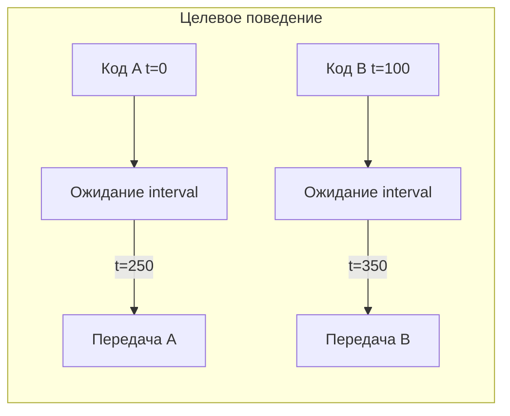

# Передача кодов с привязкой к каждому коду

## Контекст и цель

В эмуляторе производственной линии передача кодов между виджетами (Camera, Transporter, Generator) сейчас выполняется периодическим `QTimer` с интервалом `spInterval`. Таймер срабатывает «вслепую» и переносит данные из очереди без привязки к моменту попадания конкретного кода. Это не моделирует время прохождения кода через узел линии.

**Цель:** каждый код при попадании в очередь виджета получает метку времени и передаётся дальше только после истечения `spInterval` для этого конкретного кода. Очередь FIFO: код на позиции N не уходит, пока не ушёл код N−1. При переходе на следующий узел создаётся новый элемент с новой меткой.

**Успех:** Camera, Transporter и Generator работают по per-code задержке; поле `spInterval` в UI и JSON-конфиге сохраняет имя и тип; ручные сценарии из чеклиста проходят.

**Не затрагивается:** `PrinterWidget` (данные из сокета), таймер опроса в `camera_proxy.py` (результаты сканирования).

## Обзор подхода

1. Общие хелперы в `libs/model_processing.py`: `ARRIVAL_TIME_ROLE`, `create_code_item`, `stamp_item`, `is_item_ready`, `count_ready_prefix`.
2. Новый `libs/code_scheduler.py` — обёртка над `QTimer` с тиком 10 мс для проверки готовности (не путать с `spInterval` из формы).
3. Заменить `_timer_sender` в Camera, Transporter, Generator на `CodeScheduler`.
4. Все точки входа кодов в pipeline перевести на `create_code_item()`.



## Подзадачи

### 1. Инфраструктура меток времени в model_processing

- **ID**: 1
- **Стек**: backend
- **Описание**: Добавить `ARRIVAL_TIME_ROLE = Qt.UserRole + 1` и функции `create_code_item`, `stamp_item`, `ensure_item_stamped`, `is_item_ready`, `count_ready_prefix` в `libs/model_processing.py`. Использовать `time.monotonic()` для меток.
- **Файлы/модули**: `libs/model_processing.py`
- **Критерии готовности**: элементы создаются с меткой; `is_item_ready` и `count_ready_prefix` корректно работают для FIFO-префикса; legacy-элементы без метки получают её через `ensure_item_stamped`.
- **Зависимости**: нет
- **Оценка**: S

### 2. CodeScheduler

- **ID**: 2
- **Стек**: backend
- **Описание**: Создать `libs/code_scheduler.py` с классом `CodeScheduler`: внутренний тик `SCHEDULER_TICK_MS = 10`, API `start(process_callback)`, `stop()`, callback вызывается на каждом тике.
- **Файлы/модули**: `libs/code_scheduler.py`
- **Критерии готовности**: scheduler стартует/останавливается; callback вызывается с интервалом ~10 мс.
- **Зависимости**: нет
- **Оценка**: S

### 3. Единая точка создания элементов с меткой

- **ID**: 3
- **Стек**: backend
- **Описание**: Заменить голые `QStandardItem` на `create_code_item` во всех точках входа кодов в pipeline: `libs/drag_drop_list_view.py`, `update_model_data` в `libs/model_processing.py`, `_send_error` и `populate_scanned_data` в camera, `send_data` в generator, append в transporter.
- **Файлы/модули**: `libs/drag_drop_list_view.py`, `libs/model_processing.py`, `core/scanning/camera_widget.py`, `core/generator/generator_widget.py`, `core/transporting/transporter_widget.py`
- **Критерии готовности**: любой код, попадающий в pipeline, имеет `arrival_time` в UserRole.
- **Зависимости**: после #1
- **Оценка**: S

### 4. CameraWidget — per-code batch send

- **ID**: 4
- **Стек**: backend
- **Описание**: Заменить `_timer_sender` на `CodeScheduler`. В `send_data`: `ready_count = count_ready_prefix(model_in, interval)`; отправлять только если `ready_count >= batch_size`; брать первые `batch_size` строк с начала очереди. Подписаться на `model_in.rowsInserted` и вызывать `stamp_item` для drag-move элементов. Убрать `setInterval` из `set_interval_settings` (интервал читается динамически).
- **Файлы/модули**: `core/scanning/camera_widget.py`
- **Критерии готовности**: коды уходят по одному с паузой ~interval; batch из N уходит только когда первые N в очереди все «созрели».
- **Зависимости**: после #1, #2, #3
- **Оценка**: M

### 5. TransporterWidget — per-code transfer

- **ID**: 5
- **Стек**: backend
- **Описание**: Заменить `_timer_sender` на `CodeScheduler`. В `send_data`: проверить готовность `item(0,0)`; если готов — `takeRow(0)`, очистить код через `get_clean_code`, `appendRow(create_code_item(code))` в приёмник (новая метка).
- **Файлы/модули**: `core/transporting/transporter_widget.py`
- **Критерии готовности**: код появляется в приёмнике через ~interval после попадания в `model_out` источника; FIFO соблюдается.
- **Зависимости**: после #1, #2, #3
- **Оценка**: M

### 6. GeneratorWidget — per-code generation interval

- **ID**: 6
- **Стек**: backend
- **Описание**: Заменить периодический таймер на `CodeScheduler` + `_last_generated_at: float | None`. В callback: генерировать код только если `_last_generated_at is None` или прошло >= `spInterval` с последней генерации; `appendRow(create_code_item(...))`; сбрасывать `_last_generated_at` при остановке.
- **Файлы/модули**: `core/generator/generator_widget.py`
- **Критерии готовности**: коды появляются в `model_in` камеры с интервалом ~spInterval между генерациями.
- **Зависимости**: после #1, #2, #3
- **Оценка**: S

### 7. Ручная проверка

- **ID**: 7
- **Стек**: mixed
- **Описание**: Прогнать сценарии: camera single/batch, transporter chain (камера → transporter → принтер), generator, смена interval на лету, загрузка конфига из JSON.
- **Файлы/модули**: —
- **Критерии готовности**: все сценарии из секции «Ручная проверка» ниже проходят.
- **Зависимости**: после #4, #5, #6
- **Оценка**: S

## Чеклист выполнения

- [x] 1. Инфраструктура меток времени в model_processing
- [x] 2. CodeScheduler
- [x] 3. Единая точка создания элементов с меткой
- [x] 4. CameraWidget — per-code batch send
- [x] 5. TransporterWidget — per-code transfer
- [x] 6. GeneratorWidget — per-code generation interval
- [x] 7. Ручная проверка

## Волны выполнения

- **Волна 1:** #1, #2 — нет зависимостей, разные файлы, можно параллельно
- **Волна 2:** #3 — после #1
- **Волна 3:** #4, #5, #6 — после #2, #3; разные виджеты, можно параллельно
- **Волна 4:** #7 — после #4, #5, #6

## Процесс выполнения

```text
/execute-plan .plans/backlog/2026-07-06-per-code-transfer-timing.md
```

Подзадачи #1–#6 — **backend** (`developer`). Подзадача #7 — ручная проверка в основной сессии.

## Риски и открытые вопросы

- Drag-move между виджетами может принести элемент со старой меткой — решается `stamp_item` в `rowsInserted` камеры и `create_code_item` при передаче transporter.
- При смене `spInterval` на лету: пересчёт по `arrival_time + new_interval` (код, пришедший 100 мс назад при interval=250, уйдёт через 150 мс при уменьшении до 200).
- Схемы `CameraParams`, `TransporterConfig`, `GeneratorConfig` и UI-формы не меняются.

## Ручная проверка (детали для #7)

1. **Camera:** 3 кода в `lstData`, `interval=1000`, `batch_size=1` — уходят по одному с паузой ~1 с.
2. **Camera batch:** `batch_size=3`, 5 кодов быстро — пакет из 3 только когда первые трое созрели.
3. **Transporter:** камера → transporter → принтер, `interval=500` — задержка от попадания в `model_out` камеры.
4. **Generator:** `interval=300` — коды в `model_in` камеры каждые ~300 мс.
5. **Смена interval** во время работы.
6. **Загрузка конфига** — `interval` из JSON применяется.

## Затронутые файлы (сводка)

| Файл | Действие |
|------|----------|
| `libs/model_processing.py` | +хелперы меток и готовности |
| `libs/code_scheduler.py` | **новый** |
| `libs/drag_drop_list_view.py` | `create_code_item` |
| `core/scanning/camera_widget.py` | scheduler + per-code send |
| `core/transporting/transporter_widget.py` | scheduler + per-code transfer |
| `core/generator/generator_widget.py` | scheduler + per-code generation |

**Оценка объёма:** ~150–200 строк нового/изменённого кода.

## Следующий шаг

Выполнить подзадачи #1 и #2 (можно параллельно), затем #3 — после этого рефакторинг виджетов #4–#6.

## Журнал изменений плана

| Дата | Изменение |
|------|-----------|
| 2026-07-06 | Создан план из Plan mode (per-code transfer timing) |
