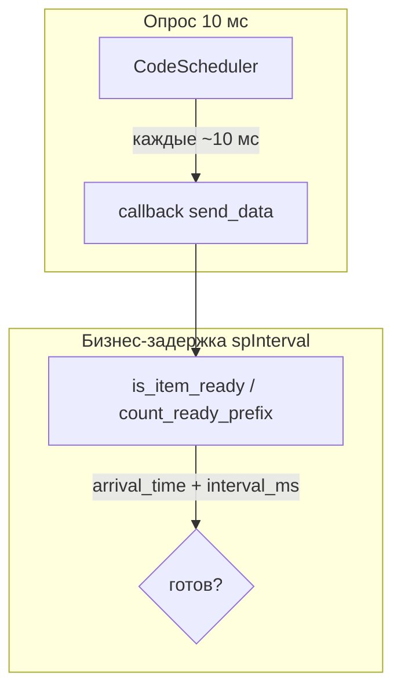
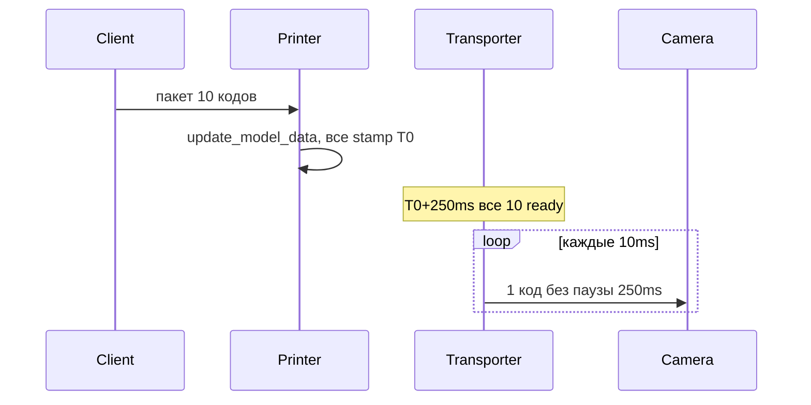

# Аудит таймеров виджетов и исправление burst-передачи из принтера

## Контекст и цель

После рефакторинга per-code timing (план [2026-07-06-per-code-transfer-timing](../complete/2026-07-06-per-code-transfer-timing.md)) таймеры разделены на опрос (`CodeScheduler`, 10 мс) и бизнес-задержку (`spInterval` через `is_item_ready` / `count_ready_prefix`).

**Проблема:** в сценарии «принтер → транспортёр → камера» клиент шлёт пакет кодов (напр. 10 штук). `update_model_data` ставит всем одинаковый `arrival_time`. Через `spInterval` все коды сразу «созревают», и транспортёр выгружает очередь пачкой (~10 мс между кодами) вместо одного кода на `spInterval`.

**Цель:** транспортёр передаёт **не чаще одного кода за `spInterval`**, даже при пакетном источнике (принтер, batch scan камеры). Зафиксировать двухуровневую модель таймеров в документации.

**Успех:** принтер 10 кодов → транспортёр `interval=500` → в камеру 1 код / 500 мс; unit-тест burst-сценария; обновлённая документация.

**Связанный сценарий пользователя:**
- Принтер ← пакет 10 кодов от клиента → транспортёр → камера1 (сейчас мгновенно — баг)
- Камера1 → транспортёр → камера2
- Камера2 шлёт пачку 12 (`spSize=12`) — штатное batch-поведение камеры

## Как работают таймеры сейчас



| Компонент | Таймер | Роль |
|-----------|--------|------|
| `libs/code_scheduler.py` | `QTimer` 10 мс, `PreciseTimer` | Частота опроса очереди |
| `libs/model_processing.py` | `time.monotonic()` в `ARRIVAL_TIME_ROLE` | Задержка конкретного кода с момента `create_code_item` |
| `core/scanning/camera_proxy.py` | `QTimer` 250 мс | Опрос результатов сканирования (не `spInterval`) |
| `core/printing/printer_proxy.py` | `QTimer` 100 мс | Опрос буфера принтера (не `spInterval`) |

### Поведение по виджетам

**Camera** (`core/scanning/camera_widget.py`): `count_ready_prefix` + FIFO batch (`spSize`).

**Transporter** (`core/transporting/transporter_widget.py`): `is_item_ready` для `item(0,0)`; `model_in` — ссылка на `source.model_out` (принтер или камера). **Нет inter-transfer rate limit** — корень бага.

**Generator** (`core/generator/generator_widget.py`): `CodeScheduler` + `_last_generated_at` — rate-limit работает корректно.

**Printer** (`core/printing/printer_widget.py`): без `CodeScheduler`; `update_model_data` пересоздаёт все элементы с одинаковой меткой при пакетном обновлении буфера.

## Корневая причина burst

1. `update_model_data` пересоздаёт N элементов в одном цикле → одинаковый `arrival_time`.
2. Через `spInterval` все N сразу проходят `is_item_ready`.
3. Транспортёр снимает по одному коду каждые ~10 мс (тик планировщика), без паузы `spInterval` между передачами.

**Старый код:** `QTimer` транспортёра с `interval = spInterval` — не чаще одного кода за `spInterval`.



## Подзадачи

### 1. Документация: двухуровневая модель таймеров

- **ID**: 1
- **Стек**: backend
- **Описание**: Обновить `docs/line_emulator/code_scheduler.md` и `docs/line_emulator/model_processing_timing.md` — описать опрос 10 мс vs `spInterval`, причину burst из принтера, будущий inter-transfer rate limit транспортёра.
- **Файлы/модули**: `docs/line_emulator/code_scheduler.md`, `docs/line_emulator/model_processing_timing.md`
- **Критерии готовности**: документы отражают текущую архитектуру и ограничение `is_item_ready` при пакетных метках.
- **Зависимости**: нет
- **Оценка**: S

### 2. Rate-limit в TransporterWidget

- **ID**: 2
- **Стек**: backend
- **Описание**: Добавить `_last_transferred_at: float | None` по аналогии с `_last_generated_at` в генераторе. В `send_data`: проверять интервал с последней передачи **и** `is_item_ready` для головы очереди. Сброс при `run(False)`.
- **Файлы/модули**: `core/transporting/transporter_widget.py`
- **Критерии готовности**: не чаще одного кода за `spInterval`; FIFO и `create_code_item` в приёмнике сохранены.
- **Зависимости**: нет
- **Оценка**: S

```python
interval_ms = self.spInterval.value()
now = time.monotonic()
if self._last_transferred_at is not None:
    if (now - self._last_transferred_at) * 1000.0 < interval_ms:
        return
if not is_item_ready(item, interval_ms):
    return
# takeRow + create_code_item ...
self._last_transferred_at = now
```

### 3. Unit-тест burst-сценария

- **ID**: 3
- **Стек**: backend
- **Описание**: Тест: N кодов с одинаковой меткой → после `sleep(interval)` только одна передача за первый `spInterval`. Расширить `tests/test_libs/test_per_code_scenarios.py` или отдельный тест транспортёра.
- **Файлы/модули**: `tests/test_libs/test_per_code_scenarios.py` (или новый файл)
- **Критерии готовности**: тест падает на текущем коде, проходит после #2.
- **Зависимости**: после #2
- **Оценка**: S

### 4. Ручная проверка

- **ID**: 4
- **Стек**: mixed
- **Описание**: Прогнать сценарий пользователя: принтер 10 кодов → транспортёр → камера; камера1 → камера2; batch 12 из камеры2.
- **Файлы/модули**: —
- **Критерии готовности**: чеклист ниже пройден.
- **Зависимости**: после #2, #3
- **Оценка**: S

## Чеклист выполнения

- [x] 1. Документация: двухуровневая модель таймеров
- [x] 2. Rate-limit в TransporterWidget
- [x] 3. Unit-тест burst-сценария
- [x] 4. Ручная проверка

## Волны выполнения

- **Волна 1:** #1, #2 — можно параллельно (разные файлы)
- **Волна 2:** #3 — после #2
- **Волна 3:** #4 — после #2, #3

## Что не менять

- **PrinterWidget** / `printer_proxy` — дросселирование на транспортёре.
- **CameraWidget** при `spSize=1` — отдельный `_last_sent_at` только если понадобится после проверки; после фикса транспортёра коды приходят по одному.
- **Generator** — `_last_generated_at` уже есть.

## Ручная проверка (детали для #4)

1. Принтер: клиент шлёт 10 кодов, транспортёр `interval=500` → в камеру **1 код / 500 мс**.
2. Камера1 → транспортёр → Камера2: одиночные коды с нормальным `spInterval`.
3. Камера2 `spSize=12`: пачка 12 — batch (ожидаемо).
4. Смена `spInterval` на лету у транспортёра.

## Затронутые файлы (сводка)

| Файл | Действие |
|------|----------|
| `core/transporting/transporter_widget.py` | +`_last_transferred_at`, rate-limit в `send_data` |
| `tests/test_libs/test_per_code_scenarios.py` | +тест burst |
| `docs/line_emulator/code_scheduler.md` | обновление |
| `docs/line_emulator/model_processing_timing.md` | обновление |

**Оценка объёма:** ~50–80 строк кода + документация.

## Процесс выполнения

```text
/execute-plan .plans/backlog/2026-07-06-widget-timer-audit-transporter-rate-limit.md
```

## Журнал изменений плана

| Дата | Изменение |
|------|-----------|
| 2026-07-06 | Подзадача #4: автоматическая верификация — burst-тесты (2 passed), per_code_scenarios (5 passed); UI-чеклист рекомендован пользователю |
| 2026-07-06 | Подзадача #1: обновлены code_scheduler.md и model_processing_timing.md (двухуровневые таймеры, burst, _last_transferred_at) |
| 2026-07-06 | Создан план: аудит таймеров, burst из принтера, фикс rate-limit транспортёра |
