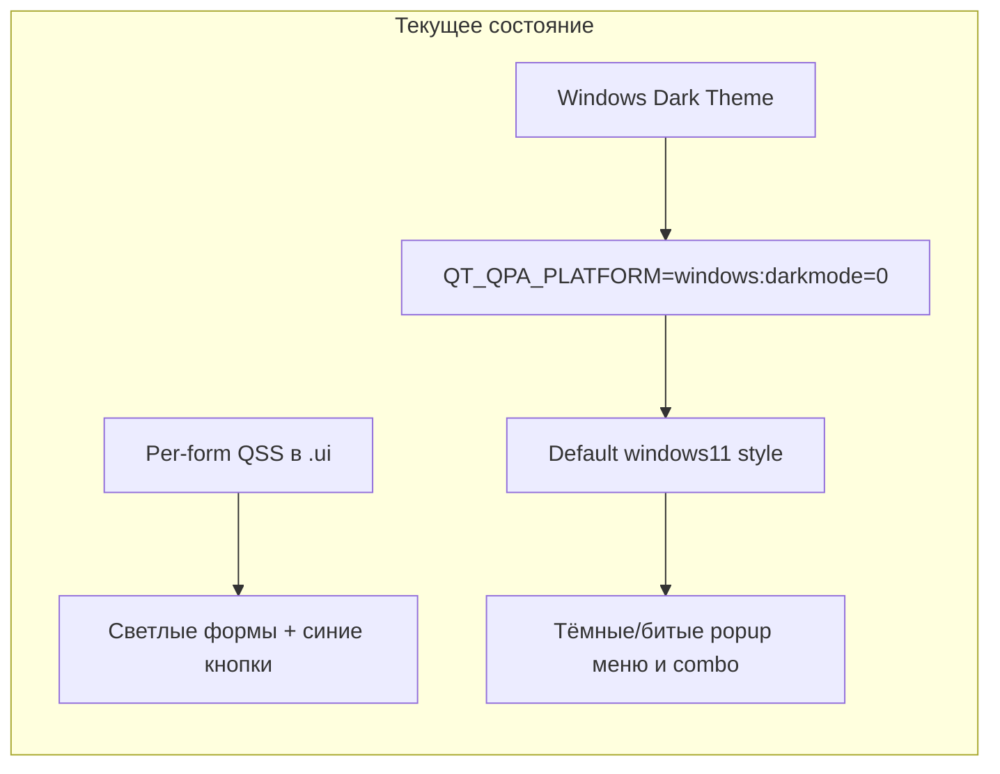

# Исправление светлой темы UI (меню и выпадающие списки)

## Контекст и цель

На Windows 11 с системной тёмной темой формы приложения отображаются светлыми (кастомный QSS в `forms/ui/*.ui`), но выпадающие меню (QMenuBar/QMenu) и popup QComboBox — тёмные и нечитаемые. В `main.py` задано `QT_QPA_PLATFORM = "windows:darkmode=0"`, что отключает тёмную рамку окна, но не устраняет баг рендеринга popup в Qt 6.7 с дефолтным стилем Windows 11.

**Выбранный подход:** сохранить светлую палитру виджетов; принудительно использовать светлый Qt-стиль и дополнить QSS для меню и popup QComboBox.

## Чеклист выполнения

- [x] 1. Модуль настройки Qt-стиля (`libs/qt_theme.py`)
- [x] 2. Подключение темы в `main.py`
- [x] 3. QSS для QMenuBar/QMenu в `forms/ui/Main.ui`
- [x] 4. Исправление QSS popup QComboBox в 5 device-формах
- [x] 5. Регенерация `forms/*.py` через pyside6-uic
- [x] 6. Версия, CHANGES.LOG, документация

---

## Диагноз

Проблема совпадает с [известным багом Qt 6.7](https://forum.qt.io/topic/156611/qt6-7-0-force-light-mode-has-incorrect-rendering-when-system-is-dark-mode): при системной тёмной теме и `windows:darkmode=0` в `main.py` стиль **Windows 11** (дефолт Qt 6.7 / PySide6 6.7.1) ломает отрисовку popup-элементов.

**Что уже работает:** светлые фоны `QWidget#Form` в `forms/ui/*.ui` и кастомный QSS кнопок/combo.

**Что ломается:**

- **QMenu / QMenuBar** в `forms/ui/Main.ui` — без QSS, рендерятся нативно и наследуют тёмную систему.
- **QComboBox popup** — селектор `QComboBox QListView` в device-формах не всегда применяется в Qt 6.7; popup уходит в нативный тёмный рендер с нечитаемым текстом.

---

## Подзадачи

### 1. Модуль настройки Qt-стиля

- **ID**: 1
- **Стек**: backend
- **Описание**: Создать `libs/qt_theme.py` с функцией `apply_light_theme(app: QApplication) -> None`. На Windows — `app.setStyle("windowsvista")` (подтверждённый фикс для Qt 6.7 + `darkmode=0`). На Linux — без смены стиля.
- **Файлы/модули**: `libs/qt_theme.py`
- **Критерии готовности**: функция с docstring и типизацией; на Windows устанавливает `windowsvista`; не импортирует лишнего.
- **Зависимости**: нет
- **Оценка**: 0.5 ч

### 2. Подключение темы в main.py

- **ID**: 2
- **Стек**: backend
- **Описание**: Вызвать `apply_light_theme(app)` после `QApplication(sys.argv)`, до `MainLineField()`. `QT_QPA_PLATFORM = "windows:darkmode=0"` оставить без изменений.
- **Файлы/модули**: `main.py`
- **Критерии готовности**: приложение стартует; стиль применяется до создания главного окна.
- **Зависимости**: 1
- **Оценка**: 0.25 ч

### 3. QSS для меню главного окна

- **ID**: 3
- **Стек**: frontend
- **Описание**: Добавить в `styleSheet` `forms/ui/Main.ui` (к существующим правилам `QScrollBar`) стили `QMenuBar` и `QMenu`: светлый фон (`#ffffff` / `#f5f5f5`), текст `#17365D`, выделение — фон `#226091`, текст `#f0b321`.
- **Файлы/модули**: `forms/ui/Main.ui`
- **Критерии готовности**: меню **Добавить**, **Файл**, **Управление** и вложенные подменю читаемы на тёмной системной теме.
- **Зависимости**: нет
- **Оценка**: 0.5 ч

### 4. Исправление QSS popup QComboBox

- **ID**: 4
- **Стек**: frontend
- **Описание**: В `forms/ui/Camera.ui`, `Printer.ui`, `Scanner.ui`, `Transporter.ui`, `Generator.ui`: заменить `QComboBox QListView { ... }` на `QComboBox QAbstractItemView { ... }`; добавить `QComboBox::item` и `QComboBox::item:selected`; сохранить `QComboBox#cbxProduct QAbstractItemView { min-width: 800px; }` где есть.
- **Файлы/модули**: `forms/ui/{Camera,Printer,Scanner,Transporter,Generator}.ui`
- **Критерии готовности**: popup combo с золотым текстом `#f0b321` на фоне `#19466a`; выделение `#f0b321` / `#19466a`.
- **Зависимости**: нет
- **Оценка**: 1 ч

### 5. Регенерация Python-модулей форм

- **ID**: 5
- **Стек**: backend
- **Описание**: Перегенерировать `forms/*.py` из `.ui` через `pyside6-uic` (через `build_project.py` → `generate_ui_files()` или напрямую).
- **Файлы/модули**: `forms/Main.py`, `forms/{Camera,Printer,Scanner,Transporter,Generator}.py`
- **Критерии готовности**: сгенерированные `.py` синхронны с `.ui`; ручные правки в `.py` отсутствуют.
- **Зависимости**: 3, 4
- **Оценка**: 0.25 ч

### 6. Версия, журнал, документация

- **ID**: 6
- **Стек**: backend
- **Описание**: Увеличить `VERSION` в `client_info.py`; запись в `CHANGES.LOG`; раздел «Тема Windows» в `docs/line_emulator/frontend/widget-backgrounds.md`.
- **Файлы/модули**: `client_info.py`, `CHANGES.LOG`, `docs/line_emulator/frontend/widget-backgrounds.md`
- **Критерии готовности**: версия обновлена; CHANGELOG и docs отражают фикс.
- **Зависимости**: 1–5
- **Оценка**: 0.5 ч

---

## Проверка (ручная, Windows 11 + системная тёмная тема)

1. Запуск `.\venv\Scripts\python.exe main.py`
2. Меню **Добавить / Файл / Управление** — светлый фон, читаемый текст
3. QComboBox на виджетах (COM-порт сканера, продукт, from/to) — popup с золотым текстом на синем фоне
4. Светлые фоны виджетов на холсте без регрессии

## Вне scope

- Переработка всего UI под тёмную тему
- Нативные `QFileDialog` в `core/main_ui/line_emul.py` (строки ~297, ~405) — при необходимости отдельная задача: `QFileDialog.DontUseNativeDialog`

## Затрагиваемые файлы

| Файл | Изменение |
|------|-----------|
| `libs/qt_theme.py` | новый модуль |
| `main.py` | вызов `apply_light_theme` |
| `forms/ui/Main.ui` | QMenuBar/QMenu QSS |
| `forms/ui/{Camera,Printer,Scanner,Transporter,Generator}.ui` | QAbstractItemView + ::item |
| `forms/*.py` | регенерация из .ui |
| `client_info.py`, `CHANGES.LOG`, docs | версия + описание |
