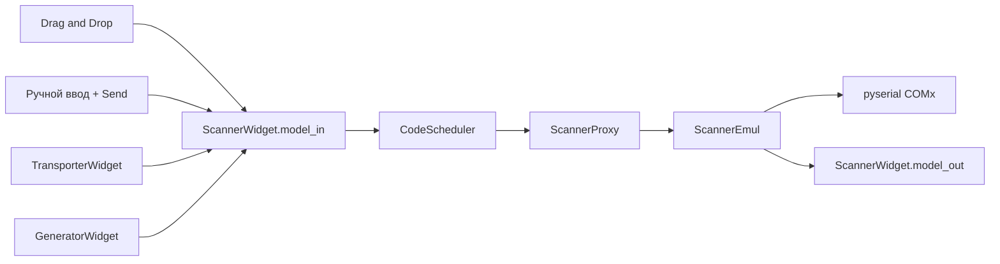
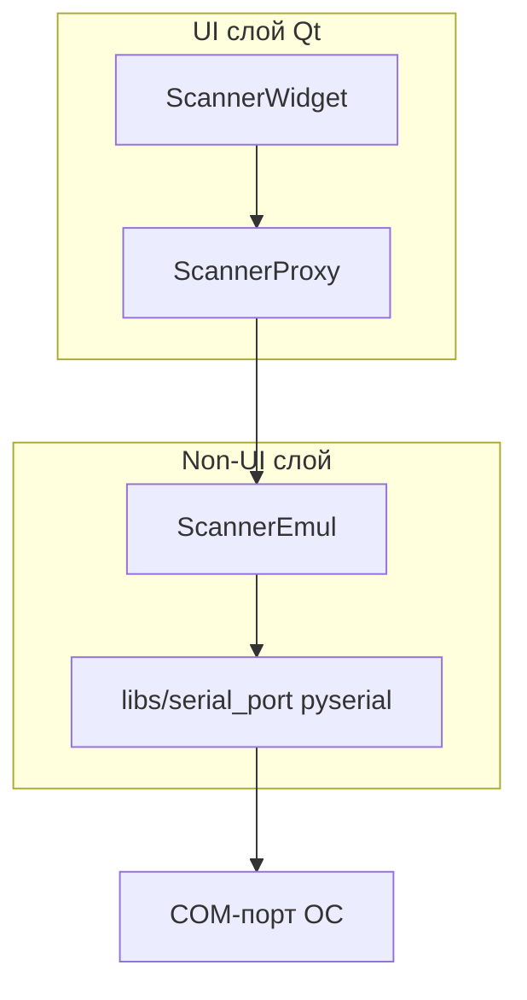

# Эмулятор ручного сканера ШК (Serial) + фоны виджетов + массовое управление

## Контекст и цель

Добавить новый виджет и класс эмуляции ручного сканера штрихкодов с выводом по COM-порту (не TCP), drag-and-drop и ручным вводом данных, интеграцию в transport/generator, сохранение в JSON-конфиг, светлые фоны для всех типов виджетов и меню массового запуска/остановки/очистки.

**Принцип разделения слоёв:** Qt/PySide6 — только UI (`*_widget.py`, `forms/`, прокси-мост). Эмуляция и COM — без Qt:
- `camera_core.py` → `socket` (stdlib)
- `printer_core.py` → `socket` (stdlib)
- `scanner_core.py` → **`pyserial`**

**Ограничение COM (Windows):** приложение не создаёт новый COM-порт без драйвера; перечисление через `serial.tools.list_ports`, выбор в UI, документация com0com.

**Оценка:** ~57 ч (middle developer).

## Чеклист выполнения

- [x] 1. Инфраструктура Serial и ядро эмулятора (10.75 ч)
- [x] 2. Модель конфигурации (1.5 ч)
- [x] 3. UI-форма виджета сканера (3.5 ч)
- [x] 4. Виджет ScannerWidget (8 ч)
- [x] 5. Интеграция в главное окно (4 ч)
- [x] 6. Интеграция в Transport и Generator (2 ч)
- [x] 7. Визуальные фоны всех типов виджетов (3 ч)
- [x] 8. Тестирование (6 ч)
- [x] 9. Сборка, документация, журнал (5 ч)
- [x] 10. Меню массового управления виджетами (11 ч)

---
## Подзадачи

### 1. Инфраструктура Serial и ядро эмулятора

- **ID**: 1
- **Стек**: backend
- **Описание**: `libs/serial_port.py` (pyserial), `ScannerEmul`, `ScannerProxy`, `SCANNER_LOGGER`.
- **Файлы/модули**: `libs/serial_port.py`, `core/barcode_scanner/scanner_core.py`, `core/barcode_scanner/scanner_proxy.py`, `libs/loggers.py`, `requirements.txt`
- **Критерии готовности**: COM открывается/закрывается в фоновом потоке; коды пишутся с суффиксом `\r\n`; proxy эмитит `scanned`; нет импортов PySide6 в core/libs serial.
- **Зависимости**: нет
- **Оценка**: 10.75 ч

#### 1.1. `libs/serial_port.py` (pyserial, без Qt)

| Подзадача | Содержание | Оценка |
|-----------|------------|--------|
| 1.1.0 | Добавить `pyserial` в `requirements.txt` | 0.25 ч |
| 1.1.1 | `list_available_ports()` через `serial.tools.list_ports.comports()` | 0.5 ч |
| 1.1.2 | `SerialPortConfig`: port_name, baud_rate=9600, bytesize=8, parity='N', stopbits=1, suffix=`\r\n` | 0.5 ч |
| 1.1.3 | `open_serial_port(config) -> serial.Serial`, `SerialPortError` | 1.5 ч |
| 1.1.4 | `write_barcode(port, code, suffix)` — UTF-8, flush | 1 ч |

#### 1.2. `ScannerEmul` — `core/barcode_scanner/scanner_core.py`

| Подзадача | Содержание | Оценка |
|-----------|------------|--------|
| 1.2.1 | Класс по образцу `CameraEmul`, threading, без PySide6 | 1 ч |
| 1.2.2 | `start()` / `stop()` — open/close COM | 1.5 ч |
| 1.2.3 | `send()` — очередь `_to_send`, запись в serial | 1.5 ч |
| 1.2.4 | `get_sent_data()` | 0.5 ч |
| 1.2.5 | Логгер `SCANNER_LOGGER` | 0.5 ч |

#### 1.3. `ScannerProxy` — Qt-мост

| Подзадача | Содержание | Оценка |
|-----------|------------|--------|
| 1.3.1 | QObject + `scanned: Signal(list)` | 0.5 ч |
| 1.3.2 | `start` / `stop` / `send_data` | 1 ч |
| 1.3.3 | QTimer 250 ms → emit scanned | 0.5 ч |

---

### 2. Модель конфигурации

- **ID**: 2
- **Стек**: backend
- **Описание**: `ScannerParams`, `ScannerConfig`, расширение `ConfigFile.scanners`.
- **Файлы/модули**: `core/barcode_scanner/data.py`, `core/main_ui/data.py`
- **Критерии готовности**: JSON save/load с секцией `scanners`, обратная совместимость.
- **Зависимости**: нет
- **Оценка**: 1.5 ч

---

### 3. UI-форма виджета сканера

- **ID**: 3
- **Стек**: frontend
- **Описание**: `forms/ui/Scanner.ui` — макет принтера + ручной ввод + send, фон `#f3e5f5`.
- **Файлы/модули**: `forms/ui/Scanner.ui`, `forms/Scanner.py`
- **Критерии готовности**: name | COM combo | R/S; manual input + send; lstData DropOnly.
- **Зависимости**: нет
- **Оценка**: 3.5 ч

```
┌─────────────────────────────────────────┐
│ [Название]  [COM-порт ▼]  [R/S]         │
│ [Ручной ввод текста........] [▶ send]   │
│ ┌─────────────────────────────────────┐ │
│ │  Список очереди (DnD DropOnly)      │ │
│ └─────────────────────────────────────┘ │
└─────────────────────────────────────────┘
```

---

### 4. Виджет ScannerWidget

- **ID**: 4
- **Стек**: frontend
- **Описание**: DnD, CodeScheduler, ручная отправка, QtAwesome иконка send, `clear_data()`, options/load_options.
- **Файлы/модули**: `core/barcode_scanner/scanner_widget.py`, `requirements.txt` (QtAwesome)
- **Критерии готовности**: данные из DnD/transport/manual → serial; ошибка занятого порта → QMessageBox.
- **Зависимости**: после #1, #2, #3
- **Оценка**: 8 ч

---

### 5. Интеграция в главное окно

- **ID**: 5
- **Стек**: mixed
- **Описание**: `acAddScanner`, add/load/save сканеров в `MainLineField`.
- **Файлы/модули**: `core/main_ui/line_emul.py`, `forms/ui/Main.ui`, `forms/Main.py`
- **Критерии готовности**: меню «Добавить → Сканер»; конфиг JSON; closeEvent останавливает сканеры.
- **Зависимости**: после #4
- **Оценка**: 4 ч

---

### 6. Интеграция в Transport и Generator

- **ID**: 6
- **Стек**: backend
- **Описание**: ScannerWidget в combo from/to transporter и generator.
- **Файлы/модули**: `core/transporting/transporter_widget.py`, `core/generator/generator_widget.py`
- **Критерии готовности**: сканер — цель transport/generator; source через model_out.
- **Зависимости**: после #4
- **Оценка**: 2 ч

---

### 7. Визуальные фоны всех типов виджетов

- **ID**: 7
- **Стек**: frontend
- **Описание**: светлый фон `QWidget#Form` для каждого типа.

| Виджет | Файл | Фон |
|--------|------|-----|
| Printer | `forms/ui/Printer.ui` | `#fff3e0` |
| Camera | `forms/ui/Camera.ui` | `#e8f5e9` |
| Scanner | `forms/ui/Scanner.ui` | `#f3e5f5` |
| Transporter | `forms/ui/Transporter.ui` | `#e3f2fd` |
| Generator | `forms/ui/Generator.ui` | `#fffde7` |

- **Критерии готовности**: виджеты визуально различимы; контраст текста/кнопок приемлемый.
- **Зависимости**: после #3
- **Оценка**: 3 ч

---

### 8. Тестирование

- **ID**: 8
- **Стек**: backend
- **Описание**: unit-тесты эмулятора, serial lib, transport, config.
- **Файлы/модули**: `tests/test_core/test_scanner_emul.py`, `tests/test_libs/test_serial_port.py`, `tests/test_core/test_scanner_transport.py`, тест ConfigFile
- **Критерии готовности**: mock `serial.Serial`; тесты core без QApplication где возможно.
- **Зависимости**: после #1–#6
- **Оценка**: 6 ч

---

### 9. Сборка, документация, журнал

- **ID**: 9
- **Стек**: mixed
- **Описание**: PyInstaller hiddenimports, docs, CHANGES.LOG, VERSION, example config.
- **Файлы/модули**: `build/spec/main.spec`, `docs/line_emulator/`, `CHANGES.LOG`, `client_info.py`, `configs/scanner_example.json`
- **Критерии готовности**: сборка включает pyserial и qtawesome; документация com0com.
- **Зависимости**: после #1–#8
- **Оценка**: 5 ч

---

### 10. Меню массового управления виджетами

- **ID**: 10
- **Стек**: mixed
- **Описание**: меню «Управление» с подменю Запустить / Остановить / Очистить данные.

```
Управление
├── Запустить → Всё | Принтеры | Камеры | Сканеры | Перевозчики | Генераторы
├── Остановить → (те же 6)
└── Очистить данные → Всё | Принтеры | Камеры | Сканеры
```

| Действие | Правило |
|----------|---------|
| Запустить | Только `tbRun == False` → `setChecked(True)` |
| Остановить | Только `tbRun == True` → `setChecked(False)` |
| Очистить | `clear_data()` без остановки; только устройства с очередями |

**Порядок «Всё»:** запуск — устройства → перевозчики → генераторы; остановка — обратно.

- **Файлы/модули**: `forms/ui/Main.ui`, `core/main_ui/line_emul.py`, `printer_widget.py`, `printer_proxy.py`, `camera_widget.py`, `camera_proxy.py`, `core/main_ui/widget_protocols.py` (опционально)
- **Критерии готовности**: публичный `clear_data()`; сброс буфера принтера при Run; тесты bulk control.
- **Зависимости**: после #4 (сканер), может частично параллельно с #5
- **Оценка**: 11 ч

#### 10.1. Рефакторинг API очистки (3.75 ч)

- `_clear_data()` → `clear_data()` в Printer, Camera, Scanner
- Printer: `PrinterProxy.clear_buffer()` при clear во время Run
- Camera/Scanner: сброс очередей core через proxy

#### 10.2. Оркестрация MainLineField (4 ч)

- `_iter_*()` по типам, `_start_widgets`, `_stop_widgets`, `_clear_widgets`
- 16 action slots + setup_connections

#### 10.3. UI меню (1.25 ч)

#### 10.4. Тесты и docs (2 ч)

---

## Архитектура (data flow)





## Граница слоёв (чеклист при ревью)

| Слой | Файлы | Разрешённые зависимости |
|------|-------|-------------------------|
| Core / libs | `scanner_core.py`, `libs/serial_port.py`, `data.py` | stdlib, pyserial, pydantic, project libs |
| Qt-мост | `scanner_proxy.py` | PySide6.QtCore |
| UI | `scanner_widget.py`, `forms/Scanner.*` | PySide6, QtAwesome, proxy |

## Ключевые файлы

**Новые:**
- `core/barcode_scanner/scanner_core.py`
- `core/barcode_scanner/scanner_proxy.py`
- `core/barcode_scanner/scanner_widget.py`
- `core/barcode_scanner/data.py`
- `libs/serial_port.py`
- `forms/ui/Scanner.ui`, `forms/Scanner.py`
- `core/main_ui/widget_protocols.py` (опционально)

**Изменяемые:**
- `core/main_ui/line_emul.py`
- `core/main_ui/data.py`
- `core/printing/printer_widget.py`, `printer_proxy.py`
- `core/scanning/camera_widget.py`, `camera_proxy.py`
- `core/transporting/transporter_widget.py`
- `core/generator/generator_widget.py`
- `forms/ui/Main.ui`, все device `.ui`
- `requirements.txt`, `libs/loggers.py`, `build/spec/main.spec`

## Риски

| Риск | Митигация |
|------|-----------|
| COM-порт занят | Проверка при open, QMessageBox |
| Нет виртуального порта | Документация com0com |
| PyInstaller без pyserial | hiddenimports |
| Qt в non-UI | code review |
| Очистка принтера при Run | clear_buffer в core |
| Гонки bulk start/stop | Фиксированный порядок pipeline |

## Итоговая оценка

| Этап | Часы |
|------|------|
| 1. Serial + ядро | 10.75 |
| 2. Конфигурация | 1.5 |
| 3. UI-форма | 3.5 |
| 4. ScannerWidget | 8.0 |
| 5. Главное окно | 4.0 |
| 6. Transport + Generator | 2.0 |
| 7. Фоны | 3.0 |
| 8. Тесты | 6.0 |
| 9. Документация/сборка | 5.0 |
| 10. Массовое управление | 11.0 |
| Буфер | 2.0 |
| **ИТОГО** | **56.75 ч (~57 ч)** |
