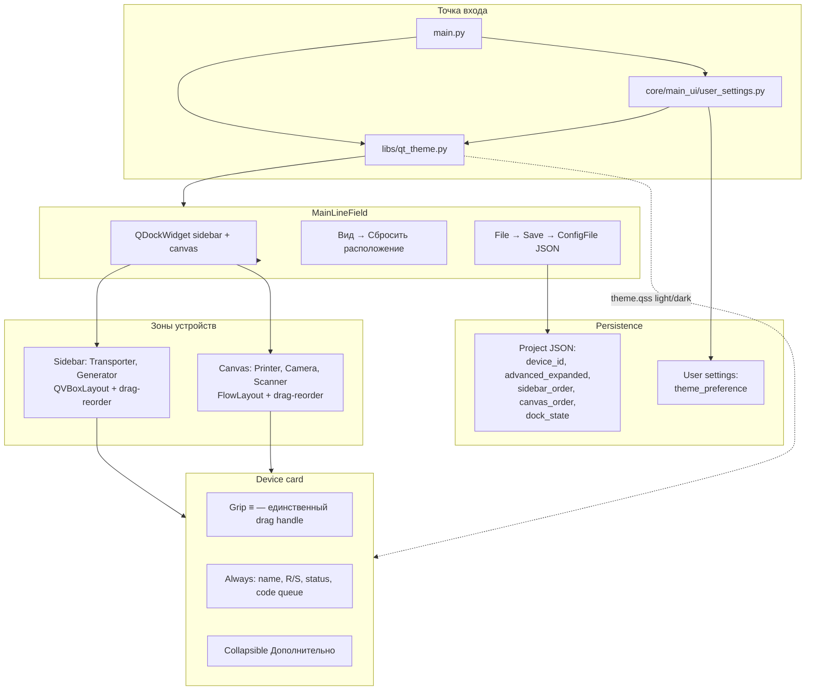

# Монолитная модернизация UI Line Emulator

## Контекст и цель

Line Emulator (`main.py` → `MainLineField` в `core/main_ui/line_emul.py`) — desktop-приложение PySide6 6.7.1 для визуальной эмуляции производственной линии. Сейчас главное окно — фиксированный split: левая колонка (`scaTransporters` + `transporters_layout`) и правый холст (`scaDevices` + `FlowLayout`). Стили размазаны по шести `.ui`-файлам; фоны типов устройств документированы в `docs/line_emulator/frontend/widget-backgrounds.md`, но в рантайме только `Scanner.ui` содержит `QWidget#Form { background-color }` — регрессия после widget-backgrounds.

**Подтверждённые решения grilling-сессии (финальные, не пересматривать):**

| Область | Решение |
|---------|---------|
| Scope | Только Line Emulator; Manager/Monitor и др. не трогать |
| Layout | `QMainWindow` + `QDockWidget`: sidebar (transporter + generator) и canvas (camera + printer + scanner) — dockable (float, tab, left/right) |
| Canvas | Auto-wrap (`FlowLayout`) + drag-reorder; **без** free x/y |
| Sidebar | Вертикальный список (1 колонка) + drag-reorder |
| Зоны | Строгое разделение: transporter/generator → только sidebar; camera/printer/scanner → только canvas |
| DnD | Только через grip «≡» в заголовке карточки; не вся карточка, без модификаторов |
| Сброс | Меню «Вид → Сбросить расположение» — default dock + default device order |
| Persistence | В project JSON, **только при File→Save** (не auto на каждый drag) |
| Project JSON | `sidebar_order[]`, `canvas_order[]`, `dock_state` (base64 `QMainWindow.saveState()`), per-device `advanced_expanded: bool` (default collapsed для новых) |
| Migration | Старые JSON без новых полей → default order + sidebar слева, canvas справа |
| Theme | Light + Dark в первом релизе; system default + manual override в меню; preference в **user settings** (глобально), не в project file |
| Design system | Центральный `theme.qss` + tokens; палитра фонов по типу (Printer `#fff3e0`, Camera `#e8f5e9`, Scanner `#f3e5f5`, Transporter `#e3f2fd`, Generator `#fff9c4`); sans-serif для UI, monospace только для code lists / tech fields |
| Widgets | Collapsible «Дополнительно» на всех 5 типах; collapsed by default; always visible: имя, Run/Stop, ключевой статус, очередь кодов |
| Delivery | **Монолит** — один план, один релиз (без фаз 1→2→3) |

**Успех:** оператор получает dockable layout с drag-reorder в зонах, сворачиваемые advanced-секции, light/dark/system themes, сохранение layout в project JSON и theme в user settings; старые конфиги открываются без ошибок.

**Ограничения:** без изменений БД/`DB_VERSION`; `forms/*.py` только через pyside6-uic; structured logging; bump `client_info.VERSION` и `CHANGES.LOG` в финальной подзадаче.

## Обзор подхода

1. **Стабильные идентификаторы устройств** — добавить `device_id: str` (shortuuid) во все Pydantic-модели устройств; `sidebar_order`/`canvas_order` ссылаются на `device_id`, не на `id(widget)` (сейчас transporter/generator используют `TRW_{id(self)}` / `GW_{id(self)}` — непригодно для persistence).
2. **Design system** — `media/themes/theme.qss` + Python-tokens в `libs/qt_theme.py`; динамическое свойство `deviceType` на карточках для фона по типу; вынос дублирующего QSS из `.ui`.
3. **Dock shell** — переработать `forms/ui/Main.ui`: убрать фиксированный `QHBoxLayout` с двумя `QScrollArea`; два `QDockWidget` (sidebar, canvas) + central placeholder или canvas-as-central; меню «Вид».
4. **Reorder** — общий chrome карточки (`DeviceCardChrome`) с grip «≡» как единственным drag handle; sidebar — `QVBoxLayout` с insert-on-drop; canvas — расширение `FlowLayout` (`insertWidget` уже есть) + internal drag logic, zone guard.
5. **Theme** — `libs/qt_theme.py`: `ThemeMode` (system/light/dark), detect Windows theme, `apply_theme(app, mode)`; user settings JSON рядом с `WORKDIR` или в `%APPDATA%`; сохранить `windowsvista` workaround для Qt 6.7 popup на light.
6. **Тесты** — unit-тесты migration/order/theme без GUI где возможно; Qt-тесты по паттерну `tests/test_core/test_widget_delete.py`.

### Архитектура (целевое состояние)



## Подзадачи

### 1. Расширение моделей конфигурации и migration

- **ID**: 1
- **Стек**: backend
- **Описание**: Расширить `ConfigFile` и модели устройств:
  - `device_id: str` во всех `*Config` (`PrinterConfig`, `CameraConfig`, `ScannerConfig`, `TransporterConfig`, `GeneratorConfig`);
  - `advanced_expanded: bool = False` в каждом `*Config`;
  - корневые поля `sidebar_order: list[str]`, `canvas_order: list[str]`, `dock_state: str | None = None` (base64);
  - helper `migrate_legacy_config(data: dict) -> ConfigFile` — для JSON без новых полей: сгенерировать `device_id`, построить order из порядка списков (sidebar: transporters→generators, canvas: printers→cameras→scanners), `dock_state=None`, `advanced_expanded=False`.
- **Файлы/модули**: `core/main_ui/data.py`, `core/printing/data.py`, `core/scanning/data.py`, `core/barcode_scanner/data.py`, `core/transporting/data.py`, `core/generator/data.py`, новый `core/main_ui/config_migration.py`
- **Критерии готовности**: `ConfigFile.model_validate_json` принимает старые и новые JSON; migration покрыта unit-тестами; strict pydantic не ломается на optional новых полей с defaults.
- **Зависимости**: нет
- **Оценка**: M

### 2. Модуль user settings (theme preference)

- **ID**: 2
- **Стек**: backend
- **Описание**: Создать `core/main_ui/user_settings.py` с Pydantic-моделью `UserSettings(theme_preference: Literal["system","light","dark"] = "system")`, load/save JSON (путь: `{WORKDIR}/line_emulator_user.json` или `%APPDATA%/DataMatrixControl/line_emulator_user.json` — зафиксировать один путь в docstring). Без Qt-зависимости для тестируемости.
- **Файлы/модули**: `core/main_ui/user_settings.py`
- **Критерии готовности**: load создаёт default при отсутствии файла; save/load roundtrip; типизация и docstrings.
- **Зависимости**: нет
- **Оценка**: S

### 3. Design tokens и skeleton theme.qss

- **ID**: 3
- **Стек**: frontend
- **Описание**: Создать design system:
  - `media/themes/theme_light.qss`, `media/themes/theme_dark.qss` (или единый `theme.qss` с секциями);
  - `libs/qt_theme.py` — refactor: `ThemeMode`, `DesignTokens` (цвета фонов по типу, accent `#f0b321`, border `#17365D`, menu/combo popup rules), `load_stylesheet(mode) -> str`, сохранить `windowsvista` на Windows для light popup-fix;
  - sans-serif (`Segoe UI` / system sans) для labels/buttons/combo; monospace для `QListView` code queues и tech fields (селекторы по `objectName` или property).
- **Файлы/модули**: `media/themes/*.qss`, `libs/qt_theme.py`, `docs/line_emulator/qt_theme.md` (черновик API — финал в #14)
- **Критерии готовности**: QSS содержит правила `QWidget#Form[deviceType="printer"]` и аналоги для 5 типов с палитрой из grilling; tokens documented in code.
- **Зависимости**: нет
- **Оценка**: M

### 4. Стабильный device_id в виджетах

- **ID**: 4
- **Стек**: frontend
- **Описание**: При создании каждого виджета генерировать и хранить `device_id` (shortuuid); включать в `options()` / восстанавливать в `load_options()` / factory methods (`add_printer`, `add_transporter`, …). `MainLineField` — registry `dict[str, QWidget]` по `device_id`. При load без `device_id` в legacy item — assign в migration path (#1).
- **Файлы/модули**: `core/printing/printer_widget.py`, `core/scanning/camera_widget.py`, `core/barcode_scanner/scanner_widget.py`, `core/transporting/transporter_widget.py`, `core/generator/generator_widget.py`, `core/main_ui/line_emul.py`
- **Критерии готовности**: save→load сохраняет `device_id`; order arrays могут ссылаться на стабильные id; transporter/generator больше не полагаются на `id(self)` для persistence.
- **Зависимости**: после #1
- **Оценка**: M

### 5. Device card chrome с grip «≡»

- **ID**: 5
- **Стек**: frontend
- **Описание**: Общий компонент заголовка карточки: `core/main_ui/device_card.py` — `DeviceCardHeader` (grip label/button «≡», optional title slot, delete button); mixin или wrapper `DeviceCardMixin` устанавливает `deviceType` property для QSS; экспорт `DeviceZone` enum (SIDEBAR/CANVAS). Grip — единственный `QDrag` source (custom mime `application/x-line-emulator-device-id`).
- **Файлы/модули**: `core/main_ui/device_card.py`, начальная интеграция в одном виджете-пилоте (можно Printer) для проверки API
- **Критерии готовности**: drag начинается только с grip; mime содержит `device_id` и zone; drop на другую zone отклоняется.
- **Зависимости**: после #3, #4
- **Оценка**: M

### 6. Reorderable sidebar layout

- **ID**: 6
- **Стек**: frontend
- **Описание**: `core/main_ui/sidebar_layout.py` — контейнер для sidebar widgets (transporter + generator): vertical list, accept drops только из SIDEBAR zone, reorder по `device_id`, visual drop indicator. API: `set_order(ids)`, `get_order() -> list[str]`, `add_widget(w)`, `remove_widget(w)`.
- **Файлы/модули**: `core/main_ui/sidebar_layout.py`, `core/main_ui/line_emul.py` (подключение вместо прямого `transporters_layout.addWidget`)
- **Критерии готовности**: drag-reorder transporter↔generator; cross-zone drop на canvas отклоняется; order читается для save.
- **Зависимости**: после #5
- **Оценка**: M

### 7. Reorderable canvas FlowLayout

- **ID**: 7
- **Стек**: frontend
- **Описание**: Расширить `core/main_ui/flow_layout.py` или обёртку `CanvasDeviceArea`: drag-reorder через grip mime, только CANVAS zone, auto-wrap сохранён; `set_order(ids)`, `get_order()`. Не путать с DnD code queues (`libs/model_processing.py`, `libs/drag_drop_list_view.py`).
- **Файлы/модули**: `core/main_ui/flow_layout.py`, новый `core/main_ui/canvas_area.py` (если нужен), `core/main_ui/line_emul.py`
- **Критерии готовности**: reorder printer/camera/scanner на canvas; drop transporter/generator отклоняется; wrap layout работает при resize.
- **Зависимости**: после #5
- **Оценка**: M

### 8. Main.ui — QMainWindow + QDockWidget

- **ID**: 8
- **Стек**: frontend
- **Описание**: Переработать `forms/ui/Main.ui`:
  - убрать фиксированный horizontal split (`scrollArea_2` + `scrollArea`);
  - `QDockWidget` `dockSidebar` (objectName для restore) — host для sidebar layout;
  - `QDockWidget` `dockCanvas` или central widget для canvas;
  - меню `menuView` («Вид»): actions `acResetLayout`, `acThemeSystem`, `acThemeLight`, `acThemeDark` (checkable group);
  - default: sidebar Left, canvas Right (Main area).
  - Минимизировать inline QSS — перенос в theme (#10).
- **Файлы/модули**: `forms/ui/Main.ui` → regenerate `forms/Main.py`
- **Критерии готовности**: docks float/tab/dock; scroll внутри dock areas; меню «Вид» присутствует.
- **Зависимости**: нет (можно параллельно с #3)
- **Оценка**: M

### 9. MainLineField — dock state, order, reset layout

- **ID**: 9
- **Стек**: frontend
- **Описание**: Интеграция в `MainLineField`:
  - `_apply_default_layout()` — dock areas + default device order;
  - `open_config` / `process_config` — restore order via sidebar/canvas layouts, `restoreState` from `dock_state` or defaults;
  - `save_configuration_to_file` — write order arrays, `saveState().toBase64()`, `advanced_expanded` per device;
  - `acResetLayout` → default dock + default order (не меняет unsaved project until Save);
  - routing add/remove через sidebar/canvas containers;
  - bulk iterators respect visual order.
- **Файлы/модули**: `core/main_ui/line_emul.py`
- **Критерии готовности**: save/load roundtrip layout; legacy JSON opens with migration defaults; reset restores defaults without crash.
- **Зависимости**: после #1, #4, #6, #7, #8
- **Оценка**: L

### 10. Collapsible «Дополнительно» — 5 типов устройств

- **ID**: 10
- **Стек**: frontend
- **Описание**: В каждом `forms/ui/{Printer,Camera,Scanner,Transporter,Generator}.ui`:
  - header row: grip (from chrome #5), name, Run/Stop, delete;
  - always visible: key status + code queue (`lstData` / аналог);
  - `QToolButton` «Дополнительно» toggles `QWidget` advanced panel;
  - **Advanced (ориентир):** Printer — port, buffer; Camera — interval, packet/no-read/duplicate/grade settings; Scanner — COM params, suffix, bulk-related; Transporter — interval, from/to combos; Generator — type, GTIN, interval, target combo;
  - widget Python: `set_advanced_expanded(bool)`, read state for save.
- **Файлы/модули**: `forms/ui/*.ui` (5 device), `core/*/\*_widget.py` (5 files), regenerate `forms/*.py`
- **Критерии готовности**: все 5 типов collapsed by default; toggle работает; state в project JSON on Save; always-visible блок не скрывается.
- **Зависимости**: после #5
- **Оценка**: L

### 11. Централизация QSS — вынос из .ui

- **ID**: 11
- **Стек**: frontend
- **Описание**: Удалить дублирующий QSS из `forms/ui/*.ui` (кнопки, combo popup, scrollbar, menu — где перенесено в theme); оставить в `.ui` только layout/geometry; device backgrounds через `deviceType` property + theme.qss; исправить регрессию фонов (только Scanner имеет `#f3e5f5` в Form сейчас). Обновить `docs/line_emulator/frontend/widget-backgrounds.md`.
- **Файлы/модули**: `forms/ui/Main.ui`, `forms/ui/{Printer,Camera,Scanner,Transporter,Generator}.ui`, `media/themes/*.qss`, `libs/qt_theme.py`
- **Критерии готовности**: 5 типов показывают документированные фоны в light theme; `.ui` не содержат massive duplicate QSS blocks; pyside6-uic regenerate done.
- **Зависимости**: после #3, #8, #10
- **Оценка**: M

### 12. Dark theme + меню переключения + main.py

- **ID**: 12
- **Стек**: frontend
- **Описание**: Завершить dark QSS (menu, combo popup, device cards, docks); `MainLineField` — connect theme actions, persist via `UserSettings` on change; `main.py` — load user settings, `apply_theme(app, effective_mode)` before `MainLineField`; Windows system theme detection (registry `AppsUseLightTheme` или `QStyleHints.colorScheme()` if available in 6.7); keep `QT_QPA_PLATFORM=windows:darkmode=0` behavior documented.
- **Файлы/модули**: `main.py`, `libs/qt_theme.py`, `media/themes/*.qss`, `core/main_ui/line_emul.py`, `core/main_ui/user_settings.py`
- **Критерии готовности**: light/dark/system работают на Windows 11; preference переживает restart; popup readable в обеих темах.
- **Зависимости**: после #2, #3, #11
- **Оценка**: M

### 13. Unit-тесты persistence, migration, theme

- **ID**: 13
- **Стек**: backend
- **Описание**: Тесты:
  - `tests/test_core/test_config_layout_migration.py` — legacy JSON, order arrays, device_id assignment;
  - `tests/test_core/test_user_settings.py` — theme preference roundtrip;
  - `tests/test_libs/test_qt_theme.py` — effective mode resolution, token loading (без GUI или minimal QApplication);
  - Qt tests: order restore / reset layout smoke (`MainLineField` pattern from `test_widget_delete.py`).
- **Файлы/модули**: `tests/test_core/`, `tests/test_libs/`
- **Критерии готовности**: `.\venv\Scripts\python.exe -m pytest` green для новых тестов.
- **Зависимости**: после #1, #2, #9, #12
- **Оценка**: M

### 14. Версия, CHANGES.LOG, техническая документация, PyInstaller

- **ID**: 14
- **Стек**: backend
- **Описание**: Bump `client_info.VERSION`; запись в `CHANGES.LOG`; обновить `docs/line_emulator/qt_theme.md`, `docs/line_emulator/line_emulator.md`, `docs/line_emulator/frontend/widget-backgrounds.md`; новый `docs/line_emulator/frontend/layout-and-docking.md` (dock, order, reset, zones); при новых модулях — `hiddenimports` в `build/spec/main.spec` (`core.main_ui.device_card`, `core.main_ui.config_migration`, …).
- **Файлы/модули**: `client_info.py`, `CHANGES.LOG`, `docs/line_emulator/**`, `build/spec/main.spec`
- **Критерии готовности**: docs отражают финальный API; VERSION incremented; spec собирается.
- **Зависимости**: после #9–#13
- **Оценка**: S

## Чеклист выполнения

- [x] 1. Расширение моделей конфигурации и migration
- [x] 2. Модуль user settings (theme preference)
- [x] 3. Design tokens и skeleton theme.qss
- [x] 4. Стабильный device_id в виджетах
- [x] 5. Device card chrome с grip «≡»
- [x] 6. Reorderable sidebar layout
- [x] 7. Reorderable canvas FlowLayout
- [x] 8. Main.ui — QMainWindow + QDockWidget
- [x] 9. MainLineField — dock state, order, reset layout
- [x] 10. Collapsible «Дополнительно» — 5 типов устройств
- [x] 11. Централизация QSS — вынос из .ui
- [x] 12. Dark theme + меню переключения + main.py
- [x] 13. Unit-тесты persistence, migration, theme
- [x] 14. Версия, CHANGES.LOG, техническая документация, PyInstaller

## Волны выполнения

- **Волна 1:** #1 (backend), #2 (backend), #3 (frontend), #8 (frontend) — нет общих файлов, нет зависимостей
- **Волна 2:** #4 (frontend) — после #1
- **Волна 3:** #5 (frontend) — после #3, #4
- **Волна 4:** #6 (frontend), #7 (frontend), #10 (frontend) — после #5; между собой параллельно (разные файлы)
- **Волна 5:** #9 (frontend) — после #6, #7, #8
- **Волна 6:** #11 (frontend) — после #8, #10; #12 (frontend) — после #2, #3, #11 (можно начать #12 после #11 в той же волне последовательно)
- **Волна 7:** #13 (backend) — после #9, #12
- **Волна 8:** #14 (backend) — после #13

## Процесс выполнения

**Обязательно:** каждая подзадача проходит цикл по полю **Стек**:

- `backend` → `developer` → `code-review` → `tech-writer`
- `frontend` → `frontend-developer` → `frontend-code-review` → `frontend-tech-writer`

**После всех подзадач (#1–#14)** оркестратор запускает **`user-doc-writer`**: `user-guides/`, `WHATSNEW.md` — отдельная numbered subtask **не создаётся**.

```text
/execute-plan .plans/backlog/2026-07-23-line-emulator-ui-modernization.md
```

## Ручной чеклист QA (Windows 11)

### Подготовка

- [ ] Системная тема Windows: **Светлая** → полный прогон секций A–E
- [ ] Системная тема Windows: **Тёмная** → полный прогон секций A–E
- [ ] Тестовый legacy JSON без `sidebar_order` / `canvas_order` / `dock_state` / `device_id`

### A. Layout и docking

- [ ] Старт: sidebar слева, canvas справа (default)
- [ ] Dock sidebar вправо, canvas влево — float, tab together
- [ ] «Вид → Сбросить расположение» → default zones + default order
- [ ] Resize окна: canvas wrap, sidebar scroll

### B. Drag-reorder (только grip «≡»)

- [ ] Canvas: reorder printer / camera / scanner — порядок меняется
- [ ] Sidebar: reorder transporter / generator
- [ ] Drag за body карточки — **не** двигает
- [ ] Попытка перетащить transporter на canvas — отклонено
- [ ] Попытка перетащить camera в sidebar — отклонено

### C. Collapsible «Дополнительно»

- [ ] Новый виджет каждого типа — advanced **свёрнут**
- [ ] Toggle раскрывает COM/interval/bulk/etc.
- [ ] Run/Stop, имя, очередь кодов видны при collapsed

### D. Persistence (Save only)

- [ ] Drag-reorder + dock changes **без Save** → reopen app / reload — **не** сохранено
- [ ] File→Save → reopen — order, dock_state, advanced_expanded восстановлены
- [ ] Legacy JSON → migration defaults, без ошибок

### E. Themes

- [ ] Preference «Как в системе» следует Windows light/dark
- [ ] Manual Light / Dark override работает независимо от системы
- [ ] Restart app — theme preference сохранена (user settings, не project)
- [ ] QMenuBar, QComboBox popup, device card backgrounds читаемы в light и dark
- [ ] Device type colors различимы в обеих темах

## Риски и открытые вопросы

- **Qt 6.7 dark + windowsvista:** dark theme может потребовать отдельной ветки стиля (не `windowsvista`) — проверить popup в #12; задокументировать компромисс.
- **Порядок vs bulk control:** `_iter_printers` и аналоги должны использовать visual order (#9), иначе bulk actions не совпадут с UI.
- **Collapsible + Designer:** крупные правки `.ui` — риск merge-конфликтов; regenerate обязателен после каждой волны UI.
- **device_id в legacy:** при migration order строится из list order в JSON — если порядок в старых файлах не соответствовал UI, первое открытие может переупорядочить; acceptable per grilling migration rule.

## Следующий шаг

Запустить **волну 1** параллельно: `developer` для **#1** и **#2**, `frontend-developer` для **#3** и **#8**.

```text
/execute-plan .plans/backlog/2026-07-23-line-emulator-ui-modernization.md
```

## Журнал изменений плана

| Дата | Изменение |
|------|-----------|
| 2026-07-23 | Подзадача **#10** выполнена: collapsible «Дополнительно» на всех 5 типах; docs — device-card.md |
| 2026-07-23 | Создан монолитный план UI modernization Line Emulator (14 подзадач, grilling decisions) |
