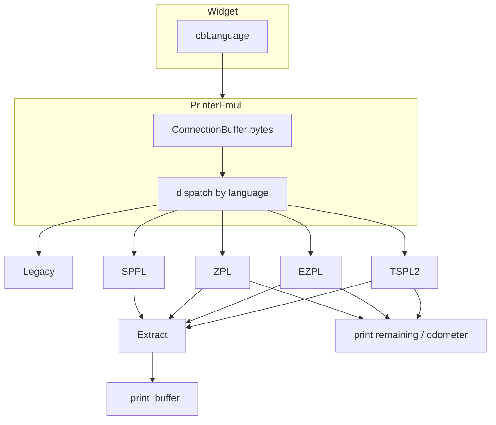

# Эмуляция языков принтера (оркестрация субагентов)

## Контекст и цель

Эмулятор [`core/printing/printer_core.py`](core/printing/printer_core.py) должен:

1. Принимать задание на печать и класть **код** в `_print_buffer` (как сейчас).
2. Корректно отвечать на запросы статуса **языком запроса**.
3. Дать явный выбор типа принтера в виджете: **Legacy / TSPL2 / EZPL / ZPL / SAVEMA**.

Контракты:

- Print Station Mini: [`.plans/PRINTER_INTEGRATION_EMULATOR.md`](../PRINTER_INTEGRATION_EMULATOR.md)
- SAVEMA SPPL Rev.11: [`docs/SPPL - Rev11.pdf`](../../docs/SPPL%20-%20Rev11.pdf)

**Успех:** PSM на TSPL2/EZPL/ZPL проходит identity/status/queue; SAVEMA-клиент получает `~SPGRES{…}^`; GS1 из нативных полей и очередей `SPLAMQ` попадает в буфер линии; растровые задания не роняют TCP; старые JSON без `language` работают как Legacy.

**Вне объёма:** GoDEX+ZPL как отдельный пункт combo; команды PSM §12 (`~K1`, `~HQOD`); полная таблица 100+ SPPL config/traverse; камера.

## Правила оркестрации

- Один субагент = одна подзадача (или явно помеченная «волна»).
- **Один писатель на файл.** Матрица владельцев ниже. Не параллелить задачи с общим файлом.
- Не вызывать Shell/терминал без явного разрешения пользователя (`AGENTS.md`). Скачивание PDF и `uic` — только после «да».
- Не коммитить. Не трогать `build/`, `.idea/`.
- После любых правок исходников: `CHANGELOG.md` + при смене модулей `index.md` — это **подзадача 16**, не каждый агент.
- Реализация только по этому плану; не расширять scope.

## Целевая архитектура



Новые модули (создают агенты 2–9, интегратор 10 только подключает):

| Модуль | Владелец | Назначение |
|--------|----------|------------|
| `core/printing/data.py` | **#2** | `PrinterLanguage`, поле конфига |
| `core/printing/dialects/base.py` | **#2** | ABC диалекта + общее состояние устройства |
| `core/printing/framing.py` | **#3** | recv bytes, кадры BITMAP/Q/GFA/SPPL |
| `core/printing/extract.py` | **#4** | извлечение GS1 по языку |
| `core/printing/dialects/tspl2.py` | **#5** | ESC !?, LABEL, BITMAP/PRINT |
| `core/printing/dialects/ezpl.py` | **#6** | ~HI GoDEX, STATUS/LABEL, Q…E |
| `core/printing/dialects/zpl.py` | **#7** | ~HI Zebra, ~HS, SGD, ^GFA |
| `core/printing/dialects/sppl.py` | **#8** | SAVEMA ~SP…^ |
| `core/printing/dialects/legacy.py` | **#9** | CHW + старые ~S/~HS; SPPL → #8 |
| `core/printing/printer_core.py` | **#10** | TCP-сервер, dispatch, очередь печати |
| `forms/ui/Printer.ui` + виджет/прокси | **#11** | combo |
| `backend/services/device_manager.py` | **#12** | прокидка language |

`libs/sockets.py` **не менять** для остальных устройств: бинарный recv живёт в `framing.py` / `printer_core`.

## Волны запуска

```text
Волна 0 (параллельно):  #1 docs     #2 контракт (data + base)
Волна 1 (после #2):     #3 framing  #4 extract  #11 UI  | затем параллельно #5 #6 #7 #8
Волна 2 (после #8):     #9 legacy
Волна 3 (после #3–#9):  #10 PrinterEmul
Волна 4 (после #10+#11): #12 backend  #13–#15 тесты
Волна 5:                #16 CHANGELOG + index.md
```

#1 не блокирует код. #11 может идти параллельно диалектам, если #2 уже добавил `language` в `PrinterConfig`.

---

## Подзадачи

### 1. Мануалы языков в `docs/printing`

- **ID**: 1
- **Стек**: docs
- **Агент**: docs / generalPurpose
- **Параллельно с**: #2
- **Описание**:
  1. Создать `docs/printing/manuals/` и `docs/printing/README.md` (источники, дата 2026-09-16, какие команды эмулируем).
  2. Скачать PDF **только после разрешения пользователя** на команды:
     - TSPL2: `https://fs.tscprinters.com/system/files/31-0000001-00_tspl_tspl2_programming_3_0.pdf`
     - EZPL: `https://godex.com.ua/components/com_jshopping/files/demo_products/EZPL_O.4_EN.pdf`
     - ZPL: `https://www.zebra.com/content/dam/support-dam/en/documentation/unrestricted/guide/software/zpl-zbi2-pg-en.pdf`
  3. SAVEMA не качать. В README дать ссылку на [`docs/SPPL - Rev11.pdf`](../../docs/SPPL%20-%20Rev11.pdf).
  4. Если скачивание ещё не разрешено — README с URL и пометкой «положить PDF сюда»; не блокировать остальные волны.
- **Файлы**: только `docs/printing/**`
- **Критерии**: README описывает 4 языка; SPPL-ссылка живая; PDF либо лежат в `manuals/`, либо явно listed as pending download.
- **Зависимости**: нет
- **Оценка**: S

### 2. Контракт: язык, состояние, ABC диалекта

- **ID**: 2
- **Стек**: backend
- **Агент**: generalPurpose
- **Блокирует**: #3–#12
- **Описание**: Минимальный контракт, без TCP и без логики команд.
  - В [`core/printing/data.py`](../../core/printing/data.py):
    - `class PrinterLanguage(str, Enum): legacy / tspl2 / ezpl / zpl / sppl`
    - `PrinterConfig.language: PrinterLanguage = PrinterLanguage.legacy` (старые JSON без поля грузятся)
  - Новый `core/printing/dialects/__init__.py` и `base.py`:
    - `PrinterDeviceState`: odometer, remaining, busy_phase (`idle|processing|printing`), error flags, `savema_state`, named FIFOs SPPL, `_print_buffer` **не дублировать** — буфер линии остаётся в `PrinterEmul`, диалект зовёт callback `on_codes(list[str])`.
    - ABC `PrinterDialect`:
      - `try_handle_query(buf: bytearray) -> tuple[int, bytes | None]` — (сколько байт съесть, ответ или None если не query)
      - `try_handle_job(buf: bytearray) -> tuple[int, list[str]]` — съесть полный формат, вернуть коды (пусто если ещё не полный кадр: вернуть `(0, [])`)
      - без ACK на формат
  - Не реализовывать команды. Не править `printer_core.py` (владелец #10), кроме необходимости импорта — лучше не трогать.
- **Файлы**: `core/printing/data.py`, `core/printing/dialects/__init__.py`, `core/printing/dialects/base.py`
- **Критерии**: pydantic грузит старый `{"name","port","buffer"}`; enum сериализуется строкой.
- **Зависимости**: нет
- **Оценка**: S

### 3. Бинарный framing

- **ID**: 3
- **Стек**: backend
- **Агент**: generalPurpose
- **Описание**: `core/printing/framing.py` — чистые функции, без сокетов Qt.
  - Накопительный `bytearray` на соединение.
  - TSPL2: найти `BITMAP x,y,B,H,mode,` → прочитать ровно `B*H` байт → ждать `\r\nPRINT`. Не сканировать команды внутри bitmap.
  - EZPL: после `Q0,0,B,H\r\n` ровно `B*H` байт + суффикс `\r\nE\r\n`.
  - ZPL: `^XA` … `^GFA,N,N,B,` + ровно `2*N` hex + `^FS^PQ1^XZ\r\n`.
  - SPPL: команды `~…^`, цепочки через `|`; не резать внутри `{…}`.
  - Неполные данные → «ещё не кадр».
  - Фикстуры из PSM: EZPL B=2,H=8, 16×`0x47` + `\r\nE\r\n`; TSPL 16×16 hex `00000000…1FFF`.
- **Файлы**: `core/printing/framing.py`, `tests/test_core/test_printer_framing.py` (можно сразу, владелец этого агента)
- **Критерии**: тесты на полный кадр, нарезку по 1 байту, CR/LF/NUL/`PRINT`/`E` внутри растра не завершают кадр рано.
- **Зависимости**: #2 (типы не обязательны, но согласовать импорты)
- **Оценка**: M

### 4. Извлечение кода

- **ID**: 4
- **Стек**: backend
- **Агент**: generalPurpose
- **Описание**: `core/printing/extract.py`. Логику перенести из [`libs/template_parsers.py`](../../libs/template_parsers.py), не ломая импорт: оставить тонкие обёртки `extract_barcode_value_from_template` / `process_barcode`, делегирующие сюда (этот файл — единственный, кто правит `template_parsers.py`).
  - TSPL2: `DMATRIX` / `BARCODE "content"`; `~1`, `~dNNN`, `~~`.
  - EZPL: `XRB…,length` + следующие `length` байт; `BR,…`.
  - ZPL: `^FD`/`^FH^FD` включая `_7e`; не брать hex `^GFA`.
  - SPPL: пары `Field~gt~rows` из `SPLAMQ`/`SPLAQD`; все значения длиной ≥13, не только поле `barcode`; `SPMC2D`/`SPMCBV`/`SPMCSV`; XML `SPLTDS` `<Data>` у 2D/Barcode.
  - Растр: собрать изображение (TSPL инверсия 0=чёрный; EZPL/ZPL 1=чёрный) → `pylibdmtx.decode`. Ошибка decode ≠ ошибка задания.
- **Файлы**: `core/printing/extract.py`, `libs/template_parsers.py`, `tests/test_core/test_printer_extract.py`
- **Критерии**: старый пример XRB в `template_parsers.__main__` остаётся зелёным; AMQ с полем не `barcode` извлекает GS1; `process_barcode` снимает `~1`.
- **Зависимости**: #2
- **Оценка**: M

### 5. Диалект TSPL2

- **ID**: 5
- **Стек**: backend
- **Агент**: generalPurpose
- **Описание**: `core/printing/dialects/tspl2.py`.
  - Query: `ESC !?` (hex `1B 21 3F`, без CR/LF) → 1 байт флагов. Ready = `0x00`. Маски: `01` head, `02` jam, `04` paper, `08` ribbon, `10` pause, `20` printing, `80` other. Не слать ASCII `"00"`.
  - `OUT NET "PSM_LABEL=";STR$(LABEL)\r\n` → `PSM_LABEL={odometer}\r\n`.
  - Job: framing BITMAP + PRINT 1,1 → `on_codes` + remaining++. CLS не сбрасывает odometer.
  - Не отвечать на `~HI` / `~S,STATUS`.
- **Файлы**: только `core/printing/dialects/tspl2.py` (+ свой unit-тест `tests/test_core/test_printer_tspl2.py` если удобно)
- **Критерии**: фикстуры PSM §8.4–8.5; bitmap с байтом `PRINT` внутри не триггерит вторую этикетку.
- **Зависимости**: #2, использовать API #3/#4 (импорт; если файлов ещё нет — писать вызовы по контракту, интегратор поправит)
- **Оценка**: M

### 6. Диалект EZPL (GoDEX)

- **ID**: 6
- **Стек**: backend
- **Агент**: generalPurpose
- **Описание**: `core/printing/dialects/ezpl.py`.
  - `~HI` → `\x02EZ2350i,V1.151p,12,1014KB\x03\r\n`
  - `~S,STATUS\r\n` → `aa,nnnnn\r\n` (00 idle remaining=0; 50 printing; 60 processing). Busy-фаза после job обязательна: клиент должен увидеть `50` затем `00`.
  - `~S,LABEL\r\n` → 3–5 цифр остатка (`015`, не `15`, не `1`).
  - Job: конверт `^Q/^W/^P1/^C1/^R0/~R200/^L` + `Q0,0,B,H` + raster + `\r\nE\r\n`.
  - Согласовать remaining STATUS со значением LABEL.
- **Файлы**: `core/printing/dialects/ezpl.py`, опционально `tests/test_core/test_printer_ezpl.py`
- **Критерии**: PSM §8.1, §8.6, §8.7, §9.2–9.3 (форматы ответов; тайминги busy — заложить флаг/очередь, длительность выставит #10).
- **Зависимости**: #2
- **Оценка**: M

### 7. Диалект ZPL (Zebra)

- **ID**: 7
- **Стек**: backend
- **Агент**: generalPurpose
- **Описание**: `core/printing/dialects/zpl.py`.
  - `~HI` → STX/ETX **не** EZ2350i, например `\x02ZEBRA-EMU,1.0,8\x03\r\n`
  - `~HS` → три кадра STX/ETX: 12 полей, 11 полей, непустой третий. Готовность по PSM §8.2.
  - SGD `! U1 getvar "odometer.total_label_count"\r\n` → `"123"\r\n`. Odometer++ только по завершению печати (хук состояния; #10 дергает complete).
  - Job: `^XA…^GFA…^PQ1^XZ\r\n`
- **Файлы**: `core/printing/dialects/zpl.py`, опционально `tests/test_core/test_printer_zpl.py`
- **Критерии**: три ETX; поля int.TryParse-совместимы; odometer в кавычках.
- **Зависимости**: #2
- **Оценка**: M

### 8. Диалект SAVEMA SPPL

- **ID**: 8
- **Стек**: backend
- **Агент**: generalPurpose
- **Описание**: `core/printing/dialects/sppl.py` по Rev.11. Вынести и **починить** текущие ветки `~SPL*` / `~SPP*` / `~SPG*` из `printer_core`.
  Обязательные команды:

  | Команда | Ответ |
  |---------|--------|
  | `SPLAMQ` / `SPLAQD` | `~SPGRES{SPLAMQ:OK}^` / `SPLAQD:OK`; FIFO по полям; GS1 ≥13 во все `on_codes` |
  | `SPLGMQ` / `SPLGQC` | `~SPGRES{SPLGMQ:F1=n<F2=n}^` — имя **запрошенной** команды (опечатка PDF с.79 игнорировать) |
  | `SPLCMQ` / `SPLCQD` | `~SPGRES{SPLCMQ:OK}^` + очистка указанных FIFO и кодов линии через callback |
  | `SPMC2D` / `SPMCBV` / `SPMCSV` / `SPMCTV` | `~SPGRES{CMD:OK}^` + код в буфер если ≥13 |
  | `SPPSAP` / `SPPSTP` / `SPPSLQ` | OK/FAIL; SAP→RUNNING, STP→WAITING; разбор `\|` |
  | `SPPSTA` | `~SPGRES{SPPSTA:RUNNING<}^` без `<WORKING` |
  | `SPGGFV` и алиас `SPGGFW` | `~SPGRES{SPGGFV:…}^` (совместимость с текущим клиентом) |
  | `SPGGTP` / `SPGGCP` | числа в SPGRES |
  | `SPLGSD` | `~SPGRES{SPLGSD:a.csv<b.csv}^` не сырой текст |
  | `SPLDDF` | `~SPGRES{SPLDDF:OK}^` не `SPLFFG` |
  | `SPLTDS` / `SPLLTF` / `SPLCDF` | OK-заглушки |

  Прочие `~SP[CLMPGT]…^`: `~SPGRES{CMD:OK}^` (get — правдоподобный пустой/нулевой payload), чтобы клиент не висел.
  Состояние `INIT|WAITING|RUNNING|ERROR` не сбрасывать на reconnect.
- **Файлы**: `core/printing/dialects/sppl.py`, `tests/test_core/test_printer_sppl.py`
- **Критерии**: AMQ с полем не `barcode` кладёт код; CMQ отвечает SPGRES; STA без WORKING; цепочка `~SPPSLQ{1000}|SPPSAP^` обрабатывает обе команды.
- **Зависимости**: #2, #4 (extract SPPL)
- **Оценка**: L

### 9. Диалект Legacy

- **ID**: 9
- **Стек**: backend
- **Агент**: generalPurpose
- **Описание**: `core/printing/dialects/legacy.py` — поведение текущего `_process_status_requests` **кроме** SPPL.
  - Оставить: `ESC !?` / `ESC !.` как сейчас, `~!F`, `DOWNLOAD F`, `~S,CHECK/STATUS/LABEL/BUFCLR/FEED`, `OUT @LABEL`, `~HS` (старый однострочный), MAC, CHW `START/STOP/ORDER/STATE/BOXCLOSE/SPLIT`.
  - Кадры `~SP…^` **делегировать** в экземпляр SPPL (#8), не дублировать.
  - `ORDER` → `get_chw_codes` как сейчас.
- **Файлы**: только `core/printing/dialects/legacy.py`
- **Критерии**: CHW-ветки сохранены; SPPL из Legacy идёт в sppl.py.
- **Зависимости**: #2, **#8**
- **Оценка**: M

### 10. Интеграция `PrinterEmul`

- **ID**: 10
- **Стек**: backend
- **Агент**: generalPurpose
- **Описание**: Переписать [`printer_core.py`](../../core/printing/printer_core.py):
  - `PrinterEmul(name, port, buffer, language=legacy)`
  - recv **bytes** через framing, буфер на сокет
  - выбор диалекта по `language`
  - query → `sendall(response)` (байты, не `.encode()` для ESC !?)
  - job → коды в `_print_buffer` сразу; remaining/busy: короткая задержка в processing-thread (GoDEX 50→00 наблюдаем)
  - reconnect не чистит odometer/очереди SPPL/`_printed`
  - выкинуть монолитный `_process_status_requests`
- **Файлы**: `core/printing/printer_core.py` (+ `__init__.py` dialects re-export если нужно)
- **Не трогать**: `libs/sockets.get_server_socket` можно оставить; `get_data_from_socket` для принтера не использовать.
- **Критерии**: Legacy+CHW не регрессирует по смыслу; TSPL2/EZPL/ZPL/SPPL отвечают своими кадрами; UnicodeDecodeError на BITMAP больше нет.
- **Зависимости**: #3, #4, #5, #6, #7, #8, #9
- **Оценка**: L

### 11. Виджет: выбор языка

- [x] **ID**: 11
- **Стек**: backend / UI
- **Агент**: generalPurpose
- **Описание**:
  - [`forms/ui/Printer.ui`](../../forms/ui/Printer.ui): `QComboBox` `cbLanguage` (Legacy, TSPL2, EZPL, ZPL, SAVEMA) в ряду буфера. Стили combo в форме уже есть.
  - `forms/Printer.py`: править **вручную** (как существующий файл), без `uic`, пока нет разрешения на терминал. Если пользователь разрешит — `.\venv\Lib\site-packages\PySide6\uic.exe -g python --rc-prefix`.
  - [`printer_widget.py`](../../core/printing/printer_widget.py): читать/писать combo; disable вместе с name/port при Run; `options()` включает `language`; ctor/load из `PrinterConfig`.
  - [`printer_proxy.py`](../../core/printing/printer_proxy.py): `start(..., language=)`
  - [`line_emul.py`](../../core/main_ui/line_emul.py): `_load_printers` / `add_printer` прокидывают language.
- **Файлы**: `forms/ui/Printer.ui`, `forms/Printer.py`, `core/printing/printer_widget.py`, `core/printing/printer_proxy.py`, `core/main_ui/line_emul.py`
- **Не трогать**: `printer_core.py` (#10). Proxy вызывает `PrinterEmul(..., language=)` — сигнатуру #2/#10 согласовать (добавить kwarg со default).
- **Критерии**: старый JSON без language → Legacy; combo заблокирован на Run.
- **Зависимости**: #2; пересечение с #10 только по сигнатуре `PrinterEmul` / `PrinterProxy.start` — если #10 ещё нет, proxy передаёт kwargs, интегратор примет.
- **Оценка**: M

### 12. Backend API / DeviceManager

- **Статус**: пропущено (N/A) — в репозитории нет каталога `backend/` и headless DeviceManager API; Line Emulator — только Qt UI + `PrinterProxy` / `PrinterEmul`.
- **ID**: 12
- **Стек**: backend
- **Агент**: generalPurpose
- **Описание**: [`device_manager.py`](../../backend/services/device_manager.py) `PrinterDevice.start` передаёт `config.language`. [`line_service.py`](../../backend/services/line_service.py) не требует новой ручки, если `PrinterConfig` уже в body. Headless-тест конфига: поле language round-trip.
- **Файлы**: `backend/services/device_manager.py`, при необходимости `backend/services/line_service.py`, `backend/tests/test_headless.py` только если ломается загрузка
- **Критерии**: `POST /config` с `"language": "sppl"` поднимает SPPL-эмулятор.
- **Зависимости**: #2, #10, #11 (сигнатуры)
- **Оценка**: S

### 13. Юнит-тесты диалектов и framing

- **ID**: 13
- **Стек**: tests
- **Агент**: generalPurpose
- **Описание**: Свести/дописать тесты без живого TCP (если #3–#8 уже положили свои — проверить полноту, не дублировать файлы):
  - framing: фрагменты по 1 байту, слияние пакетов
  - TSPL ESC !? один байт; PSM_LABEL regex
  - EZPL STATUS `^\d{2},\d{5}$`; LABEL `^[0-9]{3,5}$`; ~HI поля
  - ZPL три STX/ETX; SGD кавычки
  - SPPL таблица #8
- **Файлы**: только `tests/test_core/test_printer_*.py`
- **Критерии**: тесты не открывают порт 9100.
- **Зависимости**: #3–#9
- **Оценка**: M

### 14. Тесты виджета и конфига

- [x] **ID**: 14
- **Стек**: tests
- **Агент**: generalPurpose
- **Описание**: Расширить существующие `tests/test_core/test_bulk_control.py`, `test_widget_delete.py`, `test_scanner_config.py`: `PrinterConfig` с language; `PrinterWidget.options()`; загрузка JSON без language = legacy. Не ломать QApplication-фикстуры.
- **Файлы**: указанные тесты (+ новый `tests/test_core/test_printer_config.py` предпочтительнее, чем раздувать delete-тесты)
- **Критерии**: старые тесты виджета зелёные; round-trip language.
- **Зависимости**: #2, #11
- **Оценка**: S

### 15. Регрессия буфера / proxy

- [x] **ID**: 15
- **Стек**: tests
- **Агент**: generalPurpose
- **Описание**: `PrinterProxy.clear_buffer` / `remove` / `buffer_data` после рефакторинга #10. Образец: `TestPrinterProxyClearBuffer` в `test_bulk_control.py`.
- **Файлы**: `tests/test_core/test_bulk_control.py` (осторожно: общий файл с #14 — **не параллелить #14 и #15**)
- **Критерии**: clear_data на виджете чистит ядро.
- **Зависимости**: #10, #11
- **Оценка**: S

### 16. Документация проекта

- [x] **ID**: 16
- **Стек**: docs
- **Агент**: docs
- **Описание**: По `.cursor/rules/project-docs.mdc`:
  - секция в `CHANGELOG.md` `## [2026-09-16] Эмуляция языков принтера`
  - `index.md`: дерево `core/printing/dialects`, поле `PrinterConfig.language`, combo виджета
  - `README.md` — только если нужно упомянуть выбор типа принтера для пользователя
- **Файлы**: `CHANGELOG.md`, `index.md`, опционально `README.md`
- **Критерии**: одна секция changelog; карта модулей актуальна.
- **Зависимости**: все предыдущие
- **Оценка**: S

---

## Матрица конфликтов файлов

Не запускать одновременно агентов из одной строки:

| Файл | Только агент |
|------|----------------|
| `core/printing/data.py` | #2 |
| `core/printing/dialects/base.py` | #2 |
| `core/printing/framing.py` | #3 |
| `core/printing/extract.py` + `libs/template_parsers.py` | #4 |
| `core/printing/dialects/tspl2.py` | #5 |
| `core/printing/dialects/ezpl.py` | #6 |
| `core/printing/dialects/zpl.py` | #7 |
| `core/printing/dialects/sppl.py` | #8 |
| `core/printing/dialects/legacy.py` | #9 |
| `core/printing/printer_core.py` | #10 |
| `forms/ui/Printer.ui`, `forms/Printer.py`, `printer_widget.py`, `printer_proxy.py`, `line_emul.py` | #11 |
| `backend/services/device_manager.py` | #12 |
| `tests/test_core/test_bulk_control.py` | #15 (после #14) |
| `CHANGELOG.md` / `index.md` | #16 |

## Промпт субагенту (шаблон)

```text
Работай строго по подзадаче ID={N} файла
.plans/complete/2026-09-16-printer-language-emulation.md
Не выходи за список файлов подзадачи.
Терминал не вызывать.
Не пиши CHANGELOG/index.md (это ID 16).
Критерии готовности подзадачи — Definition of Done.
Контракты: .plans/PRINTER_INTEGRATION_EMULATOR.md и docs/SPPL - Rev11.pdf
```

## Прогресс оркестрации

- [x] 1. Мануалы в `docs/printing`
- [x] 2. Контракт (`data.py`, `dialects/base`) — re-review: minor Warning `TypeError`→`ValueError` optional
- [x] 3. Framing (+ review warnings pending hardening)
- [x] 4. Extract (+ review fixes applied)
- [x] 5. TSPL2 dialect
- [x] 6. EZPL dialect
- [x] 7. ZPL dialect
- [x] 8. SPPL dialect
- [x] 9. Legacy dialect
- [x] 10. `printer_core` integration
- [x] 11. UI combo (+ run() fix applied)
- [x] 12. Backend API / DeviceManager — **пропущено** (N/A: нет `backend/` в репозитории)
- [x] 14. Тесты виджета и конфига
- [x] 15. Регрессия буфера / proxy
- [x] 13. Юнит-тесты диалектов (test_printer_*.py, 114 tests in test_core)
- [x] 16. CHANGELOG + index.md + user docs (WHATSNEW)

## Definition of Done всего плана

- [x] Combo языка на виджете принтера, persist в JSON
- [x] TSPL2: ESC !? 1 байт, PSM_LABEL, BITMAP без UTF-8 crash
- [x] EZPL: ~HI EZ2350i, STATUS/LABEL с busy 50→00
- [x] ZPL: ~HS 3 кадра, SGD odometer
- [x] SPPL: AMQ/GMQ/CMQ/STA/SAP по Rev.11, коды не только из поля `barcode`
- [x] Legacy: CHW жив, `~SP` уходит в SPPL
- [x] Тесты без живого TCP
- [x] CHANGELOG + index.md
- [x] Мануалы в docs/printing (README + pending PDF URLs)
