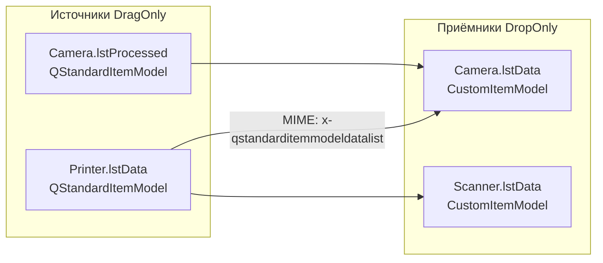

# Восстановление drag & drop между виджетами Line Emulator

## Контекст и цель

Drag & drop между виджетами Line Emulator перестал работать: курсор показывает, что drop возможен, но при отпускании ничего не происходит. Раньше механизм работал (Printer → Scanner/Camera, Camera `lstProcessed` → `lstData`).

**Цель:** восстановить перенос кодов между `QListView` виджетами с сохранением per-code timing (`stamp_item` на границе узла) и внешнего text-drop.

**Успех:** cross-widget DnD снова вставляет коды в целевую очередь; внешний text-drop работает; элементы в `lstData` нормально выделяются.

**Корневая причина:** регрессия от 2026-07-06 — `CustomItemModel.dropMimeData` в [`libs/model_processing.py`](libs/model_processing.py) принимает только `text/plain`, отклоняя стандартный MIME QListView (`application/x-qstandarditemmodeldatalist`). Дополнительно в `flags()` опечатка `&=` вместо `|=`.

## Архитектура DnD

| Виджет | Список | Режим (UIC) | Модель | Роль |
|--------|--------|-------------|--------|------|
| Printer | `lstData` | DragOnly | `QStandardItemModel` | источник |
| Camera | `lstProcessed` | DragOnly | `QStandardItemModel` | источник |
| Camera | `lstData` | DropOnly | `CustomItemModel` | приёмник |
| Scanner | `lstData` | DropOnly | `CustomItemModel` | приёмник |

Настройка в формах: [`forms/Printer.py`](forms/Printer.py), [`forms/Camera.py`](forms/Camera.py), [`forms/Scanner.py`](forms/Scanner.py). Виджеты: [`core/printing/printer_widget.py`](core/printing/printer_widget.py), [`core/scanning/camera_widget.py`](core/scanning/camera_widget.py), [`core/barcode_scanner/scanner_widget.py`](core/barcode_scanner/scanner_widget.py).

Документация: [`docs/line_emulator/model_processing_timing.md`](docs/line_emulator/model_processing_timing.md) — `dropMimeData` для внешнего text-drop; cross-widget DnD через `super().dropMimeData` + `rowsInserted` → `stamp_item`.

## Подзадачи

### 1. Исправить `CustomItemModel.dropMimeData`

- **ID**: 1
- **Стек**: backend
- **Описание**: В [`libs/model_processing.py`](libs/model_processing.py) разделить два пути в `dropMimeData`:
  - **Внутренний DnD** (QListView → QListView): если MIME содержит `application/x-qstandarditemmodeldatalist` или `application/x-qabstractitemmodeldatalist` — делегировать `super().dropMimeData(...)`. После вставки сработает `rowsInserted` → `stamp_item` в [`camera_widget.py`](core/scanning/camera_widget.py) и [`scanner_widget.py`](core/barcode_scanner/scanner_widget.py).
  - **Внешний text-drop**: оставить текущую логику с `create_code_item`.
- **Файлы/модули**: `libs/model_processing.py`
- **Критерии готовности**: `dropMimeData` не возвращает `False` для internal MIME; text-drop без изменений.
- **Зависимости**: нет
- **Оценка**: S

- [x] Выполнено

### 2. Исправить `CustomItemModel.flags`

- **ID**: 2
- **Стек**: backend
- **Описание**: Заменить `flags &= Qt.ItemFlag.ItemIsDropEnabled` на `flags |= Qt.ItemFlag.ItemIsDropEnabled` — элементы очереди сохраняют `ItemIsEnabled`, `ItemIsSelectable` и др.
- **Файлы/модули**: `libs/model_processing.py`
- **Критерии готовности**: валидный индекс имеет `Enabled | Selectable | DropEnabled` (и прочие флаги из `super()`).
- **Зависимости**: нет (можно в одной волне с #1 — тот же файл)
- **Оценка**: S

- [x] Выполнено

### 3. Unit-тесты

- **ID**: 3
- **Стек**: backend
- **Описание**: Добавить в [`tests/test_libs/test_model_processing.py`](tests/test_libs/test_model_processing.py):
  - `test_drop_mime_data_internal_format` — `mimeData(indexes)` из `QStandardItemModel` → `dropMimeData` на `CustomItemModel` → строка появляется;
  - `test_drop_mime_data_text_external` — `QMimeData.setText` → вставка с `ARRIVAL_TIME_ROLE`;
  - `test_custom_item_model_flags` — флаги валидного индекса.
  Без GUI drag-симуляции.
- **Файлы/модули**: `tests/test_libs/test_model_processing.py`
- **Критерии готовности**: все новые тесты зелёные; `pytest tests/test_libs/test_model_processing.py` проходит.
- **Зависимости**: после #1, #2
- **Оценка**: S

- [x] Выполнено

### 4. Документация и журнал

- **ID**: 4
- **Стек**: backend
- **Описание**: Запись в [`CHANGES.LOG`](CHANGES.LOG); инкремент `VERSION` в [`client_info.py`](client_info.py); при необходимости одна строка в [`docs/line_emulator/model_processing_timing.md`](docs/line_emulator/model_processing_timing.md) про делегирование `super()` для internal DnD.
- **Файлы/модули**: `CHANGES.LOG`, `client_info.py`, `docs/line_emulator/model_processing_timing.md`
- **Критерии готовности**: CHANGES.LOG и VERSION обновлены; docs согласованы с кодом.
- **Зависимости**: после #3
- **Оценка**: S

- [x] Выполнено

### 5. Ручная проверка

- **ID**: 5
- **Стек**: backend
- **Описание**: После Build проверить в Line Emulator:
  1. Printer → Scanner: код переносится, исчезает из источника (MoveAction).
  2. Printer → Camera `lstData`.
  3. Camera `lstProcessed` → Camera `lstData`.
  4. Внешний text-drop (текст из блокнота) в `lstData`.
  5. Элементы в `lstData` нормально выделяются.
- **Файлы/модули**: —
- **Критерии готовности**: все 5 сценариев проходят.
- **Зависимости**: после #4
- **Оценка**: S

- [ ] Выполнено

## Что не трогаем

- [`libs/drag_drop_list_view.py`](libs/drag_drop_list_view.py) — мёртвый код, вне scope.
- UIC-формы, `FlowLayout`, стили — не блокируют drop.
- Generator / Transporter — UI DnD не используют.

## Оценка риска

Низкая: восстановление задокументированного поведения; внешний text-drop не меняется; штамповка при cross-widget drop в `rowsInserted` обработчиках виджетов.
