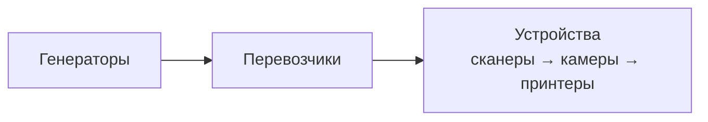

# Массовое управление виджетами

| Параметр | Значение |
|----------|----------|
| План | serial-barcode-scanner-bulk-control, подзадача **#10** |
| Главное окно | `core/main_ui/line_emul.py` → `MainLineField` |
| UI-форма | `forms/ui/Main.ui`, `forms/Main.py` → меню `menuControl` |
| Тесты | `tests/test_core/test_bulk_control.py` |

## Назначение

Меню **«Управление»** в строке меню главного окна позволяет одним действием запускать, останавливать или очищать очереди кодов у групп виджетов на холсте линии — без ручного переключения кнопки Run на каждом устройстве.

Оркестрация выполняется в `MainLineField`; виджеты устройств предоставляют публичный API `clear_data()` для сброса UI-моделей и внутренних буферов ядра **без** остановки эмулятора.

## Структура меню

```
Управление
├── Запустить
│   ├── Всё
│   ├── Принтеры
│   ├── Камеры
│   ├── Сканеры
│   ├── ─────────
│   ├── Перевозчики
│   └── Генераторы
├── Остановить
│   └── (те же пункты)
└── Очистить данные
    ├── Всё
    ├── Принтеры
    ├── Камеры
    └── Сканеры
```

| Подменю | QAction (префикс) | Обработчик в `MainLineField` |
|---------|-------------------|------------------------------|
| Запустить | `acControlStart*` | `_bulk_start_*` |
| Остановить | `acControlStop*` | `_bulk_stop_*` |
| Очистить данные | `acControlClear*` | `_bulk_clear_*` |

Подключение слотов — `_setup_bulk_control_connections()`, вызывается из `setup_connections()` при инициализации окна.

## Правила действий

| Действие | Условие | Механизм | Затронутые типы |
|----------|---------|----------|-----------------|
| **Запустить** | `tbRun.isChecked() == False` | `tbRun.setChecked(True)` → срабатывает `run(True)` виджета | Принтеры, камеры, сканеры, перевозчики, генераторы |
| **Остановить** | `tbRun.isChecked() == True` | `tbRun.setChecked(False)` → `run(False)` | Те же пять типов |
| **Очистить данные** | всегда для выбранной группы | `widget.clear_data()` | Только устройства с очередями: принтер, камера, сканер |

Уже запущенные виджеты при массовом **Запустить** пропускаются; уже остановленные — при **Остановить**. Очистка **не** меняет состояние `tbRun` и не вызывает `run(False)`.

Перевозчики и генераторы **не** имеют пункта «Очистить данные»: у них нет пользовательских очередей кодов в UI; сброс выполняется только на устройствах-источниках/приёмниках.

## Порядок pipeline («Всё»)

Фиксированный порядок снижает гонки при одновременном старте/остановке связанных узлов линии.

### Запуск (`_bulk_start_all`)


1. `_iter_devices()` — принтеры, затем камеры, затем сканеры (порядок в `_device_widgets`).
2. `_iter_transporters()` — все `TransporterWidget`.
3. `_iter_generators()` — все `GeneratorWidget`.

### Остановка (`_bulk_stop_all`)

Обратный порядок; внутри каждой группы устройств обход **в обратном** порядке (`reversed`):



1. Генераторы (`reversed(list(_iter_generators()))`).
2. Перевозчики (`reversed(list(_iter_transporters()))`).
3. Устройства (`reversed(list(_iter_devices()))`).

Порядок подтверждён unit-тестами `test_bulk_start_all_order` и `test_bulk_stop_all_reverse_order` в `tests/test_core/test_bulk_control.py`.

Пункты по отдельному типу (`_bulk_start_printers`, `_bulk_stop_cameras` и т.д.) затрагивают только соответствующий итератор без смешивания групп.

## Оркестрация в `MainLineField`

### Итераторы по типам

| Метод | Источник | Порядок |
|-------|----------|---------|
| `_iter_printers()` | `_device_widgets` | порядок значений dict |
| `_iter_cameras()` | `_device_widgets` | то же |
| `_iter_scanners()` | `_device_widgets` | то же |
| `_iter_devices()` | композиция | принтеры → камеры → сканеры |
| `_iter_transporters()` | `_transporter_widgets` | порядок dict |
| `_iter_generators()` | `_generator_widgets` | порядок dict |

### Статические хелперы

```python
@staticmethod
def _start_widgets(widgets: Iterable[QWidget]) -> None:
    for widget in widgets:
        if not widget.tbRun.isChecked():
            widget.tbRun.setChecked(True)

@staticmethod
def _stop_widgets(widgets: Iterable[QWidget]) -> None:
    for widget in widgets:
        if widget.tbRun.isChecked():
            widget.tbRun.setChecked(False)

@staticmethod
def _clear_device_widgets(
    widgets: Iterable[CameraWidget | PrinterWidget | ScannerWidget],
) -> None:
    for widget in widgets:
        widget.clear_data()
```

`_bulk_clear_all` вызывает `_clear_device_widgets(self._iter_devices())`.

## API `clear_data()` на устройствах

Публичный метод заменил прежние приватные `_clear_data()` (принтер, камера); у сканера метод введён сразу как публичный (подзадача **#4**).

| Виджет | Модуль | UI | Ядро через proxy |
|--------|--------|-----|------------------|
| `PrinterWidget` | `core/printing/printer_widget.py` | `_data_list.clear()`, `model_out.clear()` | `PrinterProxy.clear_buffer()` → `PrinterEmul.clear_buffer()` (`_print_buffer`) |
| `CameraWidget` | `core/scanning/camera_widget.py` | `model_in.clear()`, `model_out.clear()` | `CameraProxy.clear_queues()` → `CameraEmul.clear_queues()` (`_to_send`, `_sent`) |
| `ScannerWidget` | `core/barcode_scanner/scanner_widget.py` | `model_in.clear()`, `model_out.clear()` | `ScannerProxy.clear_queues()` → `ScannerEmul.clear_queues()` |

### Поведение при Run

| Ситуация | Поведение |
|----------|-----------|
| Очистка из меню при **включённом** Run | Эмулятор продолжает работать; сбрасываются отображаемые очереди и буферы ядра |
| Остановка виджета (`run(False)`) | После `stop()` виджет сам вызывает `clear_data()` (как и до #10) |

Для принтера сброс буфера ядра при работающем эмуляторе критичен: иначе в `PrinterEmul._print_buffer` остаются коды, не отражённые в очищенном `model_out`.

Прокси-методы безопасны, если ядро ещё не создано (`_printer` / `_camera` / `_scanner is None` → ранний return).

## Связь с закрытием окна

`closeEvent` по-прежнему останавливает перевозчиков и устройства по одному (`run(False)`), а не через меню «Остановить → Всё». Массовое меню — отдельный пользовательский сценарий во время работы с линией.

## Тестирование

`tests/test_core/test_bulk_control.py`:

| Класс / тест | Проверка |
|--------------|----------|
| `TestDeviceClearData` | `PrinterWidget.clear_data` — UI + `clear_buffer`; `CameraWidget.clear_data` — модели + `clear_queues` |
| `TestMainLineFieldBulkControl` | порядок start/stop «Всё»; пропуск уже running/stopped; `clear_data` на всех устройствах; Run не сбрасывается при clear |
| `TestPrinterProxyClearBuffer` | делегирование в `PrinterEmul` |

Запуск:

```powershell
.\venv\Scripts\python.exe -m pytest tests/test_core/test_bulk_control.py -v
```

## Связанная документация

- [line_emulator.md](line_emulator.md) — карта приложения, `MainLineField`, конфигурация JSON.
- [frontend/scanner-widget.md](frontend/scanner-widget.md) — `ScannerWidget.clear_data()`, `blockSignals` при валидации Run.
- [code_scheduler.md](code_scheduler.md) — планировщик, останавливаемый при `run(False)` устройств с очередями.
