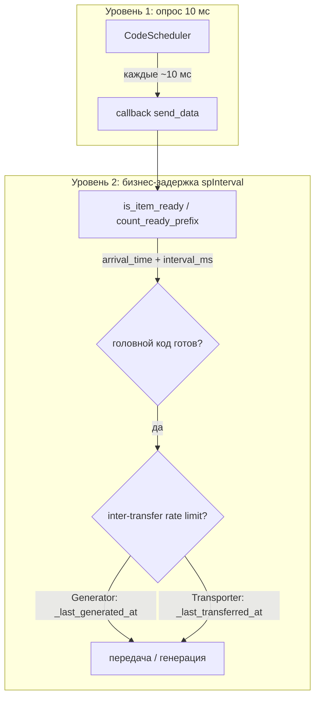
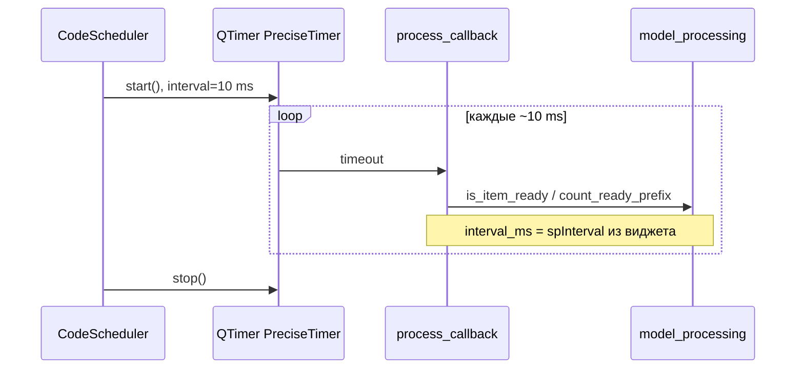
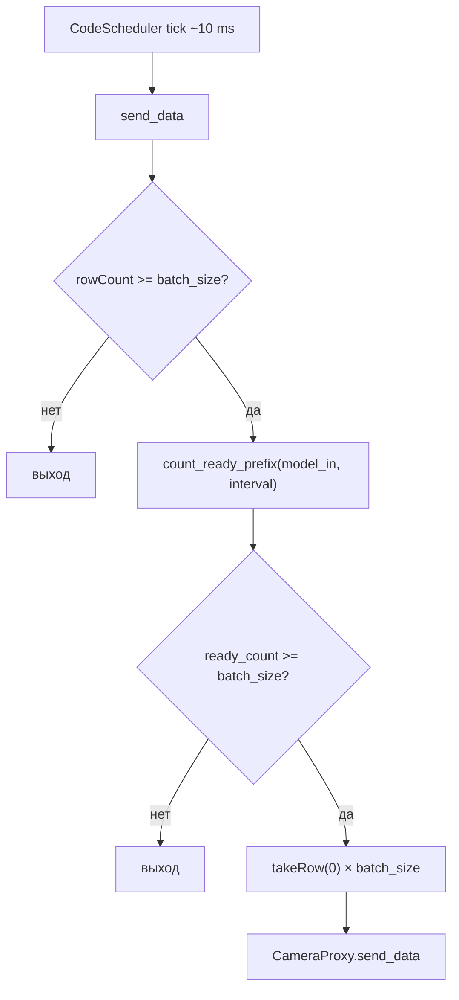
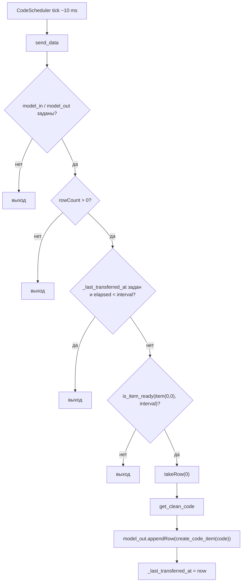
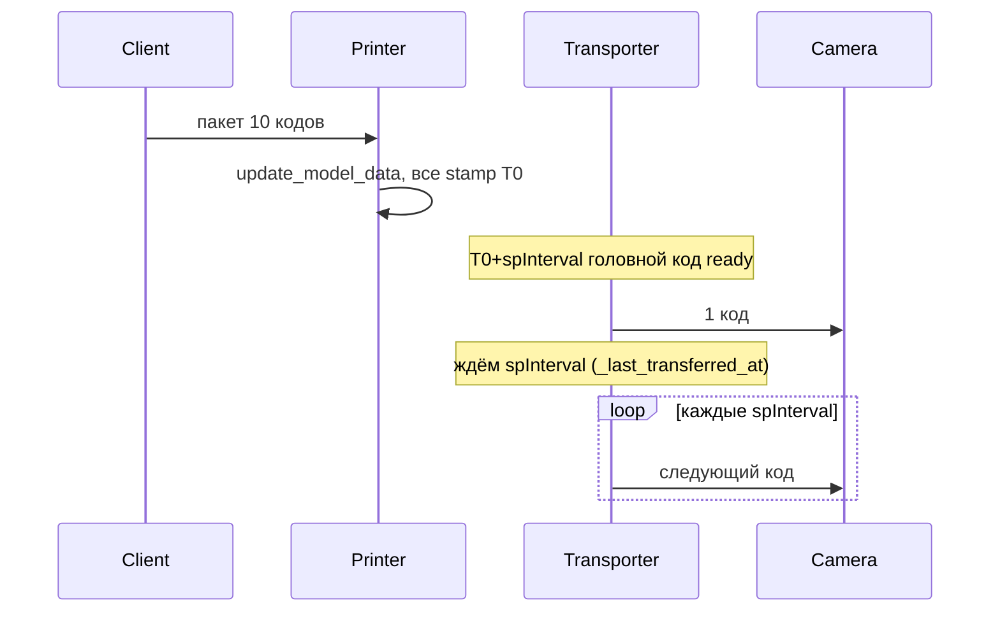
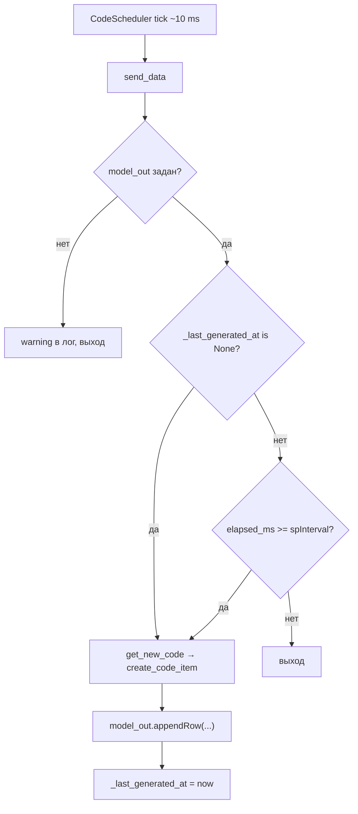

# CodeScheduler — периодический тик для per-code timing

| Параметр | Значение |
|----------|----------|
| Модуль | `libs/code_scheduler.py` |
| Класс | `CodeScheduler` |
| План | per-code transfer timing, подзадачи #2 (класс), #4 (`CameraWidget`), #5 (`TransporterWidget`), #6 (`GeneratorWidget`) |

## Назначение

`CodeScheduler` — тонкая обёртка над `QTimer`, которая с фиксированным коротким интервалом вызывает callback для **опроса готовности** элементов очереди кодов. Используется в виджетах линии (Camera, Transporter, Generator) вместо прежнего `_timer_sender`, у которого интервал совпадал с `spInterval`.

Короткий тик (~10 мс) и бизнес-интервал `spInterval` — **разные величины**:

| Параметр | Где задаётся | Роль |
|----------|--------------|------|
| `SCHEDULER_TICK_MS` (10 мс) | константа в `CodeScheduler` | частота вызова callback; проверка «созрели ли коды» |
| `spInterval` / `interval` | UI виджета, JSON-конфиг | время ожидания **каждого конкретного кода** в очереди узла |

Логика «готов ли код» реализуется в callback через хелперы из `libs/model_processing.py` (`is_item_ready`, `count_ready_prefix`); см. [model_processing_timing.md](model_processing_timing.md).

## Двухуровневая модель таймеров

После рефакторинга per-code timing в pipeline действуют **два независимых уровня** задержки:

| Уровень | Механизм | Интервал | Что ограничивает |
|---------|----------|----------|------------------|
| **Опрос** | `CodeScheduler` (`QTimer`, `PreciseTimer`) | `SCHEDULER_TICK_MS` = 10 мс | Как часто виджет **проверяет** очередь и вызывает `send_data` |
| **Бизнес** | `is_item_ready` / `count_ready_prefix` (+ `_last_*_at` виджета) | `spInterval` из UI / JSON | Сколько код **ждёт в очереди узла** и (для генератора и транспортёра) минимальный зазор **между исходящими** передачами |



**Важно:** короткий тик планировщика **не** заменяет `spInterval`. Он лишь даёт частый опрос, чтобы callback мог заметить момент готовности без привязки таймера Qt к каждому коду. Реальная пауза «один код за `spInterval`» требует либо **разных** `arrival_time` у соседних элементов очереди, либо **отдельного** счётчика последней исходящей операции на виджете (см. генератор и транспортёр с `_last_transferred_at` ниже).

### Другие таймеры линии (не `CodeScheduler`)

| Компонент | Интервал | Роль |
|-----------|----------|------|
| `core/scanning/camera_proxy.py` | 250 мс | Опрос результатов сканирования с устройства |
| `core/printing/printer_proxy.py` | 100 мс | Опрос буфера принтера |

Они **не** задают `spInterval` передачи по pipeline; per-code задержка на камере/транспортёре/генераторе считается через метки в `model_processing.py`.

## Архитектура



Виджеты при старте передачи подключают свой метод (`send_data` или аналог) как `process_callback`. Внутри callback читается актуальное значение `spInterval`, поэтому смена интервала в UI не требует `setInterval` на планировщике.

## API

### Константа

- **`SCHEDULER_TICK_MS: int = 10`** — интервал тика в миллисекундах. Не настраивается извне; единый для всех узлов pipeline.

### `__init__()`

Создаёт внутренний `QTimer` с интервалом `SCHEDULER_TICK_MS` и типом `Qt.TimerType.PreciseTimer` для более стабильного тика на Windows (в отличие от `CoarseTimer` по умолчанию).

### `start(process_callback: Callable[[], None]) -> None`

Подключает callback к сигналу `timeout` и запускает таймер.

- Если планировщик уже был запущен с другим callback, предыдущее соединение отключается, затем подключается новый callback.
- Повторный вызов `start` с тем же или новым callback возобновляет тики (`QTimer.start()`).

### `stop() -> None`

Останавливает таймер, отключает активный callback и сбрасывает ссылку на него (`_callback = None`).

## Поведение и ограничения

- Callback вызывается в потоке Qt GUI (контекст `QTimer`), как и прежний `_timer_sender`.
- Точность ~10 мс зависит от ОС и нагрузки; `PreciseTimer` снижает дрейф на Windows, но не гарантирует жёсткий real-time.
- Планировщик **не** переносит коды и **не** знает о моделях очередей — только периодически вызывает переданную функцию.
- Один экземпляр `CodeScheduler` на виджет; жизненный цикл совпадает с виджетом (создание в `__init__`, `start`/`stop` при включении/выключении передачи).

## Связь с виджетами линии

| Виджет | Планировщик | Логика callback | Inter-transfer rate limit | Статус |
|--------|-------------|-----------------|---------------------------|--------|
| `CameraWidget` | `CodeScheduler` (`_scheduler`) | `count_ready_prefix` + FIFO batch (`spSize`) | нет (batch по `spSize` штатен) | реализовано (#4) |
| `TransporterWidget` | `CodeScheduler` (`_code_scheduler`) | `is_item_ready` для `item(0, 0)` + `_last_transferred_at` | `_last_transferred_at` | реализовано (#5), inter-transfer rate limit (#2) |
| `GeneratorWidget` | `CodeScheduler` (`_scheduler`) | `_last_generated_at` + `create_code_item` | `_last_generated_at` | реализовано (#6) |

`PrinterWidget` и таймер опроса в `camera_proxy.py` **не** используют `CodeScheduler` (данные из сокета / отдельный опрос). Принтер **не** участвует в inter-transfer rate limit — пакет кодов от клиента попадает в `model_out` через `update_model_data` (см. burst ниже).

## Интеграция: CameraWidget (#4)

**Модуль:** `core/scanning/camera_widget.py`  
**Очередь отправки:** `model_in` (`CustomItemModel`, список `lstData`)

При включении камеры (`run(True)`) планировщик стартует с `send_data` как callback; при остановке — `stop()` вместе с остановкой `CameraProxy`.

### Динамический `spInterval`

Интервал передачи читается из `spInterval.value()` **на каждом тике** внутри `send_data`. Отдельного `setInterval` на планировщике нет: смена `spInterval` в UI сразу влияет на проверку готовности (пересчёт по `arrival_time + interval_ms`, см. [model_processing_timing.md](model_processing_timing.md)).

### `send_data` — FIFO batch



| Параметр UI | Роль |
|-------------|------|
| `spInterval` | `interval_ms` для `count_ready_prefix` |
| `spSize` | `batch_size` — число строк, снимаемых с начала очереди за одну отправку |

Алгоритм:

1. Если в `model_in` меньше `batch_size` строк — выход.
2. `ready_count = count_ready_prefix(self.model_in, interval)` — сколько **подряд с row 0** уже «созрели».
3. Если `ready_count < batch_size` — выход (ждём голову очереди; код на позиции N не уйдёт, пока не готов N−1).
4. Иначе `takeRow(0)` повторяется `batch_size` раз, тексты собираются в список и передаются в `_camera.send_data`.

При `batch_size = 1` коды уходят по одному с паузой ~`spInterval` между отправками. При `batch_size > 1` пакет уходит только когда **все первые N** элементов очереди готовы — даже если дальше в очереди уже есть «созревшие» строки.

### `rowsInserted` и `stamp_item`

Сигнал `model_in.rowsInserted` подключён к `_on_model_in_rows_inserted`. При вставке строк (в т.ч. drag-move из `lstProcessed` или другого виджета) для каждого нового элемента вызывается `stamp_item` — метка прибытия сбрасывается на «сейчас», отсчёт `spInterval` начинается заново для этого узла.

Внешний text-drop в `lstData` по-прежнему штампуется в `CustomItemModel.dropMimeData` через `create_code_item` (подзадача #3); `rowsInserted` покрывает перенос уже существующих элементов с возможной старой меткой.

## Интеграция: TransporterWidget (#5)

**Модуль:** `core/transporting/transporter_widget.py`  
**Очереди:** `model_in` — `model_out` виджета-источника (`cbxFrom`); `model_out` — `model_in` виджета-приёмника (`cbxTo`).

**Устройства в combo (подзадача #6 плана scanner):** источник — `CameraWidget`, `PrinterWidget`, `ScannerWidget`; приёмник — `CameraWidget`, `ScannerWidget`. Тип `_device_data`: `dict[int, CameraWidget | PrinterWidget | ScannerWidget]`.

При включении транспорта (`run(True)`) планировщик стартует с `send_data` как callback; при остановке — `stop()`. Комбобоксы источника и приёмника блокируются на время работы.

### Динамический `spInterval`

Интервал передачи читается из `spInterval.value()` **на каждом тике** внутри `send_data`. `set_interval_settings` не меняет таймер планировщика (только заглушка для сигнала UI); смена `spInterval` сразу влияет на `is_item_ready`.

### `_last_transferred_at` — inter-transfer rate limit

Поле `_last_transferred_at: float | None` — monotonic-время последней успешной передачи (по образцу `GeneratorWidget._last_generated_at`). Инициализируется `None` в `__init__`; сбрасывается в `None` при `run(False)`.

На каждом тике `send_data` проверяет **два** независимых условия:

1. **Готовность головы очереди** — `is_item_ready(item(0, 0), interval_ms)` (per-code timing по метке элемента).
2. **Зазор между исходящими передачами** — если `_last_transferred_at` задан, с момента последней передачи должно пройти ≥ `interval_ms` мс.

Первая передача после старта (`_last_transferred_at is None`) ограничена только `is_item_ready`. После успешного `takeRow` + `appendRow` поле обновляется: `_last_transferred_at = now`.

### `send_data` — FIFO, один код за `spInterval`



Алгоритм:

1. Если `model_in` или `model_out` не привязаны — предупреждение в лог и выход.
2. Если очередь источника пуста — выход.
3. `interval_ms = spInterval.value()`, `now = time.monotonic()`.
4. Если `_last_transferred_at` задан и с последней передачи прошло меньше `interval_ms` — выход (inter-transfer rate limit).
5. Проверяется только **первая строка** (`item(0, 0)`): `is_item_ready(item, interval_ms)`.
6. Если головной код ещё не «созрел» — выход (FIFO: код на позиции N не уйдёт, пока не ушёл N−1).
7. Иначе `takeRow(0)` снимает строку с источника; текст очищается через `get_clean_code`; в приёмник добавляется **новый** элемент `create_code_item(code)`; `_last_transferred_at = now`.

Типичная цепочка «камера → транспортёр → принтер»: задержка ~`spInterval` транспортёра отсчитывается от момента попадания кода в `model_out` камеры (метка на источнике), затем в `model_in` принтера попадает элемент с новой меткой.

Цепочка со сканером: приёмник — `ScannerWidget.model_in` (коды ждут отправки в COM); источник — `ScannerWidget.model_out` (коды после подтверждения ядра). См. [frontend/scanner-widget.md](frontend/scanner-widget.md) и [line_emulator.md](line_emulator.md) (раздел «Связь виджетов»).

### `set_from_model` / `set_to_model` — null guards

Если `_get_model_current_widget` возвращает `None` (пустой combo, невалидный индекс, виджет не в `_device_data`), метод логирует предупреждение (`Не выбран источник` / `Не выбран приёмник`) и **не** перезаписывает `model_in` / `model_out`. При старте Run вызываются оба метода для актуализации ссылок после смены combo в покое.

### Burst при пакетном источнике (принтер → транспортёр)

<a id="burst-при-пакетном-источнике-принтер--транспортёр"></a>

Сценарий «клиент шлёт N кодов в принтер → транспортёр → камера» **до** внедрения `_last_transferred_at` выявлял разрыв между уровнями таймеров:

1. **`PrinterWidget`** при обновлении буфера вызывает `update_model_data`: в одном цикле создаётся N элементов через `create_code_item` → у всех **одинаковый** `arrival_time` (см. [model_processing_timing.md — пакетные метки](model_processing_timing.md#пакетные-метки-и-ограничение-is_item_ready)).
2. Через `spInterval` транспортёра **все N** одновременно проходили `is_item_ready` для головы очереди (после снятия предыдущего кода следующий с той же меткой тоже сразу «созрел»).
3. **До фикса:** транспортёр снимал по одному коду на **каждом тике** планировщика (~10 мс), **без** паузы `spInterval` между исходящими передачами.

**Исправление (реализовано, подзадача #2):** поле `_last_transferred_at` в `TransporterWidget` — по аналогии с `GeneratorWidget._last_generated_at`. В `send_data` перед `takeRow` проверяются **и** готовность головы (`is_item_ready`), **и** что с последней передачи прошло ≥ `spInterval` мс; при `run(False)` поле сбрасывается. Дросселирование на транспортёре; `PrinterWidget` не меняется.



Поведение после фикса: принтер 10 кодов, транспортёр `interval=500` → в камеру **1 код / 500 мс**, даже при одинаковых метках в `model_out` принтера.

Цепочка «камера1 → транспортёр → камера2» с одиночными кодами и разнесёнными метками обычно вела себя корректно и до фикса; burst был критичен для пакетного `update_model_data` и batch-scan камеры при `spSize=1` на приёмнике.

## Интеграция: GeneratorWidget (#6)

**Модуль:** `core/generator/generator_widget.py`  
**Приёмник:** `model_out` — ссылка на `model_in` выбранного устройства (`cbxTo`): `CameraWidget` или `ScannerWidget` (подзадача #6 плана scanner).

Генератор **не** читает очередь и **не** использует `is_item_ready` / `count_ready_prefix`: интервал задаётся отдельным полем `_last_generated_at` — monotonic-время последней успешной генерации. На каждом тике планировщика callback решает, прошло ли ≥ `spInterval` мс с предыдущего кода.

При включении (`run(True)`) вызывается `set_to_model()` (привязка `model_out`), планировщик стартует с `send_data`; при остановке — `stop()` и сброс `_last_generated_at = None`. Комбобокс приёмника (`cbxTo`) блокируется на время работы.

### Динамический `spInterval`

Интервал читается из `spInterval.value()` **на каждом тике** внутри `send_data`. `set_interval_settings` не меняет таймер планировщика (заглушка для сигнала UI); смена `spInterval` сразу влияет на порог `elapsed_ms` для следующей генерации.

### `send_data` — генерация по интервалу



Алгоритм:

1. Если `model_out` не привязан (`None`) — предупреждение в лог (`Не задан приёмник`) и выход.
2. `interval_ms = spInterval.value()`, `now = time.monotonic()`.
3. Если `_last_generated_at` задан и с момента последней генерации прошло меньше `interval_ms` — выход.
4. Иначе `get_new_code(gtin, code_type)` → `get_clean_code` → `model_out.appendRow(create_code_item(code))`; `_last_generated_at = now`.

Первая генерация после старта выполняется сразу на первом подходящем тике (`_last_generated_at is None`). Каждый новый код в очереди приёмника получает свежую метку `ARRIVAL_TIME_ROLE` через `create_code_item` (точка входа pipeline, подзадача #3).

Типичный сценарий: `interval=300` — коды появляются в `model_in` камеры или сканера примерно каждые 300 мс; на камере дальнейшая задержка считается по `spInterval` камеры, на сканере отправка в COM — на ближайшем тике (`_SEND_INTERVAL_MS = 0` у `ScannerWidget`).

### `set_to_model` и `get_data_models` (#6)

`get_data_models()` включает в `cbxTo` только `CameraWidget` и `ScannerWidget`. `set_to_model` привязывает `model_out = widget.model_in`; при `widget is None` — предупреждение в лог без смены ссылки. `setup_models` обновляет список при добавлении сканера на холст (если генератор не в Run).

**Эталон inter-transfer rate limit:** генератор и транспортёр сочетают тик 10 мс с полем `_last_*_at` — на каждом тике проверяется elapsed с **последней исходящей** операции (`_last_generated_at` / `_last_transferred_at`), а не только `arrival_time` головного элемента очереди.

## Пример использования

```python
from libs.code_scheduler import CodeScheduler

scheduler = CodeScheduler()

def on_tick() -> None:
    # проверка готовности очереди, передача при interval_ms
    ...

scheduler.start(on_tick)
# ...
scheduler.stop()
```

## Связанная документация

- [line_emulator.md](line_emulator.md) — карта приложения эмулятора линии
- [model_processing_timing.md](model_processing_timing.md) — метки прибытия и проверка готовности FIFO-префикса
