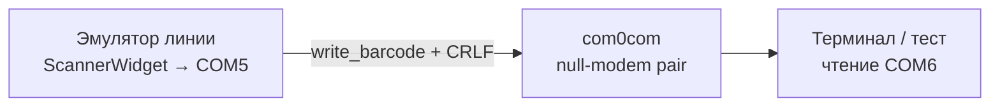

# Виртуальные COM-порты (com0com) для эмулятора сканера

| Параметр | Значение |
|----------|----------|
| Точка входа приложения | `main.py` |
| План | эмулятор сканера ШК (Serial), подзадача **#9** |
| Платформа | Windows (основная среда разработки и сборки exe) |

## Зачем нужен com0com

Виджет **Сканер** в эмуляторе линии записывает штрихкоды в **COM-порт** через pyserial (`libs/serial_port.py`). Приложение **не создаёт** виртуальные порты само — оно только перечисляет уже существующие в ОС (`list_available_ports()`) и открывает выбранный порт в UI.

Для локальной отладки без физического сканера или USB-UART адаптера удобно использовать пару связанных виртуальных портов:

- один порт — **выход эмулятора** (выбирается в combo `cbxComPort` виджета сканера);
- второй порт пары — **вход тестового клиента** (терминал, скрипт, ПО приёмника).

Типичный драйвер для Windows — **com0com** (null-modem emulator): [https://sourceforge.net/projects/com0com/](https://sourceforge.net/projects/com0com/).

## Установка com0com (Windows)

1. Скачайте установщик с [страницы проекта com0com на SourceForge](https://sourceforge.net/projects/com0com/).
2. Запустите установку **от имени администратора** (драйвер ядра требует прав).
3. После установки в системе появляется утилита **Setup** (или `com0com/setupc.exe`) для управления парами портов.

> **Примечание.** На современных Windows 10/11 может потребоваться отключение проверки подписи драйвера или использование подписанной сборки com0com — следуйте инструкции к выбранной версии установщика.

## Создание пары портов

В утилите Setup com0com:

1. Добавьте новую пару (кнопка **Add pair** / аналог в вашей версии).
2. Запомните имена портов, например `COM5` ↔ `COM6` (номера зависят от системы).
3. Убедитесь, что оба порта **включены** (use ports / enable).

Схема:



Данные, записанные эмулятором в `COM5`, появляются на чтении из `COM6`, и наоборот (полный null-modem).

## Настройка в эмуляторе линии

1. Запустите приложение: `.\venv\Scripts\python.exe main.py` (или собранный `dmcLineEmulator.exe`).
2. Меню **Добавить → Сканер** (или откройте готовый конфиг, например `configs/scanner_example.json`).
3. В поле **COM-порт** выберите **один** порт из пары (например, `COM5`).
4. Нажмите **Run** на виджете сканера — при успешном открытии порта индикатор активен; при занятом/недоступном порте — `QMessageBox` с ошибкой.
5. Подайте коды: drag-and-drop в очередь, ручной ввод + Send, генератор или перевозчик.

Параметры линии по умолчанию совпадают с `SerialPortConfig`: **9600 8N1**, суффикс **`\r\n`** после кода. Их можно изменить в JSON (`ScannerParams`) или через `load_options()` при загрузке конфига.

## Проверка приёма на втором порте

### PowerShell (pyserial в venv проекта)

```powershell
.\venv\Scripts\python.exe -c "
import serial
port = serial.Serial('COM6', 9600, timeout=1)
print('Ожидание данных на COM6...')
while True:
    line = port.readline()
    if line:
        print(repr(line.decode('utf-8', errors='replace')))
"
```

Отправьте код из эмулятора — в консоли должна появиться строка с кодом и суффиксом `\r\n`.

### Альтернативы

- **PuTTY** / **Tera Term** — режим Serial, скорость 9600, порт второй стороны пары.
- **com0com echo** / встроенные тесты драйвера — по документации к вашей версии com0com.

## Типичные проблемы

| Симптом | Возможная причина | Действие |
|---------|-------------------|----------|
| Порт не в списке combo | Драйвер не установлен или пара отключена | Переустановить/включить пару в Setup com0com |
| Порт не в списке после создания пары | Список заполняется при создании виджета и по `tbRefreshPorts` | Нажать кнопку обновления портов на виджете сканера (не обязательно перезапускать приложение) |
| «Порт занят» при Run | Второй терминал уже открыл тот же COM | Закрыть другие программы, использовать **разные** порты одной пары |
| Данные не видны на втором порте | Выбран не тот порт или несовпадение скорости | Проверить пару COM5↔COM6 и 9600 8N1 |
| Порт пропал после перезагрузки | Пара не сохранена в Setup | Снова создать/включить пару в com0com |

## Сохранение в JSON

Пример секции `scanners` — в `configs/scanner_example.json` и в [line_emulator.md](line_emulator.md) (раздел «Конфигурация JSON»). Поле `port_name` должно совпадать с именем порта, который эмулятор открывает на запись.

## См. также

- [scanner_serial.md](scanner_serial.md) — `libs/serial_port`, `ScannerEmul`, ограничения COM
- [frontend/scanner-widget.md](frontend/scanner-widget.md) — UI виджета, выбор порта, `tbRefreshPorts`, Run/Stop
- [line_emulator.md](line_emulator.md) — общая карта приложения и `ConfigFile.scanners`
