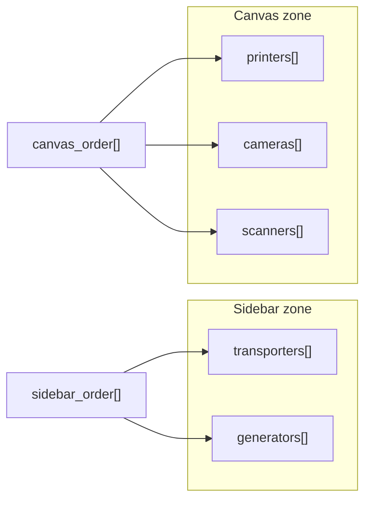

# Конфигурация проекта (`ConfigFile` и модели устройств)

| Параметр | Значение |
|----------|----------|
| Корневая модель | `core/main_ui/data.py` → `ConfigFile` |
| Модели устройств | `core/{printing,scanning,barcode_scanner,transporting,generator}/data.py` |
| План | UI modernization Line Emulator, подзадачи **#1**, **#4** |
| Загрузка / сохранение | `MainLineField.open_config`, `save_configuration_to_file` — `model_validate_json` / `model_dump_json(indent=4)` |
| Миграция legacy JSON | [config_migration.md](config_migration.md) |

## Назначение

Project JSON Line Emulator описывает состав линии (принтеры, камеры, сканеры, перевозчики, генераторы), параметры каждого виджета и **раскладку UI** (порядок карточек в зонах sidebar/canvas, состояние dock-панелей). Корневая модель — `ConfigFile` (`strict=True`).

Глобальные настройки пользователя (тема оформления) **не** входят в project JSON — см. [user_settings.md](user_settings.md).

## Корневая модель `ConfigFile`

| Поле | Тип | По умолчанию | Назначение |
|------|-----|--------------|------------|
| `printers` | `list[PrinterConfig]` | `[]` | Принтеры (TCP) |
| `cameras` | `list[CameraConfig]` | `[]` | Камеры сканирования (TCP) |
| `scanners` | `list[ScannerConfig]` | `[]` | Эмуляторы ручного сканера ШК (COM) |
| `transporters` | `list[TransporterConfig]` | `[]` | Перевозчики между виджетами |
| `generators` | `list[GeneratorConfig]` | `[]` | Генераторы кодов |
| `sidebar_order` | `list[str]` | `[]` | Порядок карточек в зоне sidebar (значения — `device_id`) |
| `canvas_order` | `list[str]` | `[]` | Порядок карточек на холсте canvas (значения — `device_id`) |
| `dock_state` | `str \| None` | `None` | Base64-сериализация `QMainWindow.saveState()` (**#8+**) |

Списки устройств могут отсутствовать в старых JSON — Pydantic подставляет `[]`. Поля layout (`sidebar_order`, `canvas_order`, `dock_state`) и per-device `device_id` для legacy-файлов добавляются автоматически при загрузке — см. [config_migration.md](config_migration.md).

### Зоны layout

| Зона | Секции JSON | Типы устройств |
|------|-------------|----------------|
| **Sidebar** | `transporters`, `generators` | Transporter, Generator |
| **Canvas** | `printers`, `cameras`, `scanners` | Printer, Camera, Scanner |

Массивы `sidebar_order` и `canvas_order` содержат только `device_id` устройств соответствующей зоны. In-memory reorder — **#6** ([frontend/sidebar-layout.md](frontend/sidebar-layout.md)), **#7** ([frontend/canvas-layout.md](frontend/canvas-layout.md)); запись в JSON при Save и восстановление при load — **#9** ([frontend/mainlinefield-layout.md](frontend/mainlinefield-layout.md)). При миграции legacy JSON порядок строится из порядка записей в списках секций (см. migration doc).



## Общие поля моделей устройств (`*Config`)

Во всех пяти моделях конфигурации устройств добавлены поля persistence UI modernization (**#1**):

| Поле | Тип | По умолчанию | Назначение |
|------|-----|--------------|------------|
| `device_id` | `str` | — (генерируется при migration) | Стабильный идентификатор карточки; используется в `sidebar_order` / `canvas_order` вместо `id(widget)` |
| `advanced_expanded` | `bool` | `False` | Развёрнута ли секция «Дополнительно» на карточке (**#10**) |

Генерация нового `device_id` — `shortuuid.uuid()` через `core/main_ui/config_migration.generate_device_id()`. Тот же helper вызывается при создании виджета в UI, если `device_id` не передан из JSON (**#4**).

### Runtime: виджеты и ссылки между устройствами (#4)

| Аспект | Поведение |
|--------|-----------|
| Создание виджета | Каждый `*Widget.__init__` принимает опциональный `device_id`; иначе — `generate_device_id()` |
| Реестры `MainLineField` | `_device_widgets`, `_transporter_widgets`, `_generator_widgets` — `dict[str, widget]`, ключ = `device_id` |
| `options()` | Все пять виджетов включают `device_id` в возвращаемый `*Config` |
| `take_from` / `give_to` | В JSON хранят **`device_id`** источника/приёмника (не `id(widget)` и не имя виджета) |
| Загрузка legacy | `process_config` → `_resolve_device_ref`: сначала поиск по `device_id`, затем fallback по `name` (старые JSON с `SCAN_1`, `CAM_23` и т.п.) |
| Transporter / Generator | Имена по умолчанию `TRW_{device_id[:8]}`, `GW_{device_id[:8]}`; combo — `QStandardItemModel`: кол. 0 имя, кол. 1 `device_id` (`setModelColumn(0)`); lookup `_device_data[device_id]` |

Save→load roundtrip и восстановление связей transporter/generator покрыты `tests/test_core/test_device_id_persistence.py`. Обзор wiring в runtime — [line_emulator.md](line_emulator.md) (раздел «Стабильный device_id в виджетах»).

## Модели по типам устройств

### `PrinterConfig` — `core/printing/data.py`

| Поле | Тип | По умолчанию |
|------|-----|--------------|
| `device_id` | `str` | — |
| `name` | `str` | — |
| `port` | `int` | — |
| `buffer` | `int` | `1` |
| `advanced_expanded` | `bool` | `False` |

### `CameraConfig` — `core/scanning/data.py`

| Поле | Тип | По умолчанию |
|------|-----|--------------|
| `device_id` | `str` | — |
| `name` | `str` | — |
| `port` | `int` | — |
| `config` | `CameraParams` | — |
| `advanced_expanded` | `bool` | `False` |

Вложенный `CameraParams`: `packet_size`, `interval`, флаги/проценты no_read, duplicates, grade (defaults как в модуле).

### `ScannerConfig` — `core/barcode_scanner/data.py`

| Поле | Тип | По умолчанию |
|------|-----|--------------|
| `device_id` | `str` | — |
| `name` | `str` | — |
| `port_name` | `str` | — |
| `config` | `ScannerParams` | — |
| `advanced_expanded` | `bool` | `False` |

`ScannerParams` и метод `to_serial_port_config()` — без изменений по сравнению с serial barcode scanner plan; подробнее в [line_emulator.md](line_emulator.md) (раздел «Модель конфигурации сканера») и [scanner_serial.md](scanner_serial.md).

### `TransporterConfig` — `core/transporting/data.py`

| Поле | Тип | По умолчанию | Назначение |
|------|-----|--------------|------------|
| `device_id` | `str` | — | Стабильный id перевозчика |
| `take_from` | `str` | — | `device_id` источника (камера / принтер / сканер); legacy JSON может содержать `name` — разрешается при load |
| `give_to` | `str` | — | `device_id` приёмника (камера / сканер); legacy fallback по `name` |
| `interval` | `int` | `250` | Задержка per-code (мс) |
| `advanced_expanded` | `bool` | `False` | Секция «Дополнительно» |

### `GeneratorConfig` — `core/generator/data.py`

| Поле | Тип | По умолчанию | Назначение |
|------|-----|--------------|------------|
| `device_id` | `str` | — | Стабильный id генератора |
| `generator_type` | `str` | — | Тип кода (`CodeType.name`) |
| `gtin` | `str` | `''` | GTIN для генерации |
| `give_to` | `str` | — | `device_id` приёмника (камера / сканер); legacy fallback по `name` |
| `interval` | `int` | `250` | Интервал генерации (мс) |
| `advanced_expanded` | `bool` | `False` | Секция «Дополнительно» |

## Пример modern JSON (фрагмент)

```json
{
    "printers": [
        {
            "device_id": "abc123",
            "name": "PRN_1",
            "port": 9100,
            "buffer": 2,
            "advanced_expanded": false
        }
    ],
    "transporters": [
        {
            "device_id": "trn456",
            "take_from": "abc123",
            "give_to": "cam789",
            "interval": 250,
            "advanced_expanded": false
        }
    ],
    "sidebar_order": ["trn456"],
    "canvas_order": ["abc123"],
    "dock_state": null
}
```

Legacy-файлы без `device_id` и layout-полей по-прежнему открываются — см. [config_migration.md](config_migration.md).

## Автоматическая migration при загрузке

`ConfigFile` содержит `@model_validator(mode="before")` → `_apply_legacy_migration`: если `needs_legacy_migration(data)` возвращает `True`, вызывается `enrich_legacy_config` до strict-валидации. Явный вызов `migrate_legacy_config(data)` доступен для тестов и утилит.

## Тестирование

| Файл | Тестов | Покрытие |
|------|--------|----------|
| `tests/test_core/test_config_layout_migration.py` | 15 | `needs_legacy_migration`, `enrich_legacy_config`, `migrate_legacy_config`, partial migration, `ConfigFile.model_validate_json` (legacy/modern), `configs/scanner_example.json` (**#13** ✓) |
| `tests/test_core/test_device_id_persistence.py` | — | roundtrip `options()` → JSON → `process_config`; stable `device_id` в реестрах; `take_from`/`give_to` по `device_id` (#4) |
| `tests/test_core/test_line_emul_layout.py` | 6 | save/load roundtrip layout; `process_config` visual order; legacy defaults; reset; visual-order iterators (#9, **#13** ✓) |
| `tests/test_core/test_user_settings.py` | 8 | `UserSettings` defaults, theme roundtrip, path resolution (**#13** ✓) — см. [user_settings.md](user_settings.md) |
| `tests/test_libs/test_qt_theme.py` | 9 | `resolve_effective_mode`, design tokens, QSS load, `apply_theme` smoke (**#13** ✓) — см. [qt_theme.md](qt_theme.md) |

Запуск (подзадача **#13**, 38 тестов в четырёх файлах):

```powershell
.\venv\Scripts\python.exe -m unittest `
  tests.test_core.test_user_settings `
  tests.test_core.test_config_layout_migration `
  tests.test_libs.test_qt_theme `
  tests.test_core.test_line_emul_layout -v
```

Прочие тесты конфигурации:

```powershell
.\venv\Scripts\python.exe -m unittest tests.test_core.test_device_id_persistence -v
```

## Roadmap (связанные подзадачи плана)

| Подзадача | Что использует поля config |
|-----------|----------------------------|
| **#4** ✓ | `device_id` в виджетах, реестры `MainLineField`, `take_from`/`give_to` по `device_id` |
| **#10** ✓ | `advanced_expanded` на карточках устройств, collapsible «Дополнительно» |
| **#6** ✓, **#7** ✓ | In-memory reorder → `get/set_*_device_order`; поля `sidebar_order`, `canvas_order` |
| **#9** ✓, **#8** ✓ | Save/load order + `dock_state`, `acResetLayout` — [frontend/mainlinefield-layout.md](frontend/mainlinefield-layout.md) |
| **#14** | Финальная актуализация cross-links |

## Связанная документация

- [config_migration.md](config_migration.md) — алгоритм migration, partial migration, API helpers.
- [line_emulator.md](line_emulator.md) — обзор приложения, интеграция save/load в `MainLineField`.
- [frontend/mainlinefield-layout.md](frontend/mainlinefield-layout.md) — save/load layout, dock, reset (#9).
- [frontend/sidebar-layout.md](frontend/sidebar-layout.md), [frontend/canvas-layout.md](frontend/canvas-layout.md) — reorder API и zone guards (#6, #7).
- [user_settings.md](user_settings.md) — разделение project JSON и глобальных настроек.
- [scanner_unit_tests.md](scanner_unit_tests.md) — тесты `ScannerConfig` / `ConfigFile.scanners` (serial scanner plan).
