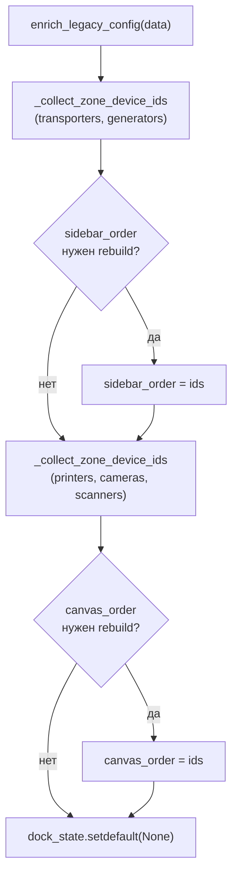

# Migration конфигурации Line Emulator (`core/main_ui/config_migration.py`)

| Параметр | Значение |
|----------|----------|
| Модуль | `core/main_ui/config_migration.py` |
| План | UI modernization Line Emulator, подзадача **#1** |
| Зависимости | `shortuuid`, Pydantic-модели из `core/main_ui/data.py` |
| Интеграция | `ConfigFile._apply_legacy_migration` (before-validator) |

## Назначение

Старые project JSON Line Emulator не содержали стабильных идентификаторов устройств и полей раскладки UI. Модуль migration обогащает сырой dict перед валидацией `ConfigFile`, чтобы:

- legacy-файлы открывались без ошибок Pydantic;
- каждому устройству назначался `device_id` для persistence порядка карточек;
- массивы `sidebar_order` / `canvas_order` соответствовали актуальным `device_id`;
- для новых полей применялись безопасные defaults (`advanced_expanded=False`, `dock_state=None`).

Описание полей моделей — [config.md](config.md).

## Когда срабатывает migration

### `needs_legacy_migration(data) -> bool`

Migration нужна, если `data` — dict и выполняется **хотя бы одно** из условий:

1. Отсутствует `sidebar_order` или `canvas_order`.
2. В любом элементе списков `printers`, `cameras`, `scanners`, `transporters`, `generators` нет ключа `device_id`.

Если все layout-поля и `device_id` уже присутствуют, автоматический before-validator **не** вызывает `enrich_legacy_config` (modern JSON валидируется as-is).

### Точки входа

| API | Поведение |
|-----|-----------|
| `ConfigFile.model_validate(data)` / `model_validate_json(...)` | Before-validator вызывает `enrich_legacy_config` при `needs_legacy_migration` |
| `migrate_legacy_config(data)` | Явная migration: `copy.deepcopy` → `enrich_legacy_config` → `ConfigFile.model_validate` |
| `enrich_legacy_config(data)` | Мутирует переданный dict in-place (вызывающий код должен передавать копию) |

## Алгоритм `enrich_legacy_config`



### Шаг 1 — per-device поля

Для каждого dict в списках устройств (`DEVICE_LIST_KEYS`):

- если нет `device_id` → `generate_device_id()` (`shortuuid.uuid()`);
- `advanced_expanded` → `setdefault(False)`.

### Шаг 2 — порядок зон

| Зона | Ключи секций | Порядок в `*_order` |
|------|--------------|---------------------|
| Sidebar | `transporters`, `generators` | все transporters по порядку списка, затем все generators |
| Canvas | `printers`, `cameras`, `scanners` | printers → cameras → scanners |

### Шаг 3 — rebuild order arrays

`sidebar_order` или `canvas_order` **пересобираются**, если:

- поле отсутствует в JSON;
- при обходе зоны был сгенерирован **хотя бы один** новый `device_id`;
- существующий order **пустой** или содержит id, которых нет среди актуальных `device_id` зоны (`_order_needs_rebuild`).

Иначе сохранённый order **не меняется** (partial migration с уже валидными id).

### Шаг 4 — dock state

`data.setdefault("dock_state", None)` — для legacy и partial JSON без поля.

## Partial migration

Typical case: JSON уже содержит `sidebar_order` / `canvas_order`, но устройства ещё без `device_id`, либо order ссылается на устаревшие id (например, после ручного редактирования или неполного save).

| Сценарий | Результат |
|----------|-----------|
| `canvas_order: ["stale-id"]`, printer без `device_id` | Генерируется `device_id`, `canvas_order` пересобирается |
| `sidebar_order: []`, transporters/generators без `device_id` | Order пересобирается из порядка списков |
| `canvas_order: ["printer-fixed"]`, printer уже с `device_id: "printer-fixed"` | Order **сохраняется** |
| Полный legacy без layout-полей | Order строится из всех секций; `dock_state=None` |

Исходный dict при `migrate_legacy_config` **не мутируется** (работа через `deepcopy`).

## Публичный API

### `generate_device_id() -> str`

Новый случайный идентификатор (`shortuuid.uuid()`). Используется при создании устройств в UI (**#4+**) и в migration.

### `needs_legacy_migration(data: Any) -> bool`

См. раздел «Когда срабатывает migration».

### `enrich_legacy_config(data: dict[str, Any]) -> dict[str, Any]`

Обогащает dict полями layout и device; возвращает тот же объект (in-place).

### `migrate_legacy_config(data: dict[str, Any]) -> ConfigFile`

Полный цикл migration + validated `ConfigFile`. Предпочтителен в тестах; в runtime достаточно `ConfigFile.model_validate_json`.

## Константы зон

| Имя | Значение |
|-----|----------|
| `DEVICE_LIST_KEYS` | `printers`, `cameras`, `scanners`, `transporters`, `generators` |
| `SIDEBAR_DEVICE_KEYS` | `transporters`, `generators` |
| `CANVAS_DEVICE_KEYS` | `printers`, `cameras`, `scanners` |

## Пример: legacy → migrated

**Вход** (фрагмент, без layout и `device_id`):

```json
{
    "transporters": [{"take_from": "SCAN_1", "give_to": "CAM_1", "interval": 100}],
    "generators": [{"generator_type": "KM_01_14_21_13_93_4", "give_to": "CAM_1", "interval": 500}],
    "printers": [{"name": "PRN_1", "port": 9100}]
}
```

**После migration** (значения `device_id` — пример):

- `transporters[0].device_id`, `generators[0].device_id`, `printers[0].device_id` — сгенерированы;
- все `advanced_expanded` → `false`;
- `sidebar_order` → `[<transporter_id>, <generator_id>]`;
- `canvas_order` → `[<printer_id>]`;
- `dock_state` → `null`.

Реальный sample `configs/scanner_example.json` загружается через `ConfigFile.model_validate_json` без ошибок (тест `test_scanner_example_json_loads`).

## Тестирование

Файл: `tests/test_core/test_config_layout_migration.py` (**15** тестов, подзадача **#13** ✓).

| Класс / тест | Проверяет |
|--------------|-----------|
| `TestNeedsLegacyMigration.test_detects_missing_layout_fields` | Payload без `sidebar_order` / `canvas_order` требует migration |
| `test_detects_missing_device_id` | Layout-поля есть, но у устройства нет `device_id` |
| `test_modern_payload_does_not_need_migration` | Полный modern JSON пропускает before-validator |
| `test_non_mapping_input_does_not_need_migration` | Не-dict (`[]`, `None`) не мигрируется |
| `TestEnrichLegacyConfig.test_sets_dock_state_default_and_order_arrays` | `dock_state=None`, order arrays, `device_id`, `advanced_expanded` in-place |
| `TestMigrateLegacyConfig.test_assigns_device_id_and_advanced_defaults` | `device_id`, `advanced_expanded=False` на всех типах |
| `test_builds_sidebar_and_canvas_order` | Порядок зон, `dock_state=None` |
| `test_does_not_mutate_source_payload` | Immutability входного dict |
| `test_partial_migration_rebuilds_stale_canvas_order` | Stale id в `canvas_order` |
| `test_partial_migration_rebuilds_empty_sidebar_order` | Пустой `sidebar_order` |
| `test_partial_migration_preserves_valid_canvas_order` | Сохранение валидного order |
| `TestConfigFileLayoutFields.test_model_validate_json_accepts_legacy_payload` | Авто-migration через validator |
| `test_model_validate_json_accepts_new_payload` | Modern JSON с `dock_state` base64 |
| `test_strict_defaults_for_optional_new_fields` | Defaults при strict mode |
| `test_scanner_example_json_loads` | Реальный файл из `configs/` |

```powershell
.\venv\Scripts\python.exe -m unittest tests.test_core.test_config_layout_migration -v
```

## Ограничения и follow-up

- Migration **не** записывает JSON на диск — только in-memory при `open_config`. Persist layout — **File → Save** (**#8+**).
- `dock_state` заполняется UI при save (**#8+**); migration всегда оставляет `None` для legacy.
- Wiring `device_id` в виджеты и восстановление порядка по `sidebar_order`/`canvas_order` — подзадачи **#4–#11** (не входят в #1).

## Связанная документация

- [config.md](config.md) — поля `ConfigFile` и `*Config`.
- [line_emulator.md](line_emulator.md) — обзор приложения, save/load project JSON.
