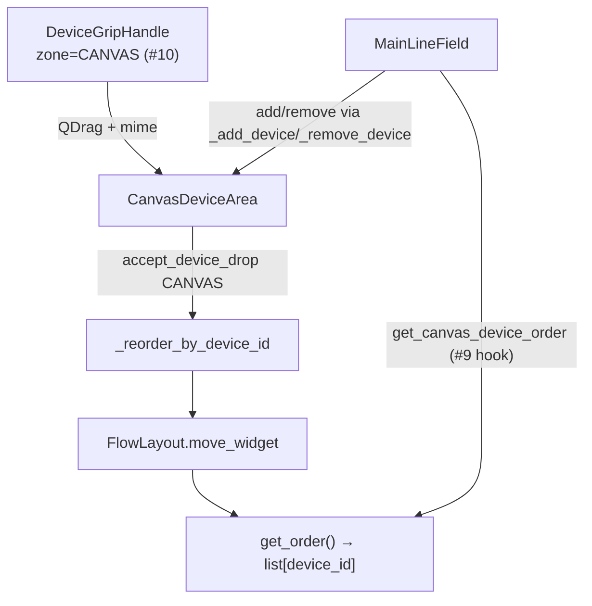

# Reorderable canvas FlowLayout

| Параметр | Значение |
|----------|----------|
| План | Line Emulator UI modernization, подзадача **#7** |
| Модуль | `core/main_ui/canvas_area.py` → `CanvasDeviceArea`; layout — `core/main_ui/flow_layout.py` → `FlowLayout` |
| Интеграция | `core/main_ui/line_emul.py` → `MainLineField._canvas_area` |
| Тесты | `tests/test_core/test_canvas_area.py` |
| Drag source (grip) | [device-card.md](device-card.md) — `DeviceGripHandle`, зона `DeviceZone.CANVAS` |
| Полный chrome на canvas | **#10** — `mount_device_card_header` на Printer/Camera/Scanner |
| Save/load порядка | **#9** ✓ — `get_canvas_device_order` / `set_canvas_device_order` → `canvas_order` в project JSON; оркестрация — [mainlinefield-layout.md](mainlinefield-layout.md) |

## Назначение

Контейнер с **auto-wrap** `FlowLayout` для карточек **Printer**, **Camera** и **Scanner** в зоне canvas (`scrollAreaCanvas` → `scaDevices`). Обеспечивает:

- drag-reorder по `device_id` через mime `application/x-line-emulator-device-id` ([device-card.md](device-card.md));
- **zone guard** — принимаются только drops с `DeviceZone.CANVAS`; sidebar-payload отклоняется;
- hit-testing позиции drop по **layout rects** после wrap (слева направо, сверху вниз);
- programmatic API `get_order` / `set_order` для persistence (**#9**);
- **не** перехватывает DnD очередей кодов (`text/plain` и прочие mime без device payload игнорируются).

Документ для разработчиков UI. Статическая оболочка холста — [layout-shell.md](layout-shell.md) (#8); поля конфига — [config.md](../config.md).

## Маршрут и точка входа

Desktop-приложение без URL-маршрутизации:

| Уровень | Компонент |
|---------|-----------|
| Главное окно | `MainLineField` |
| Host в `.ui` | `scaDevices` внутри `scrollAreaCanvas` (central widget) |
| Reorder-контейнер | `CanvasDeviceArea` (не `QWidget` — `QObject` + event filter) |
| Underlying layout | `FlowLayout` на `scaDevices`, spacing 6 px |

```text
centralwidget
└─ scrollAreaCanvas
   └─ scaDevices
      └─ FlowLayout  [CanvasDeviceArea.flow_layout]
         ├─ PrinterWidget …
         ├─ CameraWidget …
         └─ ScannerWidget …
```



## Класс `CanvasDeviceArea`

Базовый класс: `QObject`. Host — переданный `container: QWidget` (`scaDevices`). Порядок виджетов хранится во внутреннем `FlowLayout.__items`.

| Свойство / параметр | Значение |
|---------------------|----------|
| Host `objectName` | `scaDevices` (из `.ui`) |
| `spacing` (конструктор) | 6 px (horizontal + vertical между карточками) |
| Drop indicator | **нет** (в отличие от [sidebar-layout.md](sidebar-layout.md)) |
| `setAcceptDrops` | `True` на container и каждой добавленной карточке (+ descendants через event filter) |

### Public API

| Метод / свойство | Назначение |
|------------------|------------|
| `flow_layout: FlowLayout` | Underlying auto-wrap layout |
| `add_widget(widget)` | Append в flow, `installEventFilter` на карточку и direct children |
| `remove_widget(widget)` | Снятие с layout и снятие event filters |
| `get_order() -> list[str]` | `device_id` в визуальном порядке flow (слева→право, сверху→вниз) |
| `set_order(device_ids)` | Программная перестановка; неизвестные id пропускаются; неупомянутые — в конце в прежнем порядке |

**Требования к виджетам:** атрибут `device_id: str` (непустой). Иначе `add_widget` → `ValueError`.

Пример programmatic reorder:

```python
area = CanvasDeviceArea(container=scaDevices)
area.add_widget(printer)
area.add_widget(camera)
area.get_order()  # ["id-printer-1", "id-camera-1"]
area.set_order(["id-camera-1", "id-printer-1"])
```

### Drag / drop

| Событие | Поведение |
|---------|-----------|
| `dragEnter` (eventFilter) | `accept_device_drag_enter(event, DeviceZone.CANVAS)` |
| `dragMove` (eventFilter) | `accept_device_drag_move(event, DeviceZone.CANVAS)` — без preview indicator |
| `drop` (eventFilter) | `accept_device_drop` → `_insert_index_for_position` → `_reorder_by_device_id` |

**eventFilter:** drag-события с container, карточки и **прямых потомков** (например, списки кодов `lstData`) маршрутизируются в reorder-логику; координаты мапятся через `_event_position_in_container`. На `ChildAdded` новым `QWidget`-потомкам container выставляется drop routing через `_install_drop_filters`.

**Insert index (`FlowLayout.insert_index_at`):** для точки в локальных координатах container — индекс **перед** первой карточкой в visual flow order, для которой:

- `pos.y` выше vertical center rect, **или**
- `pos` внутри rect по Y и `pos.x` левее horizontal center.

Если ни одна карточка не подходит — `len(widgets)` (append в конец). Пустые margins между wrapped rows могут относиться к следующей строке, а не к концу предыдущей (см. docstring `insert_index_at`).

**Insert-before при move:** `_reorder_by_device_id` зеркалит `SidebarLayout._move_widget_to_index`: если `current_index < insert_index`, перед `move_widget` выполняется `insert_index -= 1` (компенсация pop source item).

**Append:** `FlowLayout.move_widget(from_index, to_index)` принимает `to_index == len(__items)` — drop-to-end.

Cross-zone пример (отклоняется):

```python
# payload.zone == DeviceZone.SIDEBAR → dragEnter/drop ignore, порядок не меняется
accept_device_drop(event, DeviceZone.CANVAS)  # None
```

Non-device mime (например, перетаскивание кодов) — `accept_device_drop` → `None`, порядок карточек не меняется.

После reorder — `_refresh_layout()` (`updateGeometry` + `update` на container) для reflow wrapped rows.

## Расширения `FlowLayout` (#7)

Файл: `core/main_ui/flow_layout.py`. Помимо legacy horizontal/vertical wrap остаётся совместимость с существующим использованием в проекте.

| Метод | Назначение |
|-------|------------|
| `ordered_widgets() -> list[QWidget]` | Видимые дочерние виджеты в порядке layout items |
| `index_of_widget(widget) -> int` | Индекс item или `-1` |
| `remove_widget(widget) -> bool` | Удаление без `deleteLater` |
| `move_widget(from_index, to_index) -> bool` | Перемещение `QWidgetItem`; `to_index` ∈ `[0, count]` |
| `set_widget_order(widgets)` | Программная перестановка items; unmatched — в конце |
| `insert_index_at(pos) -> int` | Hit-test insert index по post-layout `geometry()` rects |

## Интеграция в `MainLineField`

После `setupUi` в `__init__`:

```python
self._canvas_area = CanvasDeviceArea(self.scaDevices)
self._devices_layout = self._canvas_area.flow_layout
```

| Операция | Метод `MainLineField` | Вызов `CanvasDeviceArea` |
|----------|----------------------|---------------------------|
| Добавить printer/camera/scanner | `_add_device` (через `add_printer` / `add_camera` / `add_scanner`) | `add_widget(device)` |
| Удалить device | `_remove_device` | `remove_widget(device)` |
| Очистка UI | `clear_ui` | `remove_widget` для каждого canvas-виджета |

### Hooks для persistence (#9)

| Метод | Реализация | Назначение |
|-------|------------|------------|
| `get_canvas_device_order() -> list[str]` | `_canvas_area.get_order()` | Чтение порядка перед File → Save |
| `set_canvas_device_order(device_ids)` | `_canvas_area.set_order(device_ids)` | Восстановление из `ConfigFile.canvas_order` при load |

**Persistence (#9):** после drag порядок in-memory; запись `canvas_order` при File → Save и восстановление при `process_config` — [mainlinefield-layout.md](mainlinefield-layout.md).

## Связь с device card chrome

| Компонент | Подзадача | Роль |
|-----------|-----------|------|
| `DeviceGripHandle` + mime | **#5** | Единственный источник drag |
| `mount_device_card_header(..., zone=DeviceZone.CANVAS)` | **#10** | Grip на Printer/Camera/Scanner |
| `CanvasDeviceArea` drop target | **#7** (этот документ) | Reorder на холсте |

Без grip на карточке (#10) пользователь не инициирует canvas drag; без `CanvasDeviceArea` (#7) drop некуда принимать.

## Отличие от sidebar reorder

| | Sidebar (#6) | Canvas (#7) |
|---|--------------|-------------|
| Класс | `SidebarLayout` | `CanvasDeviceArea` |
| Базовый тип | `QWidget` | `QObject` + event filter |
| Layout | `QVBoxLayout` | `FlowLayout` (auto-wrap) |
| Зона | `DeviceZone.SIDEBAR` | `DeviceZone.CANVAS` |
| Типы | Transporter, Generator | Printer, Camera, Scanner |
| Drop preview | горизонтальная линия (`sidebarDropIndicator`) | нет |
| Insert index | vertical mid карточек | geometry rects в flow order |
| Hook в `MainLineField` | `get/set_sidebar_device_order` | `get/set_canvas_device_order` |

Не смешивать zone guards: transporter/generator не drop на canvas и наоборот. Подробнее sidebar — [sidebar-layout.md](sidebar-layout.md).

## Отделение от DnD очередей кодов

| Механизм | Mime / модуль | Назначение |
|----------|---------------|------------|
| Device reorder (#5–#7) | `application/x-line-emulator-device-id` | Порядок карточек |
| Code queues | `libs/model_processing.py`, `libs/drag_drop_list_view.py` | Перетаскивание кодов между `lstData` |

`CanvasDeviceArea` обрабатывает только device mime с zone guard; text/plain и прочие форматы не меняют порядок карточек.

## Тесты

`tests/test_core/test_canvas_area.py` (16 тестов):

| Класс | Покрытие |
|-------|----------|
| `TestCanvasDeviceArea` | add/remove, `get_order`, `set_order`, zone guards (SIDEBAR reject), `_reorder_by_device_id` (up/down/to-end), `insert_index_at`, `move_widget` append, text mime ignore, drop on descendant, wrap after resize |
| `TestMainLineFieldCanvasIntegration` | `_add_device`; `get_canvas_device_order` / `set_canvas_device_order` round-trip |

Запуск:

```powershell
.\venv\Scripts\python.exe -m unittest tests.test_core.test_canvas_area -v
```

## Roadmap

| Подзадача | Статус | Содержание |
|-----------|--------|------------|
| **#5** | готово | Mime, zone guards, grip |
| **#7** | готово | `CanvasDeviceArea`, `FlowLayout` reorder API |
| **#9** | готово | Save/load `canvas_order`, `sidebar_order`, dock, `acResetLayout` — [mainlinefield-layout.md](mainlinefield-layout.md) |
| **#10** | готово | Chrome + grip на всех 5 типах |

## Связанная документация

- [device-card.md](device-card.md) — grip, mime, `DeviceZone`, zone guard API.
- [layout-shell.md](layout-shell.md) — `scrollAreaCanvas`, `scaDevices`, central widget (#8).
- [sidebar-layout.md](sidebar-layout.md) — reorder transporter/generator (#6).
- [config.md](../config.md) — поле `canvas_order` в project JSON.
- [mainlinefield-layout.md](mainlinefield-layout.md) — save/load, reset, dock state (#9).
