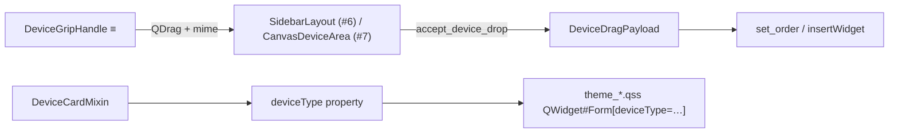
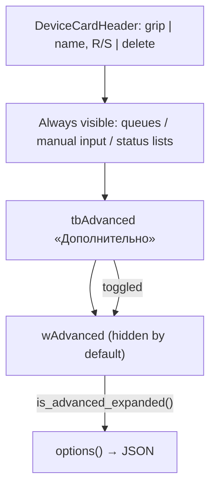

# Device card chrome (grip «≡»)

| Параметр | Значение |
|----------|----------|
| План | Line Emulator UI modernization, подзадачи **#5** (chrome), **#10** (collapsible «Дополнительно») |
| Модуль | `core/main_ui/device_card.py` |
| Виджеты | все 5 типов: `PrinterWidget`, `CameraWidget`, `ScannerWidget`, `TransporterWidget`, `GeneratorWidget` |
| Тесты | `tests/test_core/test_device_card.py` |
| Drag-reorder wiring | sidebar **#6** ([sidebar-layout.md](sidebar-layout.md)), canvas **#7** |
| Persistence `advanced_expanded` | `options()` / load в `MainLineField` — **#10**; запись в project JSON — **File → Save** (**#9**) |

## Назначение

Общий chrome заголовка карточки устройства Line Emulator:

- единая строка шапки: **grip «≡»** | слот заголовка (имя, Run/Stop, прочие контролы) | **удаление**;
- **grip — единственный источник `QDrag`** для смены порядка карточек (не перетаскивание за имя или Run);
- custom mime `application/x-line-emulator-device-id` с `device_id` и зоной layout;
- **zone guard** — drop между sidebar и canvas отклоняется;
- mixin **`DeviceCardMixin`** выставляет dynamic property **`deviceType`** для QSS-фона карточки;
- сворачиваемая секция **«Дополнительно»** (`tbAdvanced` / `wAdvanced`) на всех пяти типах — collapsed by default (**#10**).

Документ для разработчиков UI. Связь с design system — [theme-system.md](theme-system.md); стабильные id — раздел «Стабильный device_id» в [line_emulator.md](../line_emulator.md) (#4).

## Архитектура

```text
QWidget#Form (device widget, Ui_Form)
├─ verticalLayout
│  ├─ horizontalLayout (header row from .ui)
│  │  └─ DeviceCardHeader  [objectName: deviceCardHeader]
│  │     ├─ DeviceGripHandle  [objectName: deviceCardGrip]  ← sole QDrag source
│  │     ├─ title_layout (QHBoxLayout)  ← leName, tbRun, …
│  │     └─ QToolButton delete  [objectName: tbDelete]
│  ├─ … always-visible body (очереди кодов, ручной ввод — по типу)
│  ├─ QToolButton tbAdvanced  «Дополнительно» (checkable)
│  └─ QWidget wAdvanced  (visible=false по умолчанию)
└─ deviceType property → theme QSS
```



## Зоны layout (`DeviceZone`)

| Значение | Контейнер | Типы устройств |
|----------|-----------|----------------|
| `DeviceZone.SIDEBAR` | `transporters_layout` в `dockSidebar` | Transporter, Generator |
| `DeviceZone.CANVAS` | `FlowLayout` в `scaDevices` (central canvas) | Printer, Camera, Scanner |

Grip и drop-target **обязаны** использовать одну и ту же зону. Cross-zone drop отклоняется helpers `can_accept_device_drop` / `accept_device_drop`.

In-memory reorder после drag — **#6** (`SidebarLayout`, [sidebar-layout.md](sidebar-layout.md)) и **#7** (`CanvasDeviceArea`, [canvas-layout.md](canvas-layout.md)). Запись в project JSON — поля `sidebar_order` / `canvas_order` ([config.md](../config.md)), wiring save/load — **#9**.

## Drag mime

| Константа / тип | Описание |
|-----------------|----------|
| `DEVICE_DRAG_MIME_TYPE` | `"application/x-line-emulator-device-id"` |
| `DeviceDragPayload` | `@dataclass`: `device_id: str`, `zone: DeviceZone` |
| `encode_device_drag_payload` / `decode_device_drag_payload` | JSON `{"device_id":"…","zone":"sidebar\|canvas"}` → `QByteArray` |
| `device_drag_payload_from_mime` | Извлечение payload из `QMimeData` |

### Zone guard API

Используйте в `dragEnterEvent` / `dragMoveEvent` / `dropEvent` контейнера reorder:

| Функция | Роль |
|---------|------|
| `can_accept_device_drop(mime, target_zone)` | Проверка без side effects |
| `accept_device_drag_enter(event, target_zone)` | `acceptProposedAction()` или `ignore()` |
| `accept_device_drag_move(event, target_zone)` | То же для move |
| `accept_device_drop(event, target_zone)` | Accept + return `DeviceDragPayload` или `None` |
| `is_same_zone_drop(source, target)` | `source == target` |

Пример drop-target (см. `_StubDropTarget` в тестах):

```python
def dragEnterEvent(self, event: QDragEnterEvent) -> None:
    accept_device_drag_enter(event, self._zone)

def dropEvent(self, event: QDropEvent) -> None:
    payload = accept_device_drop(event, self._zone)
    if payload is not None:
        self._reorder_by_device_id(payload.device_id, event.position().toPoint())
```

## Виджеты chrome

### `DeviceGripHandle`

| Свойство | Значение |
|----------|----------|
| Базовый класс | `QToolButton` |
| `objectName` | `deviceCardGrip` |
| Текст | `≡` |
| Tooltip | «Перетащите для изменения порядка» |
| Размер | 28×28 px |
| Курсор | `OpenHandCursor` |
| Drag | После перемещения мыши ≥ `QApplication.startDragDistance()`; action `MoveAction` |

Конструктор: `DeviceGripHandle(device_id, zone, parent=None)`.

Свойства только для чтения: `device_id`, `zone`.

### `DeviceCardHeader`

Строка шапки карточки.

| Элемент | API |
|---------|-----|
| Grip | `header.grip` → `DeviceGripHandle` |
| Слот заголовка | `header.title_layout` или `header.add_title_widget(widget, stretch=0)` |
| Удаление | `header.delete_button`; сигнал `delete_clicked` |
| `objectName` | `deviceCardHeader` |

Конструктор: `DeviceCardHeader(device_id, zone, parent=None)`.

Legacy-контролы из `.ui` (имя, Run, combo и т.д.) переносятся в `title_layout`; **delete из `.ui` заменяется** кнопкой header.

### `DeviceCardMixin`

Mixin для классов вида `class XxxWidget(QWidget, Ui_Form, DeviceCardMixin)`.

| Метод / атрибут | Назначение |
|-----------------|------------|
| `apply_device_type(device_type: DeviceType)` | `setProperty("deviceType", …)` + `unpolish`/`polish` |
| `mount_device_card_header(...)` | Монтаж header в существующий header row layout |
| `wire_advanced_panel(toggle_button, panel, *, expanded=False)` | Подключение «Дополнительно» к `wAdvanced` (**#10**) |
| `set_advanced_expanded(expanded: bool)` | Показать/скрыть advanced panel, синхронизировать `tbAdvanced` |
| `is_advanced_expanded() -> bool` | Текущее состояние секции (для `options()`) |
| `_device_card_header` | Ссылка на смонтированный `DeviceCardHeader` после mount |

`DeviceType` — `Literal["printer", "camera", "scanner", "transporter", "generator"]` из `libs/qt_theme.py`.

#### `mount_device_card_header`

```python
header = self.mount_device_card_header(
    device_id=self.device_id,
    device_type="printer",       # или camera / scanner / transporter / generator
    zone=DeviceZone.CANVAS,      # CANVAS — printer/camera/scanner; SIDEBAR — transporter/generator
    row_layout=self.horizontalLayout,  # QHBoxLayout из setupUi
    delete_button=self.tbDelete,
)
```

Поведение:

1. Все виджеты из `row_layout`, кроме `delete_button`, переносятся в `title_layout` (stretch сохраняется).
2. Legacy `delete_button` удаляется (`deleteLater`).
3. `DeviceCardHeader` добавляется в `row_layout` с stretch `1`.
4. Вызывается `apply_device_type(device_type)`.
5. Если у виджета был атрибут `tbDelete`, он **переназначается** на `header.delete_button`.

После mount подключите удаление и сохраните alias при необходимости:

```python
self._device_header = header
self.tbDelete = self._device_header.delete_button
self._device_header.delete_clicked.connect(self._on_delete_clicked)
```

#### `wire_advanced_panel` (#10)

Вызывается после `mount_device_card_header` в `__init__` каждого device widget:

```python
self.wire_advanced_panel(self.tbAdvanced, self.wAdvanced)
```

Поведение:

1. `tbAdvanced` — checkable `QToolButton`, текст «Дополнительно» (перезаписывается mixin).
2. `wAdvanced` — контейнер из `.ui` с `visible=false` и `checked=false` на toggle.
3. По умолчанию **collapsed** (`expanded=False`).
4. `tbAdvanced.toggled` → `set_advanced_expanded`; программный вызов `set_advanced_expanded` синхронизирует checked без рекурсии (`blockSignals`).

Сохранение состояния:

| Операция | Поведение |
|----------|-----------|
| `widget.options()` | поле `advanced_expanded=self.is_advanced_expanded()` в `*Config` |
| Load (`process_config`) | `MainLineField._load_*` вызывает `set_advanced_expanded(config.advanced_expanded)` |
| Новый виджет (меню «Добавить») | collapsed; в JSON попадёт `false` при первом Save |
| Legacy JSON без поля | migration → `advanced_expanded=False` ([config_migration.md](../config_migration.md)) |

## Collapsible «Дополнительно» — разделение по типам (#10)

Общий паттерн во всех `forms/ui/{Printer,Camera,Scanner,Transporter,Generator}.ui`:

| Слой | Содержание |
|------|------------|
| Header (chrome) | grip «≡» \| `leName`, `tbRun` \| delete — через `DeviceCardHeader` |
| Always visible | Имя, Run/Stop, ключевой статус/очередь кодов (см. таблицу ниже) |
| Toggle | `tbAdvanced` — «Дополнительно» |
| Advanced (`wAdvanced`) | Порт, интервалы, COM, routing combo и прочие редко меняемые поля |



### Always visible vs advanced

| Тип | Зона | Always visible | Advanced (`wAdvanced`) |
|-----|------|----------------|------------------------|
| **Printer** | CANVAS | `lstData` — буфер/очередь кодов (tooltip «БУФФЕР») | `leConnetionStr` (TCP-порт), `spAmount` (размер буфера) |
| **Camera** | CANVAS | `lstData` (очередь на отправку), `lstProcessed` (обработанные) | `leConnetionStr` (TCP-порт), `tabWidget` — пакет (`spSize`), интервал (`spInterval`), no_read / duplicates / grade |
| **Scanner** | CANVAS | `leManualInput` + `btnSend`, `lstData` (очередь DropOnly) | `cbxComPort`, `tbRefreshPorts` |
| **Transporter** | SIDEBAR | только header (имя + Run/Stop) | `spInterval` («ПЕРЕДАВАТЬ КАЖДЫЕ»), `cbxFrom`, `cbxTo` |
| **Generator** | SIDEBAR | только header (имя + Run/Stop) | `spInterval`, `cbxCodeType`, `cbxTo`, `leGtin` |

Sidebar-виджеты (transporter/generator) не имеют списков кодов на карточке — always-visible блок сводится к шапке и индикации R/S. Canvas-виджеты держат очереди видимыми при collapsed advanced.

### Интеграция по виджетам

| Виджет | `device_type` | `zone` | Файл |
|--------|---------------|--------|------|
| `PrinterWidget` | `"printer"` | `CANVAS` | `core/printing/printer_widget.py` |
| `CameraWidget` | `"camera"` | `CANVAS` | `core/scanning/camera_widget.py` |
| `ScannerWidget` | `"scanner"` | `CANVAS` | `core/barcode_scanner/scanner_widget.py` |
| `TransporterWidget` | `"transporter"` | `SIDEBAR` | `core/transporting/transporter_widget.py` |
| `GeneratorWidget` | `"generator"` | `SIDEBAR` | `core/generator/generator_widget.py` |

Чеклист `__init__` (одинаков для всех пяти):

```python
self.setupUi(self)
self.device_id = device_id or generate_device_id()
self._device_header = self.mount_device_card_header(
    device_id=self.device_id,
    device_type="printer",  # camera / scanner / transporter / generator
    zone=DeviceZone.CANVAS,  # SIDEBAR для transporter / generator
    row_layout=self.horizontalLayout,
    delete_button=self.tbDelete,
)
self.tbDelete = self._device_header.delete_button
self._device_header.delete_clicked.connect(self._on_delete_clicked)
self.wire_advanced_panel(self.tbAdvanced, self.wAdvanced)
```

## Интеграция в device widget (чеклист)

1. Наследовать `DeviceCardMixin`.
2. В `__init__` после `setupUi(self)` — `device_id` (#4): `device_id or generate_device_id()`.
3. Вызвать `mount_device_card_header` с корректным `device_type` и `zone`.
4. Подключить `delete_clicked` → существующий `_on_delete_clicked` (см. [widget-delete.md](widget-delete.md)).
5. Вызвать `wire_advanced_panel(self.tbAdvanced, self.wAdvanced)` (**#10**).
6. В `options()` включить `advanced_expanded=self.is_advanced_expanded()`.
7. **Не** начинать device drag с других виджетов шапки — только grip.

## Тема: `deviceType`

QSS (когда theme подключён — **#11–#12**):

```css
QWidget#Form[deviceType="printer"] { background-color: …; }
```

Корневая форма: `objectName` **`Form`** (как в `forms/ui/*.ui`). Токены — `DesignTokens.device_background()` в [qt_theme.md](../qt_theme.md).

Стили grip/header в QSS — по мере централизации (**#10**, **#11**); селекторы по `objectName`: `deviceCardGrip`, `deviceCardHeader`, `tbDelete`.

## Отличие от DnD очередей кодов

| Механизм | Mime / API | Назначение |
|----------|------------|------------|
| Device reorder (#5–#7) | `application/x-line-emulator-device-id` | Порядок карточек на sidebar/canvas |
| Code queues | `libs/model_processing.py`, `libs/drag_drop_list_view.py` | Перетаскивание кодов между `lstData` / pipeline |

Не смешивать обработчики drop на одном виджете без явного разделения по mime format.

## Тесты

`tests/test_core/test_device_card.py`:

| Группа | Покрытие |
|--------|----------|
| `TestDeviceDragPayload` | encode/decode, invalid JSON/zone, zone guard |
| `TestDeviceCardWidgets` | grip drag + threshold, title slot не стартует drag, mixin mount + `deviceType`, stub drop same/cross zone |
| `TestPrinterWidgetDeviceCardIntegration` | CANVAS zone, `deviceType`, delete через header, advanced panel toggle + `options().advanced_expanded` |
| `TestDeviceWidgetAdvancedPanel` | collapsed by default, toggle/`set_advanced_expanded` на Camera/Scanner/Transporter/Generator; scanner `device_id` consistency |

Запуск:

```powershell
.\venv\Scripts\python.exe -m unittest tests.test_core.test_device_card -v
```

## Roadmap по плану UI modernization

| Подзадача | Содержание |
|-----------|------------|
| **#5** (готово) | `device_card.py`, mime, zone guards, mixin, pilot `PrinterWidget` |
| **#6** (готово) | `sidebar_layout.py` — reorder transporter/generator, [sidebar-layout.md](sidebar-layout.md) |
| **#7** (готово) | `canvas_area.py` / `flow_layout.py` — reorder printer/camera/scanner, `DeviceZone.CANVAS`, [canvas-layout.md](canvas-layout.md) |
| **#9** | `MainLineField` — save/load `sidebar_order` / `canvas_order` |
| **#10** (готово) | Collapsible «Дополнительно» + mount chrome на всех 5 типах; `wire_advanced_panel`, `advanced_expanded` в JSON |
| **#11–#12** | Подключение `theme_*.qss`, видимые фоны по `deviceType` |

## Связанная документация

- [theme-system.md](theme-system.md) — слои QSS, таблица `deviceType`, tokens.
- [sidebar-layout.md](sidebar-layout.md) — `SidebarLayout`, reorder API, drop indicator (#6).
- [canvas-layout.md](canvas-layout.md) — `CanvasDeviceArea`, FlowLayout reorder, zone guard CANVAS (#7).
- [layout-shell.md](layout-shell.md) — зоны sidebar/canvas в `Main.ui` (#8).
- [config.md](../config.md) — `sidebar_order`, `canvas_order`.
- [widget-delete.md](widget-delete.md) — `delete_clicked` / `delete_requested` после mount header.
- [line_emulator.md](../line_emulator.md) — обзор приложения, `device_id` (#4).
