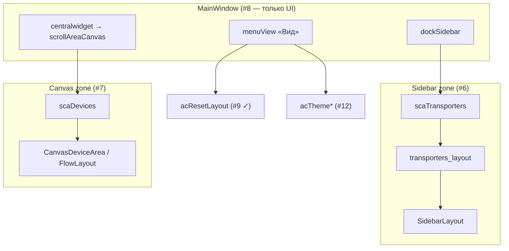

# Оболочка главного окна (layout shell)

| Параметр | Значение |
|----------|----------|
| План | Line Emulator UI modernization, подзадача **#8** |
| Макет (Qt Designer) | `forms/ui/Main.ui` |
| Сгенерированный класс | `forms/Main.py` → `Ui_MainWindow` |
| Потребитель | `core/main_ui/line_emul.py` → `MainLineField` |
| Регенерация | `pyside6-uic forms/ui/Main.ui -o forms/Main.py` |

## Назначение

Статическая оболочка главного окна Line Emulator: переход от **фиксированного горизонтального split** (две `QScrollArea` в одном layout) к **`QMainWindow` с dockable sidebar** и **холстом в central widget**. Форма задаёт зоны размещения устройств, прокрутку внутри зон и пункты меню «Вид»; **сохранение/сброс layout и dock state** — подзадача **#9** ([mainlinefield-layout.md](mainlinefield-layout.md)); переключение темы — **#12**.

## Маршрут и точка входа

Desktop-приложение без URL-маршрутизации:

| Уровень | Компонент |
|---------|-----------|
| Точка входа | `main.py` |
| Главное окно | `MainLineField(QMainWindow, Ui_MainWindow)` |
| UI-класс | `Ui_MainWindow.setupUi(self)` в `__init__` |

## Архитектура layout (после #8)

```text
┌─ QMainWindow (MainWindow) ─────────────────────────────────────────────┐
│ menuBar: Файл | Добавить | Управление | Вид                              │
├──────────────────────────────────────────────────────────────────────────┤
│ ┌─ QDockWidget dockSidebar ────┐  ┌─ centralwidget ───────────────────┐ │
│ │ «Боковая панель»             │  │ scrollAreaCanvas                  │ │
│ │ scrollAreaSidebar            │  │   └ scaDevices (FlowLayout в       │ │
│ │   └ scaTransporters          │  │      MainLineField)               │ │
│ │       transporters_layout    │  │      Printer, Camera, Scanner     │ │
│ │       + verticalSpacer       │  └───────────────────────────────────┘ │
│ │       Transporter, Generator │                                         │
│ └──────────────────────────────┘                                         │
└──────────────────────────────────────────────────────────────────────────┘
```

По умолчанию `dockSidebar` добавлен в **`LeftDockWidgetArea`**; холст занимает оставшуюся область как **central widget** (не отдельный `QDockWidget`).



### Отличие от прежнего Main.ui

| Было | Стало (#8) |
|------|------------|
| Корневой контейнер с `QHBoxLayout` и двумя scroll areas | `QMainWindow` |
| Левая и правая колонки жёстко связаны | Sidebar — `QDockWidget` (float, tab, left/right) |
| Inline QSS на `MainWindow` | QSS убран из `.ui` (централизация в theme — **#10**, **#11**) |
| Нет меню «Вид» | `menuView` с layout reset и theme actions |

Имена контейнеров **`scaDevices`**, **`scaTransporters`**, **`transporters_layout`** сохранены. Размещение устройств идёт через **`SidebarLayout`** / **`CanvasDeviceArea`** в `MainLineField` (#6, #7), а не напрямую в `transporters_layout` / `FlowLayout`.

## Зоны устройств

| Зона | objectName / layout | Типы виджетов | Код размещения (`MainLineField`) |
|------|---------------------|---------------|----------------------------------|
| Sidebar | `scaTransporters` → `transporters_layout` → **`SidebarLayout`** | Transporter, Generator | `_add_transport`, `_add_generator` → `_sidebar_layout.add_widget` |
| Canvas | `scaDevices` → **`CanvasDeviceArea`** / `FlowLayout` | Printer, Camera, Scanner | `_add_device` → `_canvas_area.add_widget` |

Sidebar прокручивается через `scrollAreaSidebar` (`widgetResizable`, `QFrame::Plain`). Холст — через `scrollAreaCanvas` с теми же свойствами.

## Компоненты и состояние

| objectName | Тип | Роль |
|------------|-----|------|
| `centralwidget` | `QWidget` | Host central area |
| `centralLayout` | `QVBoxLayout` | margins/spacing 0 |
| `scrollAreaCanvas` | `QScrollArea` | Прокрутка холста |
| `scaDevices` | `QWidget` | Контейнер canvas; `FlowLayout` задаётся в `MainLineField.__init__` |
| `dockSidebar` | `QDockWidget` | Боковая панель; заголовок «Боковая панель» |
| `dockSidebarContents` | `QWidget` | Содержимое dock |
| `dockSidebarLayout` | `QVBoxLayout` | margins/spacing 0 |
| `scrollAreaSidebar` | `QScrollArea` | Прокрутка sidebar |
| `scaTransporters` | `QWidget` | Контейнер sidebar |
| `verticalLayout` | `QVBoxLayout` | stretch 0 на `transporters_layout`, 1 на spacer |
| `transporters_layout` | `QVBoxLayout` | Host для `SidebarLayout` (#6); stretch 0 |
| `sidebarLayout` | `SidebarLayout` | Вертикальный reorder transporter/generator — см. [sidebar-layout.md](sidebar-layout.md) |
| `verticalSpacer` | `QSpacerItem` | Растяжение вниз списка |
| `menuView` | `QMenu` | Меню «Вид» |
| `acResetLayout` | `QAction` | «Сбросить расположение» |
| `themeActionGroup` | `QActionGroup` | exclusive; группа theme actions |
| `acThemeSystem` | `QAction` | «Как в системе»; checkable, checked по умолчанию |
| `acThemeLight` | `QAction` | «Светлая»; checkable |
| `acThemeDark` | `QAction` | «Тёмная»; checkable |

### Свойства `dockSidebar`

| Свойство | Значение |
|----------|----------|
| `minimumSize.width` | 280 px |
| `features` | `DockWidgetMovable` \| `DockWidgetFloatable` |
| `allowedAreas` | `LeftDockWidgetArea` \| `RightDockWidgetArea` |
| Начальная область | `LeftDockWidgetArea` (`addDockWidget`) |

Dock можно отстыковать, переместить вправо или объединить во вкладки стандартными средствами Qt. **Сохранение/восстановление** (`QMainWindow.saveState` / `restoreState`, поле `dock_state` в project JSON) и сброс через «Сбросить расположение» — **#9** ([mainlinefield-layout.md](mainlinefield-layout.md)).

## Меню «Вид» (`menuView`)

| Пункт | objectName | Текст в UI | Статус wiring |
|-------|------------|------------|---------------|
| Сброс layout | `acResetLayout` | «Сбросить расположение» | **#9** ✓ — `_on_reset_layout` → `_apply_default_layout` ([mainlinefield-layout.md](mainlinefield-layout.md)) |
| — | separator | | |
| Системная тема | `acThemeSystem` | «Как в системе» | UI only; **#12** + `UserSettings` |
| Светлая | `acThemeLight` | «Светлая» | UI only; **#12** |
| Тёмная | `acThemeDark` | «Тёмная» | UI only; **#12** |

`themeActionGroup` с `exclusive=True` обеспечивает radio-поведение checkable actions. Синхронизация с `UserSettings.theme_preference` и вызов `apply_theme` — в **#12** (`main.py`, `line_emul.py`).

## Интеграция в `MainLineField`

После `setupUi(self)` в `MainLineField.__init__`:

```python
self._canvas_area = CanvasDeviceArea(self.scaDevices)
self._devices_layout = self._canvas_area.flow_layout
self._sidebar_layout = SidebarLayout(parent=self.scaTransporters)
self.transporters_layout.addWidget(self._sidebar_layout)
```

Transporter/generator добавляются через `_sidebar_layout.add_widget`; canvas-устройства — через `_canvas_area.add_widget`. Persistence layout (**#9**): `get/set_sidebar_device_order`, `get/set_canvas_device_order`, `save_configuration_to_file`, `process_config`, `acResetLayout` — [mainlinefield-layout.md](mainlinefield-layout.md).

Подробнее: [sidebar-layout.md](sidebar-layout.md) (#6), [canvas-layout.md](canvas-layout.md) (#7), device-card (#5/#10).

Остальные меню («Файл», «Добавить», «Управление») и `acResetLayout` подключены в `setup_connections()`. **`acTheme*`** — **#12**.

## Критерии готовности #8 (выполнено в `.ui`)

- [x] `QMainWindow` вместо фиксированного split
- [x] `dockSidebar` с прокруткой и host для sidebar layout
- [x] Canvas в central widget (`scrollAreaCanvas` / `scaDevices`)
- [x] Меню «Вид» с reset и theme actions (exclusive group)
- [x] Dock float/move/tab; scroll внутри зон
- [x] Inline QSS `MainWindow` удалён из `.ui`

## Связанные подзадачи и документы

| Подзадача | Содержание |
|-----------|------------|
| **#6** | `SidebarLayout` — drag-reorder sidebar, [sidebar-layout.md](sidebar-layout.md) |
| **#7** | `CanvasDeviceArea` — drag-reorder canvas, [canvas-layout.md](canvas-layout.md) |
| **#9** | ✓ Save/load `sidebar_order` / `canvas_order` / `dock_state`, `acResetLayout` — [mainlinefield-layout.md](mainlinefield-layout.md) |
| **#12** | Подключение theme actions, `apply_theme`, persist в user settings |
| **#14** | ✓ Consolidated [layout-and-docking.md](layout-and-docking.md); cross-links |
| **#10**, **#11** | Collapsible advanced, централизация QSS |

- [sidebar-layout.md](sidebar-layout.md) — reorder transporter/generator (#6)
- [canvas-layout.md](canvas-layout.md) — reorder printer/camera/scanner (#7)
- [mainlinefield-layout.md](mainlinefield-layout.md) — dock state, save/load, reset (#9)
- [line_emulator.md](../line_emulator.md) — обзор приложения, `ConfigFile` layout-поля
- [layout-and-docking.md](layout-and-docking.md) — сводка zones, reorder, persistence (**#14**)
- [qt_theme.md](../qt_theme.md) — design system и `apply_theme`
- [user_settings.md](../user_settings.md) — `theme_preference`

Пользовательские инструкции по dock и меню «Вид» — после **#9** / **#12** (сводка в `user-doc-writer` по завершении плана).
