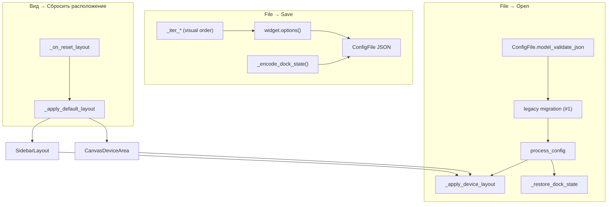

# MainLineField — dock state, порядок устройств, сброс layout


| Параметр | Значение |

|----------|----------|

| План | Line Emulator UI modernization, подзадача **#9** |

| Модуль | `core/main_ui/line_emul.py` → `MainLineField` |

| Конфиг | `core/main_ui/data.py` → `ConfigFile`; migration — [config_migration.md](../config_migration.md) |

| Тесты | `tests/test_core/test_line_emul_layout.py` (**6** тестов, **#13** ✓) |

| Reorder API | [sidebar-layout.md](sidebar-layout.md) (#6), [canvas-layout.md](canvas-layout.md) (#7) |

| Оболочка dock | [layout-shell.md](layout-shell.md) (#8) — `dockSidebar`, `acResetLayout` |


## Назначение


Оркестрация **persistence раскладки** главного окна Line Emulator: порядок карточек в зонах sidebar/canvas, состояние dock-панелей (`QMainWindow.saveState` / `restoreState`), сброс к заводским значениям через меню «Вид», согласованность bulk-операций с визуальным порядком.


Подзадачи **#6** и **#7** дают in-memory drag-reorder; **#9** связывает порядок и dock с project JSON при File → Open/Save и с пунктом «Сбросить расположение».


Документ для разработчиков UI. Поля JSON — [config.md](../config.md); пользовательские шаги — после завершения плана (`user-doc-writer`).


## Маршрут и точка входа


Desktop-приложение без URL-маршрутизации:


| Уровень | Компонент |

|---------|-----------|

| Главное окно | `MainLineField(QMainWindow, Ui_MainWindow)` |

| Sidebar order | `_sidebar_layout` → `SidebarLayout.get_order` / `set_order` |

| Canvas order | `_canvas_area` → `CanvasDeviceArea.get_order` / `set_order` |

| Dock state | `QMainWindow.saveState()` / `restoreState(QByteArray)` |

| Меню сброса | `acResetLayout` («Сбросить расположение») → `_on_reset_layout` |





## Поля project JSON (layout)


| Поле | Тип | Запись | Восстановление |

|------|-----|--------|----------------|

| `sidebar_order` | `list[str]` | `get_sidebar_device_order()` | `_apply_device_layout` → `set_sidebar_device_order` |

| `canvas_order` | `list[str]` | `get_canvas_device_order()` | `_apply_device_layout` → `set_canvas_device_order` |

| `dock_state` | `str \| None` | `_encode_dock_state()` (base64 ASCII) | `_restore_dock_state` |

| `advanced_expanded` | `bool` (в каждом `*Config`) | `dev.options()` через `_iter_*` | `_load_*` → `set_advanced_expanded` |


Пустые `sidebar_order` / `canvas_order` при load → zone defaults (`_default_sidebar_order`, `_default_canvas_order`). `dock_state: null` или отсутствие поля → `_apply_default_dock_layout` (sidebar слева).


## Save / load pipeline


### `save_configuration_to_file(file_path)`


1. Собирает `ConfigFile` из `dev.options()` для каждого типа устройства.

2. Списки устройств идут через **`_iter_printers`**, **`_iter_cameras`**, **`_iter_scanners`**, **`_iter_transporters`**, **`_iter_generators`** — порядок совпадает с **визуальным** порядком на экране (см. ниже).

3. Добавляет `sidebar_order`, `canvas_order`, `dock_state`.

4. Пишет `model_dump_json(indent=4)`.


Вызывается из `save_config`, `save_config_as` и при закрытии с активным файлом.


### `process_config(config)`


Последовательность восстановления:


1. `_load_printers` → `_load_cameras` → `_load_scanners` → `_load_transporters` → `_load_generator` (с `advanced_expanded` на каждой карточке).

2. `_apply_device_layout(config.sidebar_order, config.canvas_order)`.

3. `_restore_dock_state(config.dock_state)`.


`open_config`: `clear_ui()` → `process_config(cfg)` → обновление `_active_file`.


### Legacy JSON


Файлы без layout-полей проходят `@model_validator` → `enrich_legacy_config` (**#1**): генерируются `device_id`, `sidebar_order` / `canvas_order` из порядка записей в секциях, `dock_state` остаётся `None`. После `process_config` dock — слева, порядок — migration defaults. См. [config_migration.md](../config_migration.md).


## Dock state


| Метод | Поведение |

|-------|-----------|

| `_encode_dock_state() -> str` | `bytes(self.saveState().toBase64()).decode("ascii")` |

| `_restore_dock_state(dock_state)` | Если строка непустая — `restoreState(QByteArray.fromBase64(...))`; при неудаче — warning в лог и `_apply_default_dock_layout()` |

| `_apply_default_dock_layout()` | Снять float, `removeDockWidget` + `addDockWidget(LeftDockWidgetArea)`, `show()` |


Сериализуется полное состояние `QMainWindow` (позиция sidebar left/right, float, tabbing Qt). Не путать с порядком карточек внутри `SidebarLayout` / `CanvasDeviceArea` — это отдельные массивы `*_order`.


## Порядок устройств по умолчанию


| Зона | Метод | Правило |

|------|-------|---------|

| Sidebar | `_default_sidebar_order()` | Все transporter `device_id` (dict insertion order), затем все generator |

| Canvas | `_default_canvas_order()` | Все printer, затем все camera, затем все scanner (каждая группа — обход `_device_widgets`) |


Используется при пустых массивах в JSON, в `_apply_default_layout` и после «Сбросить расположение».


### `_apply_device_layout(sidebar_order, canvas_order)`


| Аргумент | Если непустой | Если пустой `[]` |

|----------|---------------|------------------|

| `sidebar_order` | `set_sidebar_device_order(...)` | `_default_sidebar_order()` |

| `canvas_order` | `set_canvas_device_order(...)` | `_default_canvas_order()` |


Делегирует в [SidebarLayout.set_order](sidebar-layout.md) / [CanvasDeviceArea.set_order](canvas-layout.md): неизвестные `device_id` пропускаются; неупомянутые виджеты остаются в конце в прежнем порядке.


### Public hooks (делегаты #6 / #7)


| Метод | Реализация |

|-------|------------|

| `get_sidebar_device_order()` | `_sidebar_layout.get_order()` |

| `set_sidebar_device_order(device_ids)` | `_sidebar_layout.set_order(device_ids)` |

| `get_canvas_device_order()` | `_canvas_area.get_order()` |

| `set_canvas_device_order(device_ids)` | `_canvas_area.set_order(device_ids)` |


## Сброс layout (`acResetLayout`)


| Элемент | Значение |

|---------|----------|

| QAction | `acResetLayout`, текст «Сбросить расположение» |

| Слот | `_on_reset_layout` → `_apply_default_layout()` |

| Wiring | `setup_connections()` — `acResetLayout.triggered.connect(self._on_reset_layout)` |


**`_apply_default_layout()`:** `_apply_default_dock_layout()` + default sidebar/canvas order.


**Важно:** сброс только **in-memory**. Чтобы записать defaults на диск — **File → Save** (или Save As). До сохранения открытый JSON на диске не меняется.


## Итераторы и визуальный порядок


Bulk-меню «Управление» и save/load используют итераторы, следующие **текущему** порядку на экране:


| Итератор | Источник порядка | Фильтр |

|----------|------------------|--------|

| `_iter_devices()` | `get_canvas_device_order()` | все canvas-устройства |

| `_iter_printers()` | canvas order | `isinstance(..., PrinterWidget)` |

| `_iter_cameras()` | canvas order | `CameraWidget` |

| `_iter_scanners()` | canvas order | `ScannerWidget` |

| `_iter_transporters()` | `get_sidebar_device_order()` | ключ в `_transporter_widgets` |

| `_iter_generators()` | sidebar order | ключ в `_generator_widgets` |


Порядок «Запустить всё» / «Остановить всё» / по типам согласован с drag-reorder (#6, #7). Подробнее bulk — [bulk-control.md](../bulk-control.md).


## `clear_ui()` и удаление виджетов


Перед загрузкой другого JSON или полной очисткой:


| Реестр | Снятие с layout | Удаление |

|--------|-----------------|----------|

| `_device_widgets` | `_canvas_area.remove_widget(dev)` | `setParent(None)`, `run(False)`, `deleteLater()` |

| `_transporter_widgets` | `_sidebar_layout.remove_widget(trn)` | то же |

| `_generator_widgets` | `_sidebar_layout.remove_widget(gen)` | то же |


`remove_widget` обязателен до `deleteLater` — иначе «висящие» items в `FlowLayout` / `QVBoxLayout`. `_remove_device` / `_remove_transporter` / `_remove_generator` используют ту же схему.


## Интеграция с меню и формой


| Меню | Действие | Метод #9 |

|------|----------|----------|

| Файл → Сохранить / Сохранить как | Запись JSON + layout | `save_configuration_to_file` |

| Файл → Открыть | Load + restore layout | `open_config` → `process_config` |

| Вид → Сбросить расположение | Factory defaults in-memory | `_on_reset_layout` |
| Вид → «Как в системе» / «Светлая» / «Тёмная» | Persist user theme + re-apply QSS | `_on_theme_preference_changed` (**#12**) |


Статическая оболочка (`dockSidebar`, `scrollAreaCanvas`, …) — [layout-shell.md](layout-shell.md). Theme actions — **#12** ✓; **не** входят в project JSON (см. [user_settings.md](../user_settings.md)).


## Theme preference (#12)


Переключение темы оформления — отдельно от layout persistence. Хранится в `line_emulator_user.json`, не в project JSON.


| Пункт «Вид» | `QAction` | Метод |

|-------------|-----------|--------|

| «Как в системе» | `acThemeSystem` | `_on_theme_preference_changed(ThemeMode.SYSTEM)` |

| «Светлая» | `acThemeLight` | `_on_theme_preference_changed(ThemeMode.LIGHT)` |

| «Тёмная» | `acThemeDark` | `_on_theme_preference_changed(ThemeMode.DARK)` |


**Wiring** (`setup_connections` → `_setup_theme_connections`):


1. `triggered` на каждый `acTheme*` → `_on_theme_preference_changed`.

2. При старте — `_sync_theme_menu_from_settings()` (checkable actions ↔ `self._user_settings.theme_preference`).

3. При смене — `save_user_settings(UserSettings(theme_preference=...))` + `apply_theme(QApplication.instance(), mode)`.


`MainLineField.__init__` загружает `load_user_settings()` в `self._user_settings`; первичное применение темы — в `main.py` **до** создания окна.


Подробности API, resolved mode и Windows workaround — [qt_theme.md](../qt_theme.md), [theme-system.md](theme-system.md).


## Тесты


`tests/test_core/test_line_emul_layout.py` (**6** тестов):


| Класс / тест | Покрытие |

|--------------|----------|

| `TestMainLineFieldLayoutPersistence.test_save_load_roundtrip_preserves_layout_fields` | File save/load: `sidebar_order`, `canvas_order`, `dock_state`, `advanced_expanded`, dock area |

| `test_process_config_restores_saved_visual_order` | `process_config` применяет сохранённый sidebar/canvas order (**#13**) |

| `test_process_config_applies_legacy_migration_defaults` | Legacy JSON без layout → migration defaults + dock слева |

| `TestMainLineFieldResetLayout.test_reset_layout_restores_default_dock_and_order` | `_apply_default_layout`: dock left, default order |

| `test_ac_reset_layout_slot_does_not_crash` | Меню «Сбросить расположение» (`_on_reset_layout`) |

| `TestMainLineFieldVisualOrderIterators.test_iterators_follow_visual_order` | `_iter_*` после programmatic reorder |


Запуск:


```powershell

.\venv\Scripts\python.exe -m unittest tests.test_core.test_line_emul_layout -v

```


См. также: `tests/test_core/test_config_layout_migration.py`, `tests/test_sidebar_layout.py`, `tests/test_canvas_area.py`.


## Roadmap (связанные подзадачи)


| Подзадача | Статус | Содержание |

|-----------|--------|------------|

| **#6** | готово | `SidebarLayout`, in-memory sidebar reorder |

| **#7** | готово | `CanvasDeviceArea`, in-memory canvas reorder |

| **#8** | готово | `QMainWindow`, `dockSidebar`, `acResetLayout` в `.ui` |

| **#9** | готово | Save/load order + dock, reset, visual-order iterators |

| **#12** | готово | Theme actions, `UserSettings`, `apply_theme` |

| **#14** | pending | Финальная актуализация cross-links |


## Связанная документация


- [config.md](../config.md) — поля `sidebar_order`, `canvas_order`, `dock_state`, `advanced_expanded`.

- [config_migration.md](../config_migration.md) — legacy enrichment при отсутствии layout-полей.

- [layout-shell.md](layout-shell.md) — `dockSidebar`, меню «Вид», central canvas.

- [sidebar-layout.md](sidebar-layout.md) — reorder transporter/generator (#6).

- [canvas-layout.md](canvas-layout.md) — reorder printer/camera/scanner (#7).

- [theme-system.md](theme-system.md) — design system, меню «Вид», persistence theme (#12).

- [user_settings.md](../user_settings.md) — `line_emulator_user.json`, пути APPDATA/WORKDIR.

- [qt_theme.md](../qt_theme.md) — `apply_theme`, `resolve_effective_mode`, QSS.

- [line_emulator.md](../line_emulator.md) — обзор `MainLineField`, save/load, bulk control, тема (#12).
