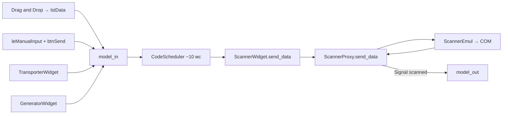
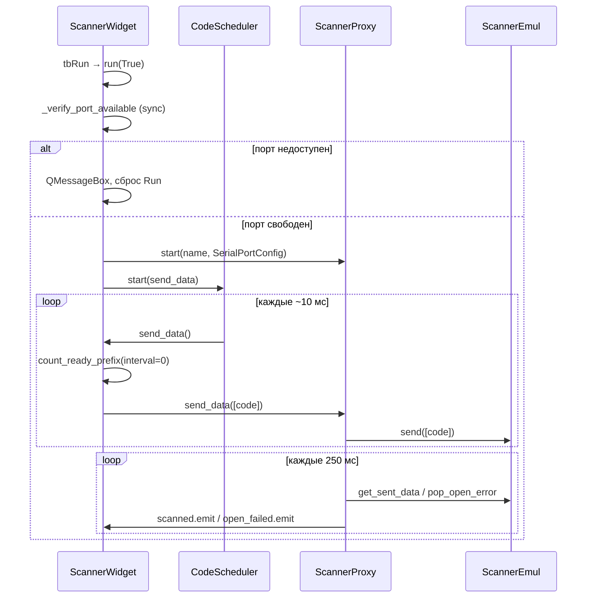

# Виджет ScannerWidget

| Параметр | Значение |
|----------|----------|
| План | serial-barcode-scanner-bulk-control, подзадача **#4** |
| Модуль | `core/barcode_scanner/scanner_widget.py` |
| UI-форма | `forms/Scanner.py` → `Ui_Form` (см. [scanner-ui.md](scanner-ui.md)) |
| Зависимости UI | PySide6, **QtAwesome** (`requirements.txt` → `QtAwesome==1.3.1`) |

## Назначение

`ScannerWidget` — виджет эмулятора **ручного сканера штрихкодов** на холсте линии. Принимает коды из drag-and-drop, ручного ввода, `TransporterWidget` и `GeneratorWidget`, ставит их в очередь `model_in`, по тику `CodeScheduler` отправляет в COM через `ScannerProxy` / `ScannerEmul` и отражает успешно записанные коды в `model_out`.

Слой Qt **не** работает с pyserial напрямую: открытие порта, очередь записи и сигнал `open_failed` — в ядре и прокси (см. [scanner_serial.md](../scanner_serial.md)).

## Маршрут и точки входа

| Элемент | Значение |
|---------|----------|
| Класс | `ScannerWidget(QWidget, Ui_Form)` |
| Создание | `ScannerWidget(name: str, port_name: str = "")` — имя и опциональный предвыбор COM |
| Размещение на холсте | `MainLineField.add_scanner` / меню «Добавить → Сканер» (подзадача **#5**, реализовано) |
| Сохранение в JSON | `options()` / `load_options()` + секция `scanners` в `ConfigFile` (модель — **#2**, wiring в `MainLineField` — **#5**) |

Публичные атрибуты для связи с transport/generator (подзадача **#6**, реализовано):

| Атрибут | Тип | Роль |
|---------|-----|------|
| `model_in` | `CustomItemModel` | Входная очередь (DnD, ручной ввод, transport, generator) |
| `model_out` | `QStandardItemModel` | Коды, подтверждённые ядром как отправленные в COM; источник для `TransporterWidget.cbxFrom` |

## Архитектура потока данных





## Компоненты и состояние

| Компонент / поле | Роль |
|------------------|------|
| `Ui_Form` (`forms/Scanner.py`) | Макет: имя, COM combo, Run/Stop, ручной ввод, список очереди |
| `_scanner` | `ScannerProxy` — мост в UI-поток, сигналы `scanned`, `open_failed` |
| `_scheduler` | `CodeScheduler` — периодический вызов `send_data` |
| `_params` | `ScannerParams` — параметры линии COM (baud, parity, suffix); задаётся `load_options` |
| `name` | Текущее имя устройства на линии (синхронизируется при Run) |

### Константы отправки

| Константа | Значение | Смысл |
|-----------|----------|--------|
| `_SEND_BATCH_SIZE` | `1` | За один тик планировщика снимается один код с головы очереди |
| `_SEND_INTERVAL_MS` | `0` | Per-code задержка отключена: код готов к отправке сразу после попадания в `model_in` |
| `_COM_PORT_PLACEHOLDER` | `"Выберите порт"` | Первая строка `cbxComPort`, не считается выбранным портом |

В отличие от `CameraWidget`, у сканера **нет** `spInterval` / `spSize` в форме: интервал и размер пакета зафиксированы константами (мгновенная отправка по одному коду).

## Очередь `model_in` и drag-and-drop

1. `lstData` использует `CustomItemModel` (`libs/model_processing.py`) с поддержкой MIME drop.
2. В конструкторе: `setAcceptDrops(True)`, `setDropIndicatorShown(True)` — режим `DropOnly` задан в [scanner-ui.md](scanner-ui.md) (`Scanner.ui`).
3. При вставке строк (`rowsInserted`) вызывается `_on_model_in_rows_inserted` → `stamp_item(item)` для каждого нового элемента (DnD, ручной ввод, внешние источники с `create_code_item`).
4. `send_data` читает готовый префикс через `count_ready_prefix(self.model_in, _SEND_INTERVAL_MS)`; при `interval_ms=0` головной элемент готов немедленно.
5. Отправка: `takeRow(0)` → текст элемента → `_scanner.send_data([code])`.

Элементы создаются через `create_code_item(text)` — единый формат pipeline с камерой и транспортёром (см. [model_processing_timing.md](../model_processing_timing.md)).

## Ручная отправка и QtAwesome

| Элемент UI | Обработчик | Поведение |
|------------|------------|-----------|
| `btnSend` | `_send_manual_input` | Добавляет trimmed-текст из `leManualInput` в `model_in`, очищает поле |
| `leManualInput` | `returnPressed` → `_send_manual_input` | То же по Enter |

Иконка кнопки отправки (`_setup_send_icon`):

```python
icon = qta.icon("fa5s.paper-plane", color="#FFFFFF")
self.btnSend.setIcon(icon)
self.btnSend.setText("")
```

Текст «▶» из `.ui` заменяется иконкой Font Awesome 5 Solid; tooltip «Отправить» остаётся из формы.

## CodeScheduler

| Событие | Действие |
|---------|----------|
| `run(True)` после успешной валидации | `_scheduler.start(self.send_data)` |
| `run(False)` | `_scheduler.stop()` |
| `_on_scanner_open_failed` | `_scheduler.stop()` до сброса Run |

Внутренний тик планировщика — **10 мс** (`SCHEDULER_TICK_MS` в `libs/code_scheduler.py`); подробности API — [code_scheduler.md](../code_scheduler.md).

Callback `send_data`:

- обновляет tooltip `lstData`: «Данных на отправку N»;
- при пустой очереди или недостаточном `ready_count` — выход;
- иначе снимает до `_SEND_BATCH_SIZE` кодов и передаёт в прокси.

## Run / Stop (`tbRun`)

### Валидация при включении

| Проверка | Сообщение | Сброс Run |
|----------|-----------|-----------|
| Пустое имя (`leName`) | «Введите название перед запуском.» | да, через `blockSignals` |
| Не выбран COM (`currentIndex <= 0`) | «Выберите COM-порт перед запуском.» | да |
| `_verify_port_available` не прошла | «Не удалось открыть COM-порт {port}: …» | да, поля имени и порта снова доступны |

`blockSignals(True/False)` при программном `setChecked(False)` предотвращает повторный вызов `run(False)` и случайный `clear_data()` во время отклонённого запуска.

### Успешный запуск

1. Блокируются `leName` и `cbxComPort`.
2. `ScannerConfig(...).to_serial_port_config()` → `SerialPortConfig`.
3. Синхронная проба `open_serial_port` + `close` в `_verify_port_available`.
4. `_scanner.start(self.name, config)`.
5. `_scheduler.start(self.send_data)`.
6. Лог INFO: сканер запущен на выбранном порту.

### Остановка

1. `_scheduler.stop()`, `_scanner.stop()`.
2. `clear_data()` — очистка UI-очередей и ядра.
3. Лог INFO: сканер остановлен.

### Индикация R / S (`_setup_icon`)

| Состояние `tbRun` | Текст | Цвет |
|-------------------|-------|------|
| выключен (Run) | `R` | `#00FF00` |
| включён (Stop) | `S` | `#FF0000` |

## COM-порт (`cbxComPort`)

`_refresh_com_ports(select_port=None)`:

1. Очищает combo, добавляет disabled-placeholder «Выберите порт».
2. Добавляет имена из `list_available_ports()` (`libs/serial_port.py`).
3. При `select_port`: выбирает существующий индекс или добавляет порт в список (для сохранённого в JSON имени, которого сейчас нет в системе).

`_get_port_name()` возвращает `""`, если выбран placeholder (индекс 0).

## Исходящая очередь `model_out`

`ScannerProxy.scanned` → `_populate_scanned_data`: для каждого кода из списка `appendRow(create_code_item(row))`.

Опрос ядра — таймер **250 мс** в прокси (не `CodeScheduler`); см. [scanner_serial.md](../scanner_serial.md).

## Обработка ошибок COM

Два уровня проверки:

| Этап | Механизм | UI-реакция |
|------|----------|------------|
| До старта потока | `_verify_port_available` — sync `open_serial_port` + `close` | `QMessageBox.warning`, заголовок «Сканер», Run не включается |
| После старта (фоновое открытие) | `ScannerEmul._open_error` → `pop_open_error()` → `ScannerProxy.open_failed` | `_on_scanner_open_failed` |

Обработчик `_on_scanner_open_failed(message)`:

1. Останавливает планировщик и прокси.
2. Сбрасывает `tbRun` с `blockSignals`.
3. Включает `leName` и `cbxComPort`.
4. Обновляет иконку на «R».
5. Показывает `QMessageBox.warning` с именем порта и текстом ошибки.
6. Пишет ERROR в `UI_LOGGER`.

Типичные причины: порт занят другим процессом, порт отсутствует в системе.

## `clear_data()`

Публичный метод для массовой очистки (подзадача **#10**) и внутреннего сброса при остановке:

| Действие | Описание |
|----------|----------|
| `model_in.clear()` | Очистка входной очереди в UI |
| `model_out.clear()` | Очистка списка отправленных кодов |
| `_scanner.clear_queues()` | Сброс `_to_send` и `_sent` в ядре через прокси |

Остановка эмулятора **не** требуется для вызова из меню «Очистить данные» (план #10); при `run(False)` `clear_data()` вызывается после `stop()`. Меню и порядок pipeline — [bulk-control.md](../bulk-control.md).

## Конфигурация: `options()` и `load_options()`

```python
def load_options(self, params: ScannerParams) -> None:
    self._params = params

def options(self) -> ScannerConfig:
    return ScannerConfig(
        name=self.name,
        port_name=self._get_port_name(),
        config=self._params,
    )
```

| Метод | Когда вызывается |
|-------|------------------|
| `load_options` | `_load_scanners` при `open_config` / `process_config` |
| `options` | `save_configuration_to_file` в `MainLineField` |

`port_name` в `options()` берётся из текущего combo (пустая строка, если выбран placeholder). Поля `ScannerParams` в UI пока не редактируются — значения по умолчанию из модели (#2); расширение формы — вне scope #4.

## Интеграция в Transport и Generator (#6)

**Модули:** `core/transporting/transporter_widget.py`, `core/generator/generator_widget.py`.

`ScannerWidget` участвует в маршрутизации кодов так же, как `CameraWidget`: приёмник подключается через `model_in`, источник для транспортёра — через `model_out`.

### TransporterWidget

| Combo | Сканер | Привязка |
|-------|--------|----------|
| `cbxFrom` | допустим | `model_in` транспортёра ← `ScannerWidget.model_out` |
| `cbxTo` | допустим | `model_out` транспортёра ← `ScannerWidget.model_in` |

В `get_data_models()` сканер попадает в **оба** списка: как источник (`from_model` — вместе с камерой и принтером) и как приёмник (`to_model` — вместе с камерой). Передача в `send_data` использует `create_code_item` при записи в `model_in` сканера; далее сканер штампует элементы при вставке (`rowsInserted`) и отправляет в COM по своему `CodeScheduler`.

Типичные цепочки:

- генератор → сканер (коды в COM);
- камера → транспортёр → сканер;
- сканер → транспортёр → камера (исходящие из `model_out` после успешной записи в порт).

### GeneratorWidget

| Combo | Сканер | Привязка |
|-------|--------|----------|
| `cbxTo` | допустим | `model_out` генератора ← `ScannerWidget.model_in` |

Генератор создаёт коды через `get_new_code` и `appendRow(create_code_item(...))` в очередь сканера с интервалом `_last_generated_at` / `spInterval` генератора. Per-code задержка на стороне сканера отключена (`_SEND_INTERVAL_MS = 0`): код уходит в COM на ближайшем тике планировщика сканера после попадания в `model_in`.

### Обновление combo (`setup_models`)

При добавлении или загрузке сканера `MainLineField` вызывает `setup_models` у всех транспортёров и генераторов. Сканер регистрируется в `_device_data` по `id(widget)`; отображаемое имя — `device.name`. Пока транспортёр/генератор в Run, списки combo не перестраиваются.

### Null guards (со стороны transport/generator)

Если в combo не выбрано устройство или виджет отсутствует в `_device_data`, `set_from_model` / `set_to_model` пишут предупреждение в `UI_LOGGER` и не меняют ссылку. `send_data` транспортёра требует обе модели; генератора — `model_out`; иначе предупреждение и выход без передачи.

Обзор wiring и диаграмма — [line_emulator.md](../line_emulator.md) (раздел «Связь виджетов: Transport и Generator»).

## Сравнение с `CameraWidget`

| Аспект | CameraWidget | ScannerWidget |
|--------|--------------|---------------|
| Транспорт | TCP (`CameraProxy`) | COM (`ScannerProxy`) |
| Подключение в UI | `leConnetionStr` (порт) | `cbxComPort` |
| Per-code интервал | `spInterval` (динамический) | `_SEND_INTERVAL_MS = 0` |
| Размер пакета | `spSize` | `_SEND_BATCH_SIZE = 1` |
| `lstData` DnD | Drop + processed drag out | DropOnly (приёмник) |
| Ручной ввод | `btnSendError` (error) | `leManualInput` + `btnSend` |
| Ошибка подключения | — | sync + `open_failed` / QMessageBox |
| `clear_data` | `_clear_data` (private) | `clear_data()` (public) |
| Иконка send | текст кнопки | QtAwesome `fa5s.paper-plane` |

## Граница ответственности (#4–#6)

**Реализовано в `scanner_widget.py` и `MainLineField`:**

- Модели `model_in` / `model_out`, DnD, `stamp_item` на вставке.
- `CodeScheduler` + `send_data` с FIFO и batch=1.
- Ручной ввод, иконка QtAwesome на `btnSend`.
- Заполнение COM combo, Run/Stop, валидация имени и порта.
- `clear_data()`, `options()`, `load_options()`.
- Обработка занятого/недоступного COM: `_verify_port_available`, `open_failed`.
- Участие в combo transport/generator, контракт `model_in` / `model_out` для pipeline (#6).
- Пункт меню «Добавить → Сканер» (`acAddScanner`), save/load секции `scanners`, `closeEvent` → `run(False)`, `_sync_scanner_name_generator`, `setup_models` при `_add_device` (#5) — см. [line_emulator.md](../line_emulator.md), раздел «Интеграция сканера в главное окно».

**Не входит (следующие подзадачи):**

| Поведение | Подзадача |
|-----------|-----------|
| Редактирование `ScannerParams` в UI | вне текущего плана |
| Пользовательские инструкции, `WHATSNEW.md` | #9 / `user-doc-writer` |

## Связанная документация

- [scanner-ui.md](scanner-ui.md) — статический макет `Scanner.ui` (подзадача #3).
- [scanner_serial.md](../scanner_serial.md) — `ScannerEmul`, `ScannerProxy`, `libs/serial_port` (подзадача #1).
- [code_scheduler.md](../code_scheduler.md) — тик 10 мс, интеграция в виджеты линии.
- [model_processing_timing.md](../model_processing_timing.md) — `create_code_item`, `count_ready_prefix`, `stamp_item`.
- [line_emulator.md](../line_emulator.md) — `ScannerConfig` / `ScannerParams` в JSON (#2); wiring transport/generator (#6).
