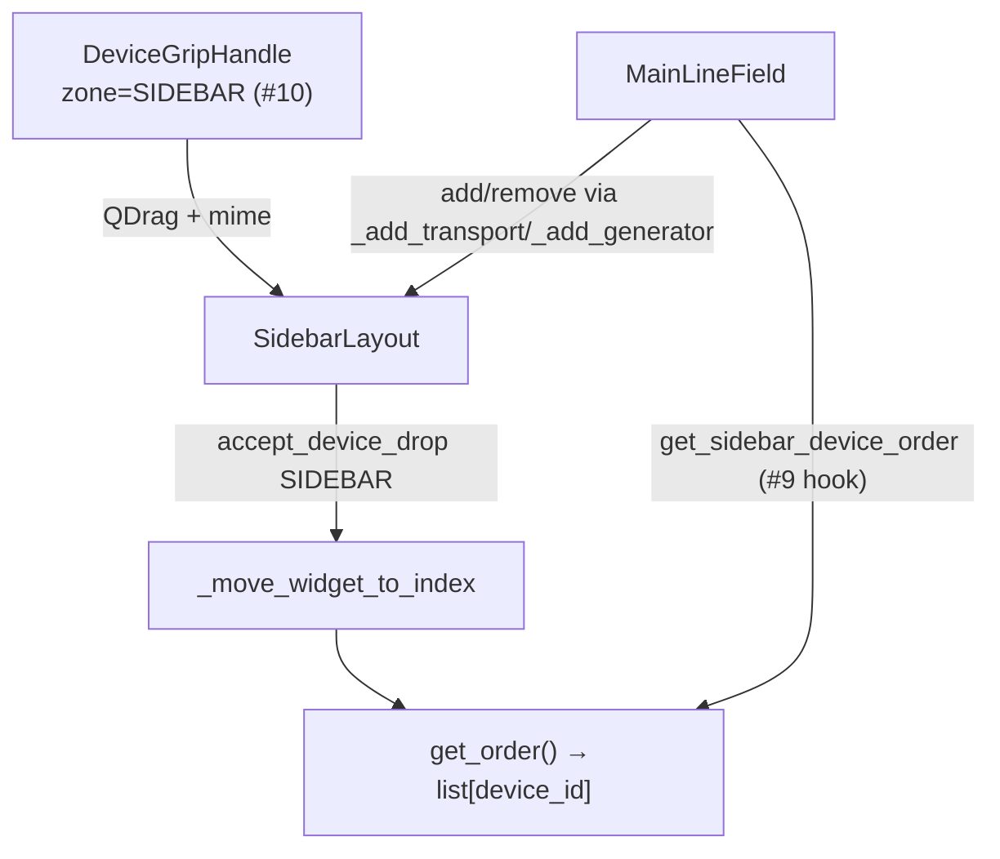

# Reorderable sidebar layout

| Параметр | Значение |
|----------|----------|
| План | Line Emulator UI modernization, подзадача **#6** |
| Модуль | `core/main_ui/sidebar_layout.py` → `SidebarLayout` |
| Интеграция | `core/main_ui/line_emul.py` → `MainLineField._sidebar_layout` |
| Тесты | `tests/test_core/test_sidebar_layout.py` |
| Drag source (grip) | [device-card.md](device-card.md) — `DeviceGripHandle`, зона `DeviceZone.SIDEBAR` |
| Полный chrome на sidebar | **#10** — `mount_device_card_header` на Transporter/Generator |
| Save/load порядка | **#9** ✓ — `get_sidebar_device_order` / `set_sidebar_device_order` → `sidebar_order` в project JSON; оркестрация — [mainlinefield-layout.md](mainlinefield-layout.md) |

## Назначение

Вертикальный контейнер для карточек **Transporter** и **Generator** в зоне sidebar (`dockSidebar` → `scaTransporters`). Обеспечивает:

- drag-reorder по `device_id` через mime `application/x-line-emulator-device-id` ([device-card.md](device-card.md));
- **zone guard** — принимаются только drops с `DeviceZone.SIDEBAR`; canvas-payload отклоняется;
- визуальный **drop indicator** (горизонтальная линия между карточками);
- programmatic API `get_order` / `set_order` для persistence (**#9**).

Документ для разработчиков UI. Статическая оболочка sidebar — [layout-shell.md](layout-shell.md) (#8); поля конфига — [config.md](../config.md).

## Маршрут и точка входа

Desktop-приложение без URL-маршрутизации:

| Уровень | Компонент |
|---------|-----------|
| Главное окно | `MainLineField` |
| Host в `.ui` | `scaTransporters` внутри `scrollAreaSidebar` |
| Reorder-контейнер | `SidebarLayout` (`objectName`: `sidebarLayout`) |
| Обёртка в форме | `transporters_layout` (`QVBoxLayout`) — один дочерний виджет `_sidebar_layout` |

```text
dockSidebar
└─ scrollAreaSidebar
   └─ scaTransporters
      └─ verticalLayout
         ├─ transporters_layout
         │  └─ SidebarLayout  [sidebarLayout]
         │     ├─ TransporterWidget …
         │     ├─ sidebarDropIndicator  (временно при drag)
         │     └─ GeneratorWidget …
         └─ verticalSpacer
```



## Класс `SidebarLayout`

Базовый класс: `QWidget`. Реестр виджетов — `dict[str, QWidget]` по `device_id`.

| Свойство / константа | Значение |
|----------------------|----------|
| `objectName` | `sidebarLayout` |
| `_DROP_INDICATOR_HEIGHT` | 3 px |
| Drop indicator `objectName` | `sidebarDropIndicator` |
| Цвет indicator | `#f0b321` (inline QSS до централизации theme) |
| Layout | `QVBoxLayout`, margins 0, spacing 1 |
| `setAcceptDrops` | `True` на контейнере и на каждой добавленной карточке |

### Public API

| Метод | Назначение |
|-------|------------|
| `add_widget(widget)` | Регистрация по `widget.device_id`, `installEventFilter`, append в layout |
| `remove_widget(widget)` | Снятие с registry и layout без `deleteLater` |
| `get_order() -> list[str]` | `device_id` сверху вниз |
| `set_order(device_ids)` | Программная перестановка; неизвестные id пропускаются; неупомянутые — в конце в прежнем порядке |

**Требования к виджетам:** атрибут `device_id: str` (непустой). Иначе `add_widget` → `TypeError`; дубликат id → `ValueError`.

Пример programmatic reorder:

```python
sidebar = SidebarLayout(parent=scaTransporters)
sidebar.add_widget(transporter)
sidebar.add_widget(generator)
sidebar.get_order()  # ["id-transporter-1", "id-generator-1"]
sidebar.set_order(["id-generator-1", "id-transporter-1"])
```

### Drag / drop

| Событие | Поведение |
|---------|-----------|
| `dragEnterEvent` | `accept_device_drag_enter(event, DeviceZone.SIDEBAR)` |
| `dragMoveEvent` | zone guard + `_insert_index_at` + `_show_drop_indicator` |
| `dragLeaveEvent` | `_hide_drop_indicator` |
| `dropEvent` | `accept_device_drop` → `_move_widget_to_index` по `payload.device_id` |

**eventFilter на дочерних карточках:** drag-события с виджета карточки (не только с пустого фона `SidebarLayout`) маршрутизируются в ту же логику; координаты мапятся через `_event_position_in_sidebar`. На `ChildAdded` новым дочерним `QWidget` выставляется `setAcceptDrops(True)`.

**Insert index:** для точки `(x, y)` в локальных координатах sidebar — индекс перед первой карточкой, чей vertical mid выше `y`; иначе append.

**Drop indicator:** `QFrame` вставляется в layout на вычисленный index; скрывается после drop или leave.

Cross-zone пример (отклоняется):

```python
# payload.zone == DeviceZone.CANVAS → dragEnter/drop ignore, порядок не меняется
accept_device_drop(event, DeviceZone.SIDEBAR)  # None
```

## Интеграция в `MainLineField`

После `setupUi` в `__init__`:

```python
self._sidebar_layout = SidebarLayout(parent=self.scaTransporters)
self.transporters_layout.addWidget(self._sidebar_layout)
```

| Операция | Метод `MainLineField` | Вызов `SidebarLayout` |
|----------|----------------------|------------------------|
| Добавить transporter | `_add_transport` | `add_widget(transport)` |
| Добавить generator | `_add_generator` | `add_widget(generator)` |
| Удалить transporter | `_remove_transporter` | `remove_widget(transport)` |
| Удалить generator | `_remove_generator` | `remove_widget(generator)` |
| Очистка UI | `clear_ui` | `remove_widget` для каждого sidebar-виджета |

### Hooks для persistence (#9)

| Метод | Реализация | Назначение |
|-------|------------|------------|
| `get_sidebar_device_order() -> list[str]` | `_sidebar_layout.get_order()` | Чтение порядка перед File → Save |
| `set_sidebar_device_order(device_ids)` | `_sidebar_layout.set_order(device_ids)` | Восстановление из `ConfigFile.sidebar_order` при load |

**Persistence (#9):** после drag порядок in-memory; запись `sidebar_order` при File → Save и восстановление при `process_config` — [mainlinefield-layout.md](mainlinefield-layout.md).


## Связь с device card chrome

| Компонент | Подзадача | Роль |
|-----------|-----------|------|
| `DeviceGripHandle` + mime | **#5** | Единственный источник drag |
| `mount_device_card_header(..., zone=DeviceZone.SIDEBAR)` | **#10** | Grip на Transporter/Generator |
| `SidebarLayout` drop target | **#6** (этот документ) | Reorder в sidebar |

Без grip на карточке (#10) пользователь не инициирует sidebar drag; без `SidebarLayout` (#6) drop некуда принимать.

## Отличие от canvas reorder

| | Sidebar (#6) | Canvas (#7) |
|---|--------------|-------------|
| Класс | `SidebarLayout` | `CanvasDeviceArea` |
| Layout | `QVBoxLayout` | `FlowLayout` (auto-wrap) |
| Зона | `DeviceZone.SIDEBAR` | `DeviceZone.CANVAS` |
| Типы | Transporter, Generator | Printer, Camera, Scanner |
| Hook в `MainLineField` | `get/set_sidebar_device_order` | `get/set_canvas_device_order` |

Не смешивать zone guards: transporter/generator не drop на canvas и наоборот. Подробнее canvas — [canvas-layout.md](canvas-layout.md).

## Тесты

`tests/test_core/test_sidebar_layout.py`:

| Класс | Покрытие |
|-------|----------|
| `TestSidebarLayoutOrderApi` | add/remove, `get_order`, `set_order`, `device_id` required |
| `TestSidebarLayoutDropGuard` | cross-zone canvas reject; same-zone drop reorder |
| `TestMainLineFieldSidebarIntegration` | `_add_transport` / `_add_generator`; get/set round-trip |

Запуск:

```powershell
.\venv\Scripts\python.exe -m unittest tests.test_core.test_sidebar_layout -v
```

## Roadmap

| Подзадача | Статус | Содержание |
|-----------|--------|------------|
| **#5** | готово | Mime, zone guards, grip |
| **#6** | готово | `SidebarLayout`, MainLineField hooks |
| **#9** | готово | Save/load `sidebar_order`, dock, `acResetLayout` — [mainlinefield-layout.md](mainlinefield-layout.md) |
| **#10** | готово | Chrome + grip на всех 5 типах |

## Связанная документация

- [device-card.md](device-card.md) — grip, mime, `DeviceZone`, zone guard API.
- [canvas-layout.md](canvas-layout.md) — reorder printer/camera/scanner на холсте (#7).
- [layout-shell.md](layout-shell.md) — `dockSidebar`, `scaTransporters`, `transporters_layout`.
- [config.md](../config.md) — поле `sidebar_order` в project JSON.
- [mainlinefield-layout.md](mainlinefield-layout.md) — save/load, reset, dock state (#9).
