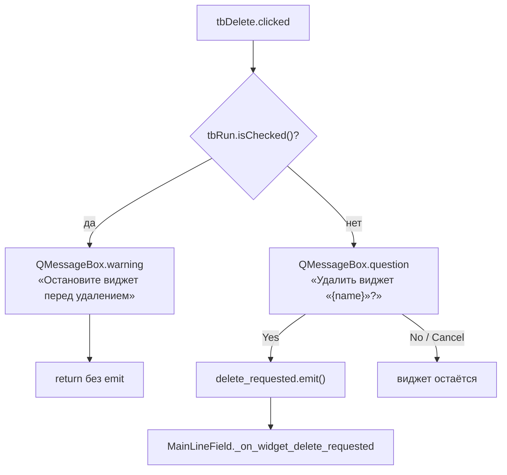
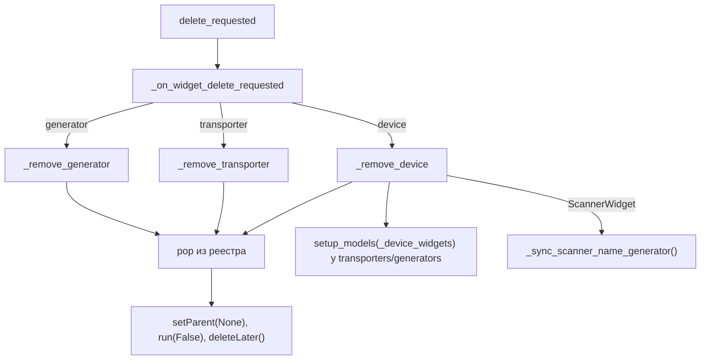
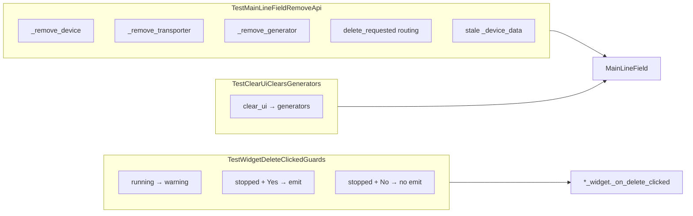

# Удаление виджетов с холста (`tbDelete` + Remove API)

| Параметр | Значение |
|----------|----------|
| План | widget-delete-com-refresh, подзадачи **#2** (UI/сигнал), **#3** (Remove API), **#4** (unit-тесты), **#5** (docs) |
| Версия | `client_info.VERSION` `1.0.0.1.b0005` |
| UI | `forms/ui/{Printer,Camera,Scanner,Transporter,Generator}.ui` → `forms/*.py` |
| Логика виджетов | `core/*/printer\|camera\|scanner\|transporter\|generator_widget.py` |
| Холст | `core/main_ui/line_emul.py` → `MainLineField` |
| Тесты | `tests/test_core/test_widget_delete.py` (16 тестов) |

## Назначение

На каждом из пяти виджетов Line Emulator есть кнопка **`tbDelete`** и сигнал **`delete_requested`**. Оператор подтверждает удаление остановленного виджета; `MainLineField` снимает виджет с холста и из реестра, обновляет combo перевозчиков/генераторов и при удалении сканера синхронизирует `scanner_name`.

## UI: `tbDelete`

| Свойство | Значение |
|----------|----------|
| Тип | `QToolButton` |
| Размер | 28×28 px |
| Текст | «X» |
| Tooltip | «Удалить» |
| Позиция | в **`DeviceCardHeader`** (справа от title slot) — после mount **#5** |

| Форма | Header до mount (`.ui`) | После mount |
|-------|-------------------------|-------------|
| Printer, Camera, Scanner, Transporter, Generator | `horizontalLayout`: `leName`, `tbRun`, legacy `tbDelete` | `DeviceCardHeader`: grip \| title_layout \| delete |

Регенерация Python после правки `.ui`:

```powershell
.\venv\Scripts\pyside6-uic.exe forms/ui/<Name>.ui -o forms/<Name>.py
```

## Сигнал и слот на виджете (#2)

Во всех пяти классах виджетов:

| Элемент | Описание |
|---------|----------|
| `delete_requested = Signal()` | PySide6-сигнал без аргументов; отправитель — сам виджет |
| `_connect_ui` | `self.tbDelete.clicked.connect(self._on_delete_clicked)` |
| `_on_delete_clicked` | см. поток ниже |

Общий mixin не используется — короткий слот скопирован в каждый виджет.



### Имя в диалоге

| Виджеты | Источник имени |
|---------|----------------|
| Printer, Camera, Scanner | `leName.text().strip() or self.name` |
| Transporter, Generator | `self.name` |

Заголовок диалогов: «Удаление».

## Remove API в `MainLineField` (#3)

При `_add_device` / `_add_transport` / `_add_generator` сигнал подключается:

```text
widget.delete_requested.connect(self._on_widget_delete_requested)
```

| Метод | Назначение |
|-------|------------|
| `_on_widget_delete_requested` | `sender()` → ветвление по типу виджета |
| `_remove_device` | pop из `_device_widgets`; `setParent(None)` → `run(False)` → `deleteLater()`; затем `setup_models` у всех transporters/generators; при `ScannerWidget` — `_sync_scanner_name_generator()` |
| `_remove_transporter` | pop из `_transporter_widgets`; тот же паттерн stop/delete |
| `_remove_generator` | pop из `_generator_widgets`; тот же паттерн stop/delete |

Паттерн снятия с холста совпадает с `clear_ui` (`setParent(None)` + `deleteLater`), без отдельного `removeWidget` для `FlowLayout`.



## `setup_models`: полная замена `_device_data`

В `TransporterWidget` и `GeneratorWidget`:

1. **Всегда** `self._device_data = dict(device_widgets)` (не `update`) — удалённые id не остаются в реестре.
2. Если `tbRun.isChecked()` — **return** без пересборки combo (маршрут во время Run не трогаем).
3. Если остановлен — пересборка моделей combo (`cbxFrom`/`cbxTo` или `cbxTo`).

Пока перевозчик/генератор в Run, combo может временно показывать устаревший пункт; `_device_data` уже чист. После Stop / следующего `setup_models` combo пересоберётся.

## `clear_ui` и `closeEvent` (generators)

| Метод | Поведение |
|-------|-----------|
| `clear_ui` | stop + `deleteLater` для `_device_widgets`, `_transporter_widgets` и **`_generator_widgets`**; затем `_sync_scanner_name_generator()` |
| `closeEvent` | `run(False)` для transporters, **generators** и devices (камеры, принтеры, сканеры) |

Ранее generators не очищались в `clear_ui` и не останавливались в `closeEvent` — исправлено в #3.

## Unit-тесты (#4)

Файл: `tests/test_core/test_widget_delete.py` — **16** тестов, паттерн как в `tests/test_core/test_bulk_control.py` (`QApplication` в `setUpClass`, mock COM/icons для `ScannerWidget`, patch `QMessageBox` для неинтерактивного прогона).



### `TestMainLineFieldRemoveApi` (10 тестов)

| Тест | Сценарий |
|------|----------|
| `test_remove_stopped_printer_from_registry_and_layout` | Printer: pop из `_device_widgets`, нет в `_devices_layout`, `run(False)` |
| `test_remove_stopped_camera_from_registry_and_layout` | Camera: то же для камеры |
| `test_remove_stopped_scanner_from_registry_and_layout` | Scanner: то же + `_sync_scanner_name_generator()` |
| `test_remove_transporter_from_registry` | pop из `_transporter_widgets`, `run(False)` |
| `test_remove_generator_from_registry` | pop из `_generator_widgets`, `run(False)` |
| `test_remove_device_clears_stale_keys_in_device_data` | После `_remove_device` id нет в `_device_data` transporter/generator |
| `test_remove_device_clears_stale_keys_while_transporter_running` | Running transporter: `_device_data` без stale id, `tbRun` остаётся checked |
| `test_on_widget_delete_requested_routes_device` | `delete_requested` device → `_remove_device` |
| `test_on_widget_delete_requested_routes_transporter` | → `_remove_transporter` |
| `test_on_widget_delete_requested_routes_generator` | → `_remove_generator` |

### `TestWidgetDeleteClickedGuards` (5 тестов)

Патч `QMessageBox.warning` / `question` в модуле соответствующего виджета.

| Тест | Сценарий |
|------|----------|
| `test_running_printer_shows_warning_and_does_not_emit` | Running printer → warning, без `question` и без emit |
| `test_stopped_printer_yes_emits_delete_requested` | Stopped + Yes → emit |
| `test_stopped_printer_no_does_not_emit` | Stopped + No → без emit |
| `test_running_transporter_shows_warning_and_does_not_emit` | Running transporter → warning |
| `test_running_scanner_shows_warning_and_does_not_emit` | Running scanner → warning |

### `TestClearUiClearsGenerators` (1 тест)

| Тест | Сценарий |
|------|----------|
| `test_clear_ui_clears_generator_widgets` | `clear_ui` опустошает `_device_widgets`, `_transporter_widgets` и **`_generator_widgets`**; `run(False)` на всех |

Вспомогательные хелперы: `_ensure_qapplication`, `_make_scanner` (mock `list_available_ports` / `qta.icon`), `_set_run_checked` (`blockSignals` на `tbRun`), `_layout_contains`.

Запуск:

```powershell
.\venv\Scripts\python.exe -m unittest tests.test_core.test_widget_delete -v
```

Ожидаемый результат: `Ran 16 tests ... OK`.

## Модули виджетов

| Класс | Файл |
|-------|------|
| `PrinterWidget` | `core/printing/printer_widget.py` |
| `CameraWidget` | `core/scanning/camera_widget.py` |
| `ScannerWidget` | `core/barcode_scanner/scanner_widget.py` |
| `TransporterWidget` | `core/transporting/transporter_widget.py` |
| `GeneratorWidget` | `core/generator/generator_widget.py` |
| `MainLineField` | `core/main_ui/line_emul.py` |

## Граница ответственности

**Реализовано (#2 + #3 + #4 + #5):**

- `tbDelete`, `delete_requested`, `_on_delete_clicked` на всех пяти виджетах.
- Подключение сигнала и Remove API в `MainLineField`.
- Полная замена `_device_data` в `setup_models`; combo только когда не Run.
- `clear_ui` / `closeEvent` обрабатывают generators.
- Unit-тесты Remove API, guards `_on_delete_clicked`, регрессия `clear_ui` → generators (`test_widget_delete.py`).
- Документация `docs/line_emulator/` и user-guides синхронизированы с UX удаления и COM refresh (сверка **#5**).

**Смежный scope (тот же план, не этот документ):**

| Тема | Подзадача | Документация |
|------|-----------|--------------|
| `tbRefreshPorts` (COM) | **#1** | [scanner-ui.md](scanner-ui.md), [scanner-widget.md](scanner-widget.md) |

## Связанная документация

- [scanner-ui.md](scanner-ui.md) — `tbDelete` и `tbRefreshPorts` в макете сканера.
- [scanner-widget.md](scanner-widget.md) — слот удаления и COM refresh в `ScannerWidget`.
- [line_emulator.md](../line_emulator.md) — обзор: удаление, `clear_ui`/`closeEvent`, `setup_models`, COM refresh.
- [bulk-control.md](../bulk-control.md) — паттерн Qt-тестов `MainLineField` (`test_bulk_control.py`).
- [scanner_unit_tests.md](../scanner_unit_tests.md) — соседние unit-тесты Line Emulator (сканер, COM refresh).
- [user-guides/widget-delete.md](../user-guides/widget-delete.md) — шаги для оператора.
- [user-guides/scanner-widget.md](../user-guides/scanner-widget.md) — обновление COM и удаление сканера.
- План: `.plans/in_progress/2026-07-13-line-emulator-widget-delete-com-refresh.md`.
