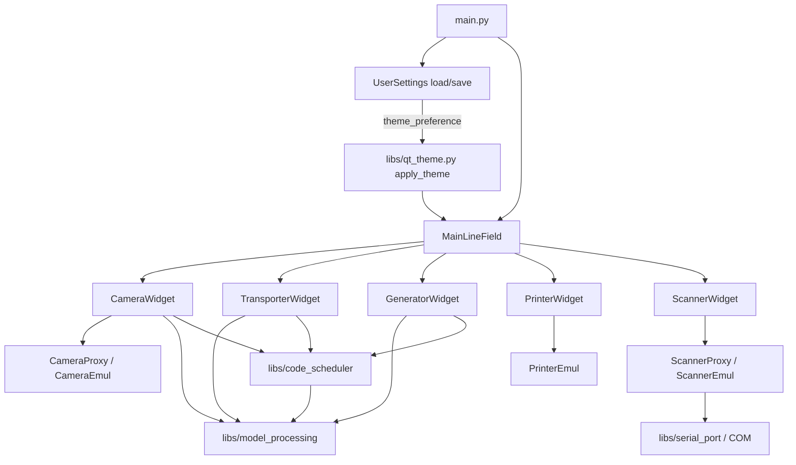
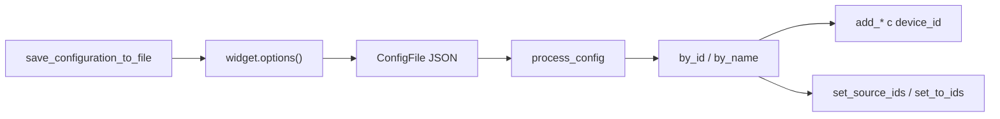
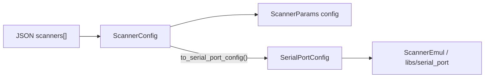
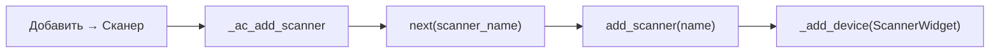
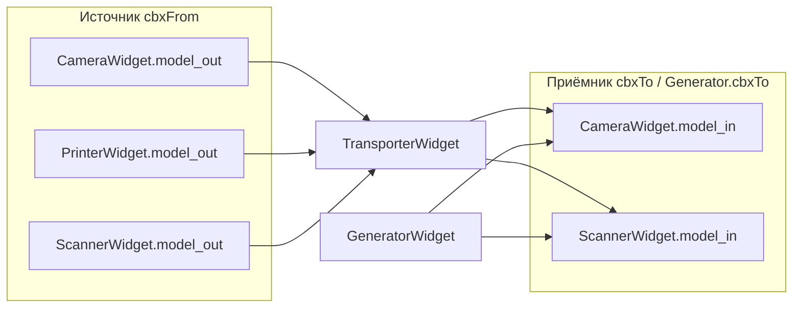

# Эмулятор производственной линии

| Параметр | Значение |
|----------|----------|
| Точка входа | `main.py` |
| Версия | `client_info.VERSION` (например `1.0.0.1.b0006`) |
| Главное окно | `core/main_ui/line_emul.py` → `MainLineField` |
| UI-форма | `forms/Main.py` → `Ui_MainWindow` |
| Конфигурация проекта | JSON через `core/main_ui/data.py` → `ConfigFile` (File → Save); см. [config.md](config.md), [config_migration.md](config_migration.md) |
| Настройки пользователя | `core/main_ui/user_settings.py` → `UserSettings` (глобально, см. [user_settings.md](user_settings.md)) |
| Сборка exe | `build_project.py` → `build/spec/main.spec` → `build/install/dmcLineEmulator/` |

## Назначение

Desktop-приложение на PySide6 для визуальной эмуляции производственной линии маркировки: камеры сканирования, эмулятор ручного сканера ШК (COM), транспортёры, генераторы кодов и принтеры. Главное окно — `QMainWindow` с dockable sidebar (transporter/generator) и холстом в central widget (printer/camera/scanner, `FlowLayout`); см. [frontend/layout-shell.md](frontend/layout-shell.md) (#8). Виджеты связываются по ID и настраиваются из JSON-конфига.

## Архитектура



| Модуль | Роль |
|--------|------|
| `core/scanning/camera_widget.py` | Очередь отправки (`model_in`), результаты (`model_out`); `CodeScheduler` + per-code batch (`spInterval`, `spSize`); `tbDelete` / `delete_requested` |
| `core/barcode_scanner/scanner_widget.py` | Очередь отправки (`model_in`), подтверждённые коды (`model_out`); `CodeScheduler` + COM через `ScannerProxy`; `tbRefreshPorts` — повторное `_refresh_com_ports`; `tbDelete` / `delete_requested` |
| `core/transporting/transporter_widget.py` | Перенос кодов между связанными виджетами (`cbxFrom` → `model_out` источника, `cbxTo` → `model_in` приёмника); источник — камера/принтер/сканер, приёмник — камера/сканер; `CodeScheduler` + per-code FIFO; `tbDelete` / `delete_requested` |
| `core/generator/generator_widget.py` | Генерация кодов в `model_in` камеры или сканера (`cbxTo`); `CodeScheduler` + `_last_generated_at` (~`spInterval` между генерациями), `create_code_item`; `tbDelete` / `delete_requested` |
| `core/printing/printer_widget.py` | Отображение буфера принтера (сокет); `DeviceCardMixin` + chrome + collapsible advanced (**#5**, **#10**); `tbDelete` / `delete_requested` |
| `core/barcode_scanner/scanner_core.py` | Эмулятор сканера ШК: очередь кодов, запись в COM (фоновый поток) |
| `core/barcode_scanner/scanner_proxy.py` | Qt-мост: `Signal scanned`, опрос ядра 250 мс |
| `libs/serial_port.py` | pyserial: перечисление портов, `SerialPortConfig`, open/write с суффиксом `\r\n` |
| `libs/model_processing.py` | Модели очередей Qt, хелперы per-code timing |
| `libs/code_scheduler.py` | Периодический тик (~10 мс) для проверки готовности кодов |

## Очереди кодов и per-code timing

Коды в pipeline представлены элементами `QStandardItem` в `QStandardItemModel`. Для моделирования времени прохождения кода через узел линии каждый элемент несёт метку прибытия в `Qt.UserRole` (см. `ARRIVAL_TIME_ROLE`).

Инфраструктура меток и проверки готовности реализована в `libs/model_processing.py` и описана в [model_processing_timing.md](model_processing_timing.md). Все точки входа кодов в pipeline (drop, загрузка модели, генератор, камера, транспортёр) создают элементы через `create_code_item` — см. раздел «Точки входа» в той же документации.

Периодический опрос готовности выполняет `CodeScheduler` (`libs/code_scheduler.py`): внутренний тик **10 мс** (`SCHEDULER_TICK_MS`, `Qt.TimerType.PreciseTimer`), callback виджета на каждом тике проверяет очередь через хелперы `model_processing`. Подробности — в [code_scheduler.md](code_scheduler.md).

Поле `spInterval` в UI виджетов (и поле `interval` в JSON-конфиге) задаёт требуемое время ожидания **для каждого конкретного кода** в очереди узла, а не период тика планировщика.

## Глобальные настройки пользователя (#2 UI modernization)

Модуль `core/main_ui/user_settings.py` хранит предпочтения, **не** входящие в project JSON: в первом релизе — `theme_preference` (`system` / `light` / `dark`, default `system`).

| Аспект | Project JSON | User settings |
|--------|--------------|---------------|
| Файл | путь, выбранный оператором (Open/Save) | `line_emulator_user.json` |
| Расположение | произвольный каталог | `%APPDATA%/DataMatrixControl/` (Windows) или `client_info.WORKDIR` |
| Сохранение | только **File → Save** | при смене «Вид → тема» (**#12** ✓) |
| Содержимое | устройства, layout, dock | тема оформления |

API: `load_user_settings()`, `save_user_settings()`, `get_user_settings_path()`. Без Qt — тестируется изолированно. Полное описание — [user_settings.md](user_settings.md).

## Тема оформления (#12 UI modernization)

Runtime light/dark/system theme: design tokens и QSS в `libs/qt_theme.py` + `media/themes/theme_*.qss`; предпочтение пользователя — `UserSettings.theme_preference`.

| Этап | Где | Действие |
|------|-----|----------|
| Startup | `main.py` | `load_user_settings()` → `apply_theme(app, ThemeMode(...))` до `MainLineField()` |
| Live switch | `MainLineField` | «Вид» → «Как в системе» / «Светлая» / «Тёмная» → `save_user_settings` + `apply_theme` |
| Resolved mode | `libs/qt_theme.py` | `system` → `QStyleHints.colorScheme()` или Windows registry; иначе explicit light/dark |

| Пункт меню «Вид» | JSON | QSS |
|------------------|------|-----|
| «Как в системе» | `"system"` | `theme_light.qss` или `theme_dark.qss` по ОС |
| «Светлая» | `"light"` | `theme_light.qss` |
| «Тёмная» | `"dark"` | `theme_dark.qss` |

На Windows: `QT_QPA_PLATFORM=windows:darkmode=0` + `apply_qt_style` (`windowsvista` для light, `windows11`/`Windows`/`Fusion` для dark) — workaround Qt 6.7 popup. Тема **не** сохраняется в project JSON.

Техническая документация — [qt_theme.md](qt_theme.md), [frontend/theme-system.md](frontend/theme-system.md); меню в `.ui` — [frontend/layout-shell.md](frontend/layout-shell.md).

## Конфигурация JSON (`ConfigFile`)

Корневая Pydantic-модель — `core/main_ui/data.py` → `ConfigFile` (`strict=True`). Загрузка и сохранение выполняются в `MainLineField` (`open_config`, `save_configuration_to_file`) через `model_validate_json()` / `model_dump_json(indent=4)`.

Полное описание полей, зон layout и моделей устройств — [config.md](config.md). Migration legacy JSON без `device_id` / layout — [config_migration.md](config_migration.md) (подзадача **#1** UI modernization).

| Поле | Тип | По умолчанию | Назначение |
|------|-----|--------------|------------|
| `printers` | `list[PrinterConfig]` | `[]` | принтеры (TCP) |
| `cameras` | `list[CameraConfig]` | `[]` | камеры сканирования (TCP) |
| `scanners` | `list[ScannerConfig]` | `[]` | эмуляторы ручного сканера ШК (COM) |
| `transporters` | `list[TransporterConfig]` | `[]` | перевозчики между виджетами |
| `generators` | `list[GeneratorConfig]` | `[]` | генераторы кодов |
| `sidebar_order` | `list[str]` | `[]` | порядок карточек sidebar (`device_id` transporter/generator) |
| `canvas_order` | `list[str]` | `[]` | порядок карточек canvas (`device_id` printer/camera/scanner) |
| `dock_state` | `str \| None` | `None` | base64 `QMainWindow.saveState()` (**#8+**) |

**Обратная совместимость:** списки устройств со значением по умолчанию `[]` (в том числе `scanners`) могут отсутствовать в старых JSON. Файлы без `device_id`, `sidebar_order`, `canvas_order` и `dock_state` автоматически обогащаются при загрузке через `core/main_ui/config_migration.py` — см. [config_migration.md](config_migration.md). Каждый элемент `*Config` содержит `device_id: str` и `advanced_expanded: bool = False` (секция «Дополнительно» на карточке — **#10**). Поля `take_from` / `give_to` в transporter/generator хранят **`device_id`** связанных устройств (**#4**); при load допускается fallback по `name` для legacy JSON.

## Стабильный device_id в виджетах (#4)

Подзадача **#4** UI modernization: runtime-идентификаторы карточек совпадают с полем `device_id` в project JSON и не зависят от `id(widget)` (адрес объекта Qt меняется между сессиями).

### Генерация и атрибут виджета

| Виджет | Модуль | Имя по умолчанию | `device_id` при create |
|--------|--------|------------------|------------------------|
| `PrinterWidget` | `core/printing/printer_widget.py` | `leName` (оператор) | `device_id or generate_device_id()` |
| `CameraWidget` | `core/scanning/camera_widget.py` | `CAM_{port}` | то же |
| `ScannerWidget` | `core/barcode_scanner/scanner_widget.py` | `SCAN_N` | то же |
| `TransporterWidget` | `core/transporting/transporter_widget.py` | `TRW_{device_id[:8]}` | то же |
| `GeneratorWidget` | `core/generator/generator_widget.py` | `GW_{device_id[:8]}` | то же |

Helper: `core/main_ui/config_migration.generate_device_id()` → `shortuuid.uuid()`.

### Реестры `MainLineField`

```python
self._device_widgets: dict[str, CameraWidget | PrinterWidget | ScannerWidget]
self._transporter_widgets: dict[str, TransporterWidget]
self._generator_widgets: dict[str, GeneratorWidget]
```

Ключ — `widget.device_id`. Методы `_add_device`, `_add_transport`, `_add_generator` регистрируют виджет; `_remove_*` удаляют по `device.device_id`.

Factory-методы (`add_printer`, `add_camera`, `add_scanner`, `add_transporter`, `add_generator`) принимают опциональный `device_id` из сохранённого конфига.

### Save / load

| Операция | Поведение |
|----------|-----------|
| Save | `save_configuration_to_file` собирает `ConfigFile` из `dev.options()` всех виджетов через `_iter_*` (визуальный порядок); включает `sidebar_order`, `canvas_order`, `dock_state` |
| Load | `process_config` строит `by_id` / `by_name`, восстанавливает устройства с `device_id=…`, transporter/generator через `set_source_ids` / `set_to_ids`, затем `_apply_device_layout` и `_restore_dock_state` |
| Legacy refs | `_resolve_device_ref(ref, by_id, by_name)` — сначала `device_id`, иначе `name` (старые JSON с `take_from: "SCAN_1"`) |



### Transporter / Generator wiring

`setup_models(device_widgets)` получает `_device_widgets` — словарь `{device_id: widget}`. Combo transporter/generator: `QStandardItemModel` (кол. 0 — имя, кол. 1 — `device_id`, отображается только кол. 0); выбор разрешается через `_device_data[device_id]`. `options()` записывает `take_from` / `give_to` как `device_id` выбранных устройств (пустая строка, если combo без выбора). При load — `set_source_ids` / `set_to_ids` по сохранённым id; legacy JSON с именами — `_resolve_device_ref`.

Тесты: `tests/test_core/test_device_id_persistence.py` — roundtrip JSON и восстановление связей; см. также обновлённые `test_widget_delete`, `test_scanner_transport`.

Подробности полей `*Config` — [config.md](config.md).

### Модель конфигурации сканера (`ScannerConfig`)

Модуль: `core/barcode_scanner/data.py`. План: serial barcode scanner, подзадача **#2** (модель конфигурации).

| Класс | Роль |
|-------|------|
| `ScannerParams` | Параметры линии COM и суффикс штрихкода |
| `ScannerConfig` | Сохраняемое состояние одного виджета сканера |
| `ScannerConfig.to_serial_port_config()` | Преобразование в `libs/serial_port.SerialPortConfig` для `ScannerEmul` |



#### `ScannerParams`

Вложенный объект `config` внутри элемента `scanners[]`. Значения по умолчанию совпадают с `SerialPortConfig` в `libs/serial_port.py`.

| Поле | Тип | По умолчанию | Описание |
|------|-----|--------------|----------|
| `baud_rate` | `int` | `9600` | Скорость порта |
| `bytesize` | `int` | `8` | Размер символа (5–8) |
| `parity` | `str` | `"N"` | Чётность: `N`, `E`, `O`, `M`, `S` |
| `stopbits` | `float` | `1` | Стоп-биты: `1`, `1.5`, `2` |
| `suffix` | `str` | `"\r\n"` | Суффикс после кода при записи в COM |

#### `ScannerConfig`

| Поле | Тип | Обязательное | Описание |
|------|-----|--------------|----------|
| `device_id` | `str` | да* | Стабильный id карточки (*генерируется при migration legacy JSON) |
| `name` | `str` | да | Имя виджета на холсте |
| `port_name` | `str` | да | Имя COM-порта ОС (например, `COM3`) |
| `config` | `ScannerParams` | да | Параметры линии и суффикс |
| `advanced_expanded` | `bool` | нет (default `False`) | Развёрнута ли секция «Дополнительно» |

Метод `to_serial_port_config()` собирает `SerialPortConfig`: переносит `port_name` с верхнего уровня и поля `baud_rate`, `bytesize`, `parity`, `stopbits`, `suffix` из вложенного `config`. Используется при старте эмулятора, чтобы UI-слой не зависел напрямую от dataclass `libs/serial_port`.

#### Пример фрагмента JSON

```json
{
    "scanners": [
        {
            "name": "SCN_COM3",
            "port_name": "COM3",
            "config": {
                "baud_rate": 9600,
                "bytesize": 8,
                "parity": "N",
                "stopbits": 1,
                "suffix": "\r\n"
            }
        }
    ]
}
```

Файлы без секции `scanners` (например, `configs/test.json`) по-прежнему загружаются; список сканеров остаётся пустым.

#### Пример конфигурации `configs/scanner_example.json`

Готовый JSON для отладки цепочки **генератор → сканер (COM) → перевозчик → камера** (подзадача **#9**). Файл можно открыть через меню конфигурации в `MainLineField.open_config`.

| Секция | Содержание | Связь на холсте |
|--------|------------|-----------------|
| `scanners[]` | `SCAN_1`, `port_name`: `COM5`, 9600 8N1, суффикс `\r\n` | Эмулятор ручного сканера; порт — одна сторона пары com0com (см. [com0com_setup.md](com0com_setup.md)) |
| `generators[]` | `give_to`: `device_id` сканера (legacy: `SCAN_1`), `interval`: 500 мс | Коды попадают в `ScannerWidget.model_in` |
| `transporters[]` | `take_from` / `give_to`: `device_id` (legacy: имена `SCAN_1`, `CAM_23`), `interval`: 250 мс | После записи в COM коды снимаются с `model_out` сканера и передаются в камеру |
| `cameras[]` | `CAM_23`, TCP-порт `23` | Приёмник перевозчика |

Перед запуском замените `port_name` на фактический COM из пары com0com или физического адаптера. Секции `printers` в примере нет — для минимального сценария сканера достаточно перечисленных полей.

Для отладки COM без физического адаптера см. [com0com_setup.md](com0com_setup.md).

## Device card chrome (#5 UI modernization)

Подзадача **#5** плана UI modernization (не путать с подзадачей **#5** плана serial barcode scanner ниже): общий заголовок карточки устройства с grip «≡» для drag-reorder, zone guard (sidebar vs canvas) и установкой `deviceType` для QSS.

| Компонент | Модуль |
|-----------|--------|
| Chrome API | `core/main_ui/device_card.py` — `DeviceCardHeader`, `DeviceGripHandle`, `DeviceCardMixin`, mime helpers |
| Пилот | `PrinterWidget` — `DeviceZone.CANVAS`, `device_type="printer"` |
| Тесты | `tests/test_core/test_device_card.py` |

Grip — **единственный** источник `QDrag`; mime `application/x-line-emulator-device-id` несёт `device_id` и `zone`. Drop между зонами отклоняется (`can_accept_device_drop`).

| Зона | `DeviceZone` | Устройства |
|------|--------------|------------|
| Sidebar | `SIDEBAR` | Transporter, Generator |
| Canvas | `CANVAS` | Printer, Camera, Scanner |

Reorder в layout — **#6** ([frontend/sidebar-layout.md](frontend/sidebar-layout.md)), **#7** ([frontend/canvas-layout.md](frontend/canvas-layout.md)); save/load порядка и dock — **#9** ✓ ([frontend/mainlinefield-layout.md](frontend/mainlinefield-layout.md)). Полный mount chrome на все 5 типов + collapsible «Дополнительно» — **#10** (готово).

Техническая документация — [frontend/device-card.md](frontend/device-card.md); связь с design system — [frontend/theme-system.md](frontend/theme-system.md).

## Collapsible «Дополнительно» (#10 UI modernization)

На каждой карточке устройства секция редко используемых настроек сворачивается под кнопкой **«Дополнительно»** (`tbAdvanced`). Контейнер `wAdvanced` скрыт по умолчанию; имя, Run/Stop и очереди кодов (где есть) остаются видимыми.

| Аспект | Реализация |
|--------|------------|
| API | `DeviceCardMixin.wire_advanced_panel`, `set_advanced_expanded`, `is_advanced_expanded` — `core/main_ui/device_card.py` |
| UI-макеты | `forms/ui/{Printer,Camera,Scanner,Transporter,Generator}.ui` |
| Сохранение | `advanced_expanded: bool` в каждом `*Config`; `options()` / restore в `_load_*` (`line_emul.py`) |
| Default | collapsed для новых виджетов и legacy JSON после migration |

Таблица always-visible vs advanced по типам — [frontend/device-card.md](frontend/device-card.md) (раздел «Collapsible «Дополнительно»»).

## Layout persistence (#9 UI modernization)

Подзадача **#9**: сохранение и восстановление раскладки главного окна в project JSON — порядок карточек sidebar/canvas, dock state, сброс через меню «Вид».

| Аспект | Реализация |
|--------|------------|
| Save | `save_configuration_to_file` — `sidebar_order`, `canvas_order`, `_encode_dock_state()`, `options()` через `_iter_*` |
| Load | `process_config` — `_load_*` → `_apply_device_layout` → `_restore_dock_state` |
| Reset | `acResetLayout` → `_on_reset_layout` → `_apply_default_layout` (in-memory; на диск — File → Save) |
| Default order | Transporters → generators; canvas: printers → cameras → scanners |
| Default dock | Sidebar в `LeftDockWidgetArea`, не floating |
| Bulk order | `_iter_devices`, `_iter_printers`, … следуют `get_*_device_order()` |

Полная техническая документация — [frontend/mainlinefield-layout.md](frontend/mainlinefield-layout.md). In-memory drag-reorder — **#6**, **#7**; оболочка dock — **#8**.

Восстановление виджетов при `open_config`, запись в `save_configuration_to_file` и пункт меню «Добавить → Сканер» реализованы в `MainLineField` — см. раздел **«Интеграция сканера в главное окно»** ниже (подзадача **#5** плана serial barcode scanner).

## Интеграция сканера в главное окно (#5)

Модуль: `core/main_ui/line_emul.py` → `MainLineField`. UI главного окна: `forms/ui/Main.ui`, `forms/Main.py`. Оболочка layout (dock sidebar, central canvas, меню «Вид») — [frontend/layout-shell.md](frontend/layout-shell.md) (#8); persistence layout / `acResetLayout` — **#9** ✓ ([frontend/mainlinefield-layout.md](frontend/mainlinefield-layout.md)); theme actions — **#12** ✓ (см. раздел «Тема оформления» выше).

### Меню «Добавить → Сканер»

| Элемент | Значение |
|---------|----------|
| QAction | `acAddScanner` (текст «Сканер») |
| Подключение | `setup_connections()` → `acAddScanner.triggered` → `_ac_add_scanner` |
| Порядок в меню | после «Принтер», перед разделителем и «Перевозчик» |



### Имена по умолчанию (`scanner_name_generator`)

Генератор имён — статический метод `scanner_name_generator(start=1)`: `SCAN_1`, `SCAN_2`, …

| Ситуация | Поведение |
|----------|-----------|
| Ручное добавление через меню | `_ac_add_scanner` берёт `next(self.scanner_name)` и создаёт виджет |
| После `open_config` / `clear_ui` | `_sync_scanner_name_generator()` находит максимальный суффикс среди существующих виджетов с именами `SCAN_<число>` и сбрасывает итератор на `max_index + 1`, чтобы новые сканеры не пересекались с загруженными |

Произвольные имена (не `SCAN_N`) при загрузке JSON не влияют на итератор — учитываются только совпадающие с шаблоном `SCAN_<digits>`.

### Добавление на холст (`add_scanner`)

```python
def add_scanner(self, name: str, port_name: str = "") -> ScannerWidget:
    scn_w = ScannerWidget(name, port_name)
    self._add_device(scn_w)
    return scn_w
```

- Виджет попадает в `_device_widgets` и на холст `scaDevices` (`FlowLayout`).
- `_add_device` после вставки вызывает `setup_models(self._device_widgets)` у **всех** существующих `TransporterWidget` и `GeneratorWidget`, чтобы combo «откуда» / «куда» увидели новый сканер без перезапуска приложения.

### Сохранение и загрузка JSON

| Операция | Метод | Сканеры |
|----------|-------|---------|
| Сохранить | `save_configuration_to_file` | `scanners=[dev.options() for dev in _device_widgets if isinstance(dev, ScannerWidget)]` |
| Открыть | `open_config` → `clear_ui` → `process_config` | `_load_scanners(config.scanners, devices)` |

Порядок восстановления в `process_config`: принтеры → камеры → **сканеры** → перевозчики → генераторы. Для каждого элемента `scanners[]`:

1. `add_scanner(scn.name, scn.port_name, device_id=scn.device_id)`
2. `scn_w.load_options(scn.config)` — параметры линии COM (`ScannerParams`)
3. Регистрация в локальных карт `by_id[scn_w.device_id]` и `by_name[scn_w.name]` для привязки transport/generator (**#4**)
4. После цикла — `_sync_scanner_name_generator()`

`options()` / `load_options()` описаны в [frontend/scanner-widget.md](frontend/scanner-widget.md).

### Остановка при закрытии (`closeEvent`) и очистка (`clear_ui`)

При закрытии главного окна `closeEvent` вызывает `run(False)` для **перевозчиков**, **генераторов** и всех устройств на холсте (камеры, принтеры, **сканеры**). Это останавливает `CodeScheduler`, закрывает COM через `ScannerProxy` / `ScannerEmul` и снимает флаг Run в UI.

`clear_ui` (перед загрузкой другого JSON) останавливает и удаляет виджеты из реестров; перед `deleteLater` вызывает `_canvas_area.remove_widget` / `_sidebar_layout.remove_widget`, затем `_sync_scanner_name_generator()`.

## Удаление виджета (`tbDelete` + Remove API, #2–#4)

План widget-delete-com-refresh (docs — **#5**). На всех пяти виджетах (Printer, Camera, Scanner, Transporter, Generator):

| Элемент | Описание |
|---------|----------|
| `tbDelete` | `QToolButton` 28×28, текст «X», tooltip «Удалить», сразу после `tbRun` в шапке формы |
| `delete_requested` | `Signal()` без аргументов |
| `_on_delete_clicked` | если `tbRun` включён → `QMessageBox.warning` без emit; иначе `question` → при Yes — `emit` |

Имя в диалоге: у устройств — `leName` (fallback `self.name`); у перевозчика/генератора — `self.name`.

`MainLineField` при `_add_*` подключает `delete_requested` → `_on_widget_delete_requested` → `_remove_device` / `_remove_transporter` / `_remove_generator` (pop из реестра, `run(False)`, `deleteLater`). После удаления device — `setup_models(self._device_widgets)` у всех transporters/generators; при удалении `ScannerWidget` — `_sync_scanner_name_generator()`.

Подробности — [frontend/widget-delete.md](frontend/widget-delete.md), шаги оператора — [user-guides/widget-delete.md](user-guides/widget-delete.md).

## Связь виджетов: Transport и Generator (#6)

`TransporterWidget` и `GeneratorWidget` подключают устройства линии через комбобоксы и ссылки на модели очередей (`QStandardItemModel`). После подзадачи **#6** в списках участвует `ScannerWidget` наравне с `CameraWidget`.

### Правила wiring

| Виджет | Combo | Допустимые устройства | Привязка модели |
|--------|-------|----------------------|-----------------|
| `TransporterWidget` | `cbxFrom` (источник) | камера, принтер, сканер | `model_in` ← `widget.model_out` |
| `TransporterWidget` | `cbxTo` (приёмник) | камера, сканер | `model_out` ← `widget.model_in` |
| `GeneratorWidget` | `cbxTo` (приёмник) | камера, сканер | `model_out` ← `widget.model_in` |

Сканер **не** фигурирует в `cbxTo` транспортёра как промежуточный «только приёмник без исходящей очереди» — у него есть и `model_in`, и `model_out`; как **источник** транспортёр читает `model_out` сканера (коды, подтверждённые записью в COM).



### Обновление списков (`setup_models`)

`MainLineField` передаёт в `setup_models(device_widgets)` словарь `{device_id: widget}` всех устройств на холсте (в т.ч. после `_add_device` и `_remove_device`). Ключи совпадают с `take_from` / `give_to` в сохранённом JSON (**#4**).

1. Виджет **всегда** выполняет полную замену: `_device_data = dict(device_widgets)` (не `update`) — удалённые `device_id` не остаются в реестре.
2. Если `tbRun` включён — return **без** пересборки combo (защита от смены маршрута во время работы).
3. Если остановлен — перестраивает модели combo:
   - **Транспортёр** — `get_data_models()` → `from_model` (все устройства), `to_model` (только `CameraWidget` и `ScannerWidget`).
   - **Генератор** — `get_data_models()` → `to_model` (только `CameraWidget` и `ScannerWidget`).

### Null guards

| Метод | Условие | Реакция |
|-------|---------|---------|
| `TransporterWidget.set_from_model` / `set_to_model` | виджет не найден в combo (`data is None` или нет в `_device_data`) | `warning` в `UI_LOGGER`, привязка не меняется |
| `TransporterWidget.send_data` | `model_in is None` или `model_out is None` | `warning` «Не заданы источники», выход |
| `GeneratorWidget.set_to_model` | виджет не выбран | `warning` «Не выбран приёмник», выход |
| `GeneratorWidget.send_data` | `model_out is None` | `warning` «Не задан приёмник», выход |

При старте Run транспортёр вызывает `set_from_model()` и `set_to_model()`; генератор — `set_to_model()` для актуализации ссылок после смены combo.

Подробности callback и `CodeScheduler` — в [code_scheduler.md](code_scheduler.md) (разделы TransporterWidget, GeneratorWidget). Контракт `model_in` / `model_out` сканера — в [frontend/scanner-widget.md](frontend/scanner-widget.md).

## Массовое управление виджетами (#10)

Меню **«Управление»** (`menuControl` в `forms/ui/Main.ui`) — массовый запуск, остановка и очистка очередей по типам виджетов. Реализация в `MainLineField`: `_setup_bulk_control_connections()`, `_bulk_start_*`, `_bulk_stop_*`, `_bulk_clear_*`.

| Подменю | Пункты | Действие |
|---------|--------|----------|
| Запустить | Всё, Принтеры, Камеры, Сканеры, Перевозчики, Генераторы | `tbRun.setChecked(True)` только для остановленных |
| Остановить | те же | `tbRun.setChecked(False)` только для запущенных |
| Очистить данные | Всё, Принтеры, Камеры, Сканеры | `clear_data()` без остановки Run |

**Порядок «Всё»:** запуск — устройства (принтеры → камеры → сканеры, по **canvas visual order**) → перевозчики → генераторы (по **sidebar order**); остановка — в обратном порядке (внутри группы устройств — `reversed`).

Публичный `clear_data()` на `PrinterWidget`, `CameraWidget`, `ScannerWidget` сбрасывает UI-модели и буферы ядра (`PrinterProxy.clear_buffer`, `CameraProxy.clear_queues`, `ScannerProxy.clear_queues`). Перевозчики и генераторы в «Очистить» не входят.

Подробности, таблицы QAction, диаграммы pipeline и тесты — в [bulk-control.md](bulk-control.md).

## Запуск

```powershell
.\venv\Scripts\python.exe main.py
```

Последовательность в `main.py`: `setup_pathes()` → `setup_logging()` → `QApplication` → `load_user_settings()` → `apply_theme(app, ThemeMode(user_settings.theme_preference))` → `MainLineField().show()` → `app.exec()`. Тема применяется до построения главного окна; смена в runtime — меню «Вид» (persist в `line_emulator_user.json`).

Логирование инициализируется в `setup_logging()`; рабочие каталоги — `client_info.WORKDIR`, `client_info.RUNDIR`.

## Тестирование UI modernization (#13)

Unit-тесты persistence, migration и theme (без интеграционных GUI-сценариев bulk/scanner). **38** тестов в четырёх модулях; подробные таблицы — в профильных документах.

| Файл | Тестов | Покрытие |
|------|--------|----------|
| `tests/test_core/test_user_settings.py` | 8 | `load_user_settings` / `save_user_settings`, defaults, theme roundtrip, `get_user_settings_path` — [user_settings.md](user_settings.md) |
| `tests/test_core/test_config_layout_migration.py` | 15 | `needs_legacy_migration`, `enrich_legacy_config`, partial migration, `ConfigFile` validator — [config_migration.md](config_migration.md) |
| `tests/test_libs/test_qt_theme.py` | 9 | `resolve_effective_mode`, `get_tokens`, QSS load, `apply_theme` smoke — [qt_theme.md](qt_theme.md) |
| `tests/test_core/test_line_emul_layout.py` | 6 | save/load layout, `process_config` order restore, reset, `_iter_*` — [frontend/mainlinefield-layout.md](frontend/mainlinefield-layout.md) |

```powershell
.\venv\Scripts\python.exe -m unittest `
  tests.test_core.test_user_settings `
  tests.test_core.test_config_layout_migration `
  tests.test_libs.test_qt_theme `
  tests.test_core.test_line_emul_layout -v
```

Прочие unit-тесты Line Emulator (device_id, sidebar/canvas reorder, scanner, bulk) — см. [config.md](config.md), [scanner_unit_tests.md](scanner_unit_tests.md), [bulk-control.md](bulk-control.md).

## Сборка exe (PyInstaller)

Подзадача **#9** плана эмулятора сканера: зависимости сканера (`pyserial`, `QtAwesome`) должны попадать в собранный дистрибутив.

### Команда сборки

```powershell
.\venv\Scripts\python.exe build_project.py
```

Скрипт пересобирает UI из `forms/ui/*.ui`, затем вызывает PyInstaller по `build/spec/main.spec`. Итоговый каталог:

`build/install/dmcLineEmulator/dmcLineEmulator.exe`

### Spec-файл `build/spec/main.spec`

| Элемент | Назначение |
|---------|------------|
| Точка входа | `main.py` |
| Имя exe | `dmcLineEmulator` |
| `hiddenimports` | `serial`, `serial.tools.list_ports` — COM; `qtawesome`, `qtawesome.iconic_font` — иконки ScannerWidget; `core.main_ui.device_card`, `config_migration`, `sidebar_layout`, `canvas_area`, `user_settings`, `flow_layout` — UI modernization layout/theme (**#14**); `libs.qt_theme` — QSS loader |
| `datas` | Каталог шрифтов QtAwesome (`qtawesome/fonts`); каталог `media/themes/` — QSS light/dark theme (**#11**, `load_stylesheet` через `get_path_to_media`) |
| Прочие `hiddenimports` | `pylibdmtx`, `psycopg`, `psycopg_c`, `shortuuid` — использовались эмулятором до UI modernization |

Зависимости в `requirements.txt`:

| Пакет | Версия | Где используется |
|-------|--------|------------------|
| `pyserial` | `3.5` | `libs/serial_port.py`, ядро `ScannerEmul` |
| `QtAwesome` | `1.3.1` | `core/barcode_scanner/scanner_widget.py` (`btnSend`, `tbRefreshPorts`) |

PyInstaller не всегда подхватывает подмодули `serial.tools.list_ports` и ресурсы QtAwesome статическим анализом — поэтому они указаны явно в `hiddenimports` и `datas`.

### Версия приложения

Номер сборки — `client_info.VERSION` в корне репозитория. Текущая версия: `1.0.0.1.b0006` (UI modernization — dock layout, reorder, themes, migration); ранее `1.0.0.1.b0005` (удаление виджетов + COM refresh), `1.0.0.1.b0004` (Remove API), `1.0.0.1.b0003` (`tbDelete` / `delete_requested`), `1.0.0.1.b0002` (fix-qt-light-theme), `1.0.0.1.b0001` (релиз с эмулятором сканера ШК). Последний разряд увеличивается по соглашениям версионирования проекта.

## Связанная документация

- [config.md](config.md) — `ConfigFile`, `*Config`, `device_id`, layout-поля (`sidebar_order`, `canvas_order`, `dock_state`), runtime wiring (#4), зоны sidebar/canvas (подзадача #1 UI modernization).
- [config_migration.md](config_migration.md) — `migrate_legacy_config`, partial migration, unit-тесты `test_config_layout_migration.py` (подзадача #1).
- [frontend/layout-and-docking.md](frontend/layout-and-docking.md) — сводка: dock zones, grip reorder, reset, project JSON vs user settings theme (**#14**).
- [frontend/mainlinefield-layout.md](frontend/mainlinefield-layout.md) — dock state, save/load order, reset, visual-order iterators (#9 UI modernization).
- [frontend/layout-shell.md](frontend/layout-shell.md) — `QMainWindow`, `dockSidebar`, central canvas (`scaDevices`), меню «Вид»; зоны sidebar/canvas (подзадача #8 UI modernization).
- [frontend/sidebar-layout.md](frontend/sidebar-layout.md) — `SidebarLayout`, drag-reorder transporter/generator (#6).
- [frontend/canvas-layout.md](frontend/canvas-layout.md) — `CanvasDeviceArea`, drag-reorder printer/camera/scanner (#7).
- [user_settings.md](user_settings.md) — `UserSettings`, `theme_preference`, пути `%APPDATA%` / `WORKDIR`, load/save JSON (подзадача #2 UI modernization).
- [qt_theme.md](qt_theme.md) — design system, `ThemeMode`, `apply_theme`, startup, Windows workaround; меню light/dark/system (**#12** ✓).
- [frontend/device-card.md](frontend/device-card.md) — `DeviceCardHeader`, grip «≡», drag mime, zone guards, `DeviceCardMixin` (#5 UI modernization).
- [frontend/theme-system.md](frontend/theme-system.md) — архитектура UI-темы, слои QSS, `deviceType`, централизация **#11**.
- [frontend/widget-backgrounds.md](frontend/widget-backgrounds.md) — палитра фонов карточек, menu/combo fix Qt 6.7, «Тема Windows».
- [model_processing_timing.md](model_processing_timing.md) — метки времени, FIFO-готовность, API хелперов, точки входа pipeline (#1, #3 плана per-code interval).
- [code_scheduler.md](code_scheduler.md) — `CodeScheduler`, тик 10 мс, API `start`/`stop`; интеграция в `CameraWidget` (#4), `TransporterWidget` (#5) и `GeneratorWidget` (#6).
- Раздел «Связь виджетов: Transport и Generator» выше — `ScannerWidget` в combo, wiring `model_in`/`model_out`, null guards (подзадача #6 плана serial barcode scanner).
- Раздел «Интеграция сканера в главное окно» выше — `acAddScanner`, save/load `scanners`, `closeEvent`, `_sync_scanner_name_generator`, `setup_models` при `_add_device` (подзадача #5 плана serial barcode scanner).
- Раздел «Конфигурация JSON» выше — `ScannerParams`, `ScannerConfig`, секция `scanners` в `ConfigFile`, `to_serial_port_config()` (подзадача #2 плана serial barcode scanner).
- [frontend/scanner-widget.md](frontend/scanner-widget.md) — `ScannerWidget`, COM refresh (`tbRefreshPorts`), `tbDelete` / `delete_requested`, интеграция с transport/generator (#6).
- [frontend/scanner-ui.md](frontend/scanner-ui.md) — макет `Scanner.ui` (в т.ч. `tbRefreshPorts`, `tbDelete`).
- [frontend/widget-delete.md](frontend/widget-delete.md) — `tbDelete` / `delete_requested`, Remove API в `MainLineField`, unit-тесты `test_widget_delete.py` (план widget-delete-com-refresh, #2–#5).
- Раздел «Удаление виджета» выше — UI, сигнал и снятие с холста; `clear_ui`/`closeEvent` для generators; `setup_models` с полной заменой `_device_data`.
- Раздел «Стабильный device_id в виджетах» выше — реестры `dict[str, widget]`, `options()` roundtrip, `take_from`/`give_to` по `device_id`, legacy name fallback (подзадача #4 UI modernization).
- [scanner_serial.md](scanner_serial.md) — инфраструктура Serial (`libs/serial_port`), `ScannerEmul`, `ScannerProxy`, `SCANNER_LOGGER` (подзадача #1 плана эмулятора сканера).
- [scanner_unit_tests.md](scanner_unit_tests.md) — unit-тесты подсистемы сканера: mock COM, `ScannerEmul` без Qt, `ConfigFile.scanners`, wiring в transport/generator; COM refresh — `test_scanner_com_refresh.py`; Remove API — см. [frontend/widget-delete.md](frontend/widget-delete.md).
- [com0com_setup.md](com0com_setup.md) — настройка виртуальных COM-портов com0com для тестирования сканера (подзадача #9).
- [bulk-control.md](bulk-control.md) — меню «Управление», массовый start/stop/clear, `clear_data()` API, порядок pipeline (подзадача #10 плана serial barcode scanner).
- Раздел «Сборка exe (PyInstaller)» выше — `main.spec`, hiddenimports `pyserial`/`qtawesome`, `media/themes/` в `datas`, `scanner_example.json`, `VERSION` (подзадача #9; theme QSS bundling — **#11**).
- [user-guides/scanner-widget.md](user-guides/scanner-widget.md) — пользовательские шаги: выбор COM, обновление списка портов (`tbRefreshPorts`), Run/Stop, удаление (`tbDelete`).
- [user-guides/widget-delete.md](user-guides/widget-delete.md) — удаление любого виджета кнопкой «X» с холста.
