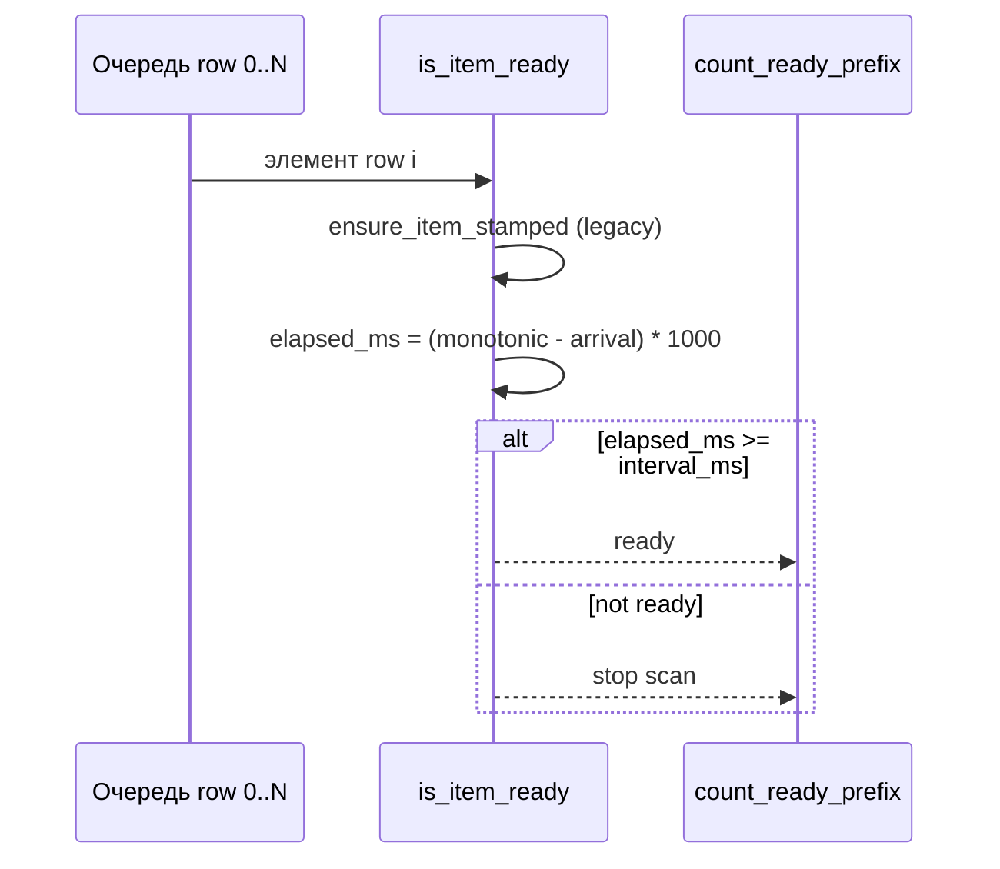
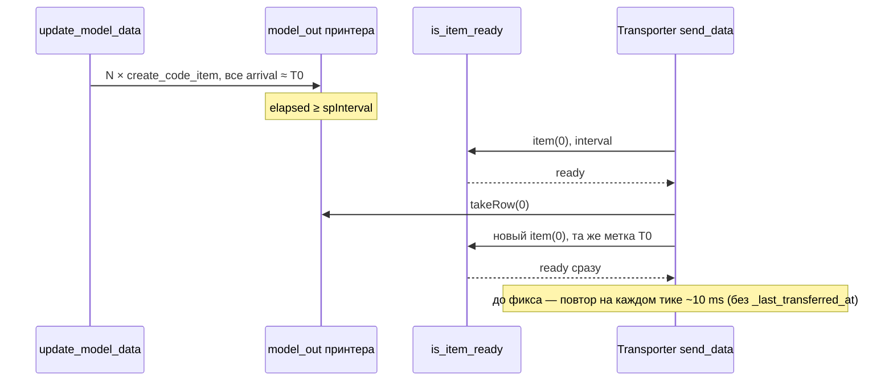

# Per-code timing в `libs/model_processing.py`

Инфраструктура меток времени для очередей кодов эмулятора линии. Основа плана «Передача кодов с привязкой к каждому коду»: каждый `QStandardItem` в очереди узла получает monotonic-метку прибытия; передача разрешена только после истечения `interval_ms` для этого элемента. Очередь обрабатывается по FIFO — код на позиции N не уходит, пока не готов код N−1.

**Модуль:** `libs/model_processing.py`  
**Тесты:** `tests/test_libs/test_model_processing.py`, `tests/test_core/test_transporter_burst.py`

## Константа роли данных

```python
ARRIVAL_TIME_ROLE = Qt.UserRole + 1
```

В `QStandardItem.data(ARRIVAL_TIME_ROLE)` хранится `float` — значение `time.monotonic()` в момент постановки метки. Используется monotonic-часы, чтобы сдвиг системного времени не влиял на расчёт задержки.

## API

| Функция | Назначение |
|---------|------------|
| `create_code_item(text: str) -> QStandardItem` | Создаёт элемент очереди с текстом кода и текущей меткой прибытия |
| `stamp_item(item: QStandardItem) -> None` | Записывает текущий monotonic-time в `ARRIVAL_TIME_ROLE` |
| `ensure_item_stamped(item: QStandardItem) -> None` | Для legacy-элементов без метки: ставит метку «сейчас», если её нет |
| `is_item_ready(item, interval_ms) -> bool` | `True`, если с момента метки прошло ≥ `interval_ms` мс |
| `count_ready_prefix(model, interval_ms) -> int` | Число подряд идущих готовых строк с row 0 (FIFO-префикс) |
| `update_model_data(model, data: list[str]) -> None` | Полностью заменяет содержимое модели строками из `create_code_item` |

Вспомогательная `_get_arrival_time(item)` — внутренняя; возвращает `float | None` при отсутствии или невалидных данных в роли.

### `CustomItemModel`

Класс для `lstData` камеры (`CameraWidget.model_in`): наследует `QStandardItemModel`, включает drop на валидных индексах.

Переопределён `dropMimeData` с двумя путями:

- **Внутренний DnD** (QListView → QListView, Printer/Camera `lstProcessed` → Camera/Scanner `lstData`): MIME `application/x-qstandarditemmodeldatalist` или `application/x-qabstractitemmodeldatalist` делегируется в `super().dropMimeData(...)`; после вставки срабатывает `rowsInserted` → `stamp_item` в `camera_widget.py` / `scanner_widget.py`.
- **Внешний text-drop** (файл, буфер обмена): каждая непустая строка текста вставляется через `create_code_item`, а не голый `QStandardItem`; поведение вставки по строкам/колонкам соответствует `QStandardItemModel`, все новые элементы получают `ARRIVAL_TIME_ROLE`.

В `flags()` для валидного индекса к флагам `super()` добавляется `ItemIsDropEnabled` (`|=`).

Drag-move между виджетами линии может переносить элемент со старой меткой. Для очереди отправки камеры (`CameraWidget.model_in`) метка сбрасывается в `_on_model_in_rows_inserted` через `stamp_item`. На других границах узлов — `create_code_item` / `stamp_item` в соответствующих виджетах, не в `dropMimeData`.

## Семантика готовности



- **`is_item_ready`:** сравнение включительное — при `elapsed_ms == interval_ms` элемент считается готовым.
- **`count_ready_prefix`:** обходит строки с 0 вверх; при первом неготовом элементе сканирование прекращается. Пустая модель → `0`.
- **`interval_ms = 0`:** элементы с уже проставленной меткой готовы сразу (см. тест `test_count_ready_prefix_zero_interval`).

## Точки входа кодов в pipeline (подзадача #3)

Любой код, попадающий в очередь узла линии, создаётся через `create_code_item` (или явный `stamp_item` на границе узла в виджетах #4–#6). Голые `QStandardItem` в pipeline больше не используются.

| Точка входа | Модуль | Метод / контекст |
|-------------|--------|------------------|
| Загрузка списка кодов в модель | `libs/model_processing.py` | `update_model_data` |
| Внешний drop в список камеры | `libs/model_processing.py` | `CustomItemModel.dropMimeData` (text → `create_code_item`) |
| Cross-widget DnD в `lstData` | `libs/model_processing.py` | `CustomItemModel.dropMimeData` → `super()`; `stamp_item` в `rowsInserted` виджета |
| Drop в произвольный `DropListView` | `libs/drag_drop_list_view.py` | `DropListView.dropEvent` |
| Ошибка «no read» в очередь отправки | `core/scanning/camera_widget.py` | `_send_error` → `model_in` |
| Результаты сканирования (эмулятор) | `core/scanning/camera_widget.py` | `populate_scanned_data` → `model_out` |
| Генерация кода | `core/generator/generator_widget.py` | `send_data` → `model_out` (камера или сканер) |
| Передача на следующий узел | `core/transporting/transporter_widget.py` | `send_data`: `takeRow(0)`, `get_clean_code`, `appendRow(create_code_item(code))` в приёмник (камера или сканер) |
| Ручной ввод / DnD в сканер | `core/barcode_scanner/scanner_widget.py` | `_send_manual_input`, DnD → `model_in`; `rowsInserted` → `stamp_item` |
| Подтверждённые коды сканера (COM) | `core/barcode_scanner/scanner_widget.py` | `_populate_scanned_data` → `model_out` (источник для транспортёра) |

`update_model_data` также вызывается из `PrinterWidget` при обновлении буфера принтера; принтер не участвует в per-code interval плана, но элементы буфера получают метку для единообразия модели. При пакетном обновлении все строки получают **одну** метку — см. [пакетные метки](#пакетные-метки-и-ограничение-is_item_ready); транспортёр downstream должен дросселировать исходящий поток отдельно от `is_item_ready`.

Комбобоксы и служебные модели виджетов (типы кодов, списки устройств) по-прежнему используют обычные `QStandardItem` — это не очереди pipeline.

## Legacy-элементы

Элементы **без** `ARRIVAL_TIME_ROLE` (например, созданные до миграции или вручную в тестах) при первом вызове `is_item_ready` получают метку через `ensure_item_stamped` и **считаются неготовыми** до истечения полного `interval_ms` с этого момента.

После подзадачи #3 новые коды в pipeline всегда штампуются при создании; путь `ensure_item_stamped` остаётся для обратной совместимости со старыми элементами в уже загруженных очередях.

## Границы узлов: `stamp_item` vs `ensure_item_stamped`

| Ситуация | Действие |
|----------|----------|
| Новый код входит в очередь узла | `create_code_item` или явный `stamp_item` |
| Legacy-элемент в той же очереди | `ensure_item_stamped` (вызывается внутри `is_item_ready`) |
| Код переходит на **следующий** узел линии | **Новый** элемент через `create_code_item` или `stamp_item` — свежая метка для нового «плеча» маршрута |
| Drag-move в `CameraWidget.model_in` | `stamp_item` в `_on_model_in_rows_inserted` (#4) |

На границах узлов **не** использовать `ensure_item_stamped`: она сохраняет старую метку, если она уже есть. Повторный `stamp_item` сбрасывает отсчёт (см. тест `test_stamp_item_refreshes_arrival_at_node_boundary`).

## Связь с `spInterval`

Параметр `spInterval` виджетов Camera / Transporter / Generator и поле `interval` в JSON-конфиге передаётся в `is_item_ready` / `count_ready_prefix` как `interval_ms`. Инфраструктура в `model_processing.py` не привязана к Qt-таймерам; опрос готовности выполняют виджеты (через `CodeScheduler`, см. `libs/code_scheduler.py`).

При смене `interval` на лету пересчёт идёт по формуле `arrival_time + new_interval` — оставшееся время до готовности может уменьшиться или увеличиться.

## Двухуровневая модель: метки vs опрос

Per-code timing в этом модуле отвечает только за **бизнес-задержку элемента в очереди узла** (`arrival_time + interval_ms`). Частота проверки — отдельный уровень: `CodeScheduler` с тиком 10 мс в виджетах Camera / Transporter / Generator (см. [code_scheduler.md](code_scheduler.md)).

| Уровень | Где | Что делает |
|---------|-----|------------|
| Опрос ~10 мс | `libs/code_scheduler.py` | Вызывает `send_data` достаточно часто, чтобы не пропустить момент готовности |
| Бизнес `spInterval` | `is_item_ready` / `count_ready_prefix` | Решает, **можно ли** снять головной элемент с очереди по его метке |
| Inter-transfer (виджет) | `GeneratorWidget._last_generated_at`; `TransporterWidget._last_transferred_at` | Ограничивает **исходящий** поток: не чаще одной операции за `spInterval`, независимо от меток в очереди |

`is_item_ready` **не** знает о предыдущей передаче с узла — только о метке конкретного `QStandardItem`. Этого достаточно, когда коды попадают в очередь **по одному** с разнесёнными `arrival_time`. Для пакетного входа или снятия очереди без паузы между исходящими передачами нужен второй счётчик на виджете (как у генератора и транспортёра).

## Пакетные метки и ограничение `is_item_ready`

<a id="пакетные-метки-и-ограничение-is_item_ready"></a>

### Как возникают одинаковые метки

`update_model_data` полностью пересоздаёт модель в одном вызове:

```python
for row in data:
    model.appendRow(create_code_item(row))
```

Каждый `create_code_item` вызывает `stamp_item` с текущим `time.monotonic()`, но в tight-цикле все N элементов получают **практически одинаковый** (или идентичный) `arrival_time`. Основной потребитель — **`PrinterWidget`**: при пакетном обновлении буфера от клиента в `model_out` принтера оказывается очередь с общей меткой T₀.

Аналогичный эффект возможен при быстрой последовательной вставке нескольких `create_code_item` без задержки между ними; для принтера это штатный сценарий.

### Поведение `is_item_ready` при общей метке

Для элемента row 0: после `interval_ms` с T₀ `is_item_ready` → `True`. После `takeRow(0)` новая голова (бывший row 1) имеет **ту же** T₀ → тоже сразу `True`. Все N кодов «созревают» одновременно с точки зрения per-code timing.

`count_ready_prefix` в такой очереди вернёт N — для камеры с `spSize > 1` это ожидаемое batch-поведение; для транспортёра без `_last_transferred_at` это означало, что **каждый** следующий тик планировщика (~10 мс) мог снять ещё один код. С `_last_transferred_at` исходящий поток ограничен одним кодом за `spInterval`.



### Разделение ответственности

| Источник пачки | Ожидаемое поведение | Достаточно ли только `is_item_ready` |
|----------------|---------------------|--------------------------------------|
| Камера, `spSize=12` | Пакет 12 кодов за одну отправку | да (`count_ready_prefix` + batch) |
| Принтер, пакет N кодов | Транспортёр: 1 код / `spInterval` | да — `_last_transferred_at` на транспортёре (вместе с `is_item_ready`) |
| Генератор | 1 код / `spInterval` | да (`_last_generated_at` уже есть) |
| Камера → транспортёр, по одному коду | 1 код / `spInterval` | обычно да (метки разнесены `create_code_item` на границе узла) |

Исправление burst из принтера **не** меняет `PrinterWidget` и не требует искусственно разносить метки в `update_model_data`: дросселирование на **транспортёре** (`_last_transferred_at` в `send_data`, реализовано), по образцу генератора. Подробности сценария и диаграмма — [code_scheduler.md — burst](code_scheduler.md#burst-при-пакетном-источнике-принтер--транспортёр).

## Покрытие тестами

### `tests/test_libs/test_model_processing.py`

Класс `TestModelProcessingTiming`:

- постановка метки в `create_code_item`;
- границы `is_item_ready` (до, на и после `interval_ms`);
- legacy-stamp при первой проверке и готовность после интервала;
- `count_ready_prefix`: пустая модель, все готовы, останов на первом неготовом (FIFO), `interval_ms = 0`;
- сброс готовности после `stamp_item` на границе узла;
- `update_model_data`: все строки после замены несут `ARRIVAL_TIME_ROLE` (`test_update_model_data_stamps_all_items`);
- `CustomItemModel.dropMimeData`: internal MIME (`test_drop_mime_data_internal_format`), внешний text (`test_drop_mime_data_text_external`), флаги индекса (`test_custom_item_model_flags`).

### `tests/test_core/test_transporter_burst.py`

Класс `TestTransporterBurstRateLimit` — burst из пакетного источника (принтер): N кодов с **одинаковой** `ARRIVAL_TIME_ROLE` в `model_in` транспортёра. Проверяется inter-transfer rate limit (`TransporterWidget._last_transferred_at`) поверх `is_item_ready`.

| Тест | Сценарий |
|------|----------|
| `test_burst_same_stamp_one_transfer_per_interval` | До истечения `spInterval` передач нет; после — многократные вызовы `send_data` (имитация тиков `CodeScheduler`) снимают **один** код, остальные остаются в очереди |
| `test_burst_second_transfer_after_next_interval` | Второй код уходит только после ещё одного полного `spInterval`; промежуточные тики не дренируют очередь |

Вспомогательно: `_append_burst_codes` — N × `create_code_item` с принудительно общей меткой (как после `update_model_data` у принтера); `time.monotonic` патчится в `libs.model_processing` и `core.transporting.transporter_widget` для детерминированного `interval_ms = 250`.

Запуск:

```powershell
.\venv\Scripts\python.exe -m unittest tests.test_libs.test_model_processing
.\venv\Scripts\python.exe -m unittest tests.test_core.test_transporter_burst
```

## Статус внедрения

| Компонент | Статус |
|-----------|--------|
| Хелперы в `model_processing.py` | реализовано (подзадача #1) |
| `create_code_item` во всех точках входа pipeline | реализовано (подзадача #3) |
| `CustomItemModel.dropMimeData` (internal DnD + внешний text-drop) | реализовано (подзадача #3; cross-widget DnD — 2026-09-03) |
| `CodeScheduler` в `CameraWidget` | реализовано (#4): `count_ready_prefix`, FIFO batch, `rowsInserted` → `stamp_item` |
| `CodeScheduler` в `TransporterWidget` | реализовано (#5): `is_item_ready` для головы очереди, `create_code_item` в приёмник, `_last_transferred_at` (inter-transfer rate limit) |
| `CodeScheduler` в `GeneratorWidget` | реализовано (#6): `_last_generated_at`, `create_code_item` в `model_out`, динамический `spInterval` |
| Inter-transfer rate limit транспортёра | реализовано (#2): `_last_transferred_at` в `TransporterWidget.send_data`, сброс при `run(False)` |
