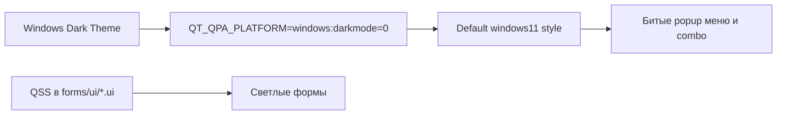
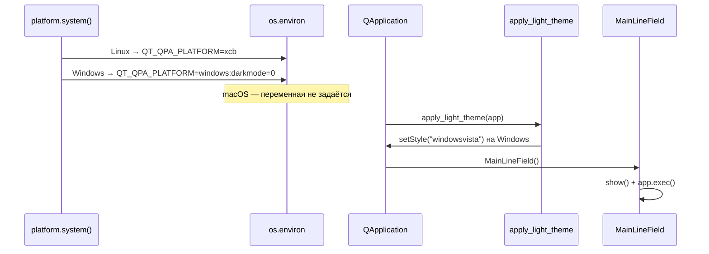

# Настройка Qt-стиля для светлой темы (`libs/qt_theme.py`)

| Параметр | Значение |
|----------|----------|
| Модуль | `libs/qt_theme.py` |
| Функция | `apply_light_theme(app)` |
| План | fix-qt-light-theme, подзадачи **#1–#2** |
| Точка входа | `main.py` |

## Назначение

Модуль задаёт **Qt-стиль приложения** на уровне `QApplication`, чтобы popup-элементы (меню `QMenuBar`/`QMenu`, выпадающие списки `QComboBox`) корректно отрисовывались в **светлой** теме на Windows 11 при системной тёмной теме.

Светлые фоны виджетов на холсте задаются отдельно — через QSS в `forms/ui/*.ui` (см. [frontend/widget-backgrounds.md](frontend/widget-backgrounds.md)). `apply_light_theme` не меняет палитру форм; он устраняет баг **нативного рендеринга popup** в Qt 6.7.

## Контекст проблемы

В `main.py` **до** создания `QApplication` задаётся `QT_QPA_PLATFORM` в зависимости от ОС (см. раздел [Подключение в `main.py`](#подключение-в-mainpy)):

| ОС | Значение |
|----|----------|
| **Linux** | `xcb` |
| **Windows** | `windows:darkmode=0` |
| **macOS** | переменная **не задаётся** |

На Windows `windows:darkmode=0` отключает тёмную рамку окна, но при дефолтном стиле **Windows 11** (Qt 6.7 / PySide6 6.7.1) popup-меню и списки `QComboBox` остаются тёмными и нечитаемыми на фоне светлых форм. Поведение совпадает с [известным багом Qt 6.7](https://forum.qt.io/topic/156611/qt6-7-0-force-light-mode-has-incorrect-rendering-when-system-is-dark-mode).



**Выбранный фикс на уровне стиля:** принудительно установить стиль `windowsvista` через `apply_light_theme` в `main.py` — подтверждённое решение для Qt 6.7 + `darkmode=0`.

Дополнительные QSS для `QMenuBar`/`QMenu` и popup `QComboBox` — подзадачи **#3–#4** того же плана; полный раздел «Тема Windows» — в [frontend/widget-backgrounds.md](frontend/widget-backgrounds.md).

## Подключение в `main.py`

Подзадача **#2** плана fix-qt-light-theme. Точка входа эмулятора линии вызывает `apply_light_theme` сразу после создания `QApplication`, **до** `MainLineField()`.

### Порядок запуска



| Шаг | Код в `main.py` | Примечание |
|-----|-----------------|------------|
| 1 | `platform.system()` → `os.environ['QT_QPA_PLATFORM']` | Только Linux (`xcb`) и Windows (`windows:darkmode=0`); для macOS ветки нет |
| 2 | `setup_logging()` | Не связано с темой; выполняется до GUI |
| 3 | `app = QApplication(sys.argv)` | Создание приложения Qt |
| 4 | `apply_light_theme(app)` | Смена стиля на Windows; на Linux/macOS — no-op |
| 5 | `pw = MainLineField(); pw.show(); app.exec()` | Главное окно создаётся **после** применения темы |

### Импорт и вызов

```python
from libs.qt_theme import apply_light_theme

# ... QT_QPA_PLATFORM по platform.system() ...

app = QApplication(sys.argv)
apply_light_theme(app)
pw = MainLineField()
```

**Критерий готовности (подзадача #2):** приложение стартует; `windowsvista` применяется до конструирования `MainLineField` и загрузки форм из `forms/Main.py`.

## API

### `apply_light_theme(app: QApplication) -> None`

Применяет светлую тему Qt к экземпляру приложения.

| Платформа | Поведение |
|-----------|-----------|
| **Windows** | `app.setStyle("windowsvista")` |
| **Linux** | стиль **не меняется** (`QT_QPA_PLATFORM=xcb` задаётся в `main.py` до `QApplication`) |
| **macOS** | стиль **не меняется** (`QT_QPA_PLATFORM` в `main.py` не задаётся) |

**Когда вызывать:** сразу после `QApplication(sys.argv)`, **до** создания и показа главного окна (`MainLineField`). В `main.py` подключено (подзадача **#2**).

**Импорты в модуле:** `QApplication` импортируется только под `TYPE_CHECKING`, чтобы не тянуть `PySide6.QtWidgets` при статическом анализе вне GUI-контекста. В рантайме тип передаётся вызывающим кодом (`main.py`).

## Пример использования

Фрагмент фактического `main.py` (упрощённо):

```python
import os
import platform
import sys

from PySide6.QtWidgets import QApplication

from core.main_ui.line_emul import MainLineField
from libs.qt_theme import apply_light_theme

if platform.system() == "Linux":
    os.environ["QT_QPA_PLATFORM"] = "xcb"
elif platform.system() == "Windows":
    os.environ["QT_QPA_PLATFORM"] = "windows:darkmode=0"

app = QApplication(sys.argv)
apply_light_theme(app)
pw = MainLineField()
pw.show()
app.exec()
```

## Ограничения

- Модуль **не** заменяет per-form QSS: фоны `QWidget#Form`, кнопки и combo по-прежнему задаются в `.ui`.
- На Linux смена стиля не требуется для описанного бага; `apply_light_theme` на Linux — no-op, платформа задаётся только через `QT_QPA_PLATFORM=xcb`.
- На macOS `QT_QPA_PLATFORM` в `main.py` не переопределяется; `apply_light_theme` не меняет стиль.
- Нативные диалоги (`QFileDialog` и т.п.) в `core/main_ui/line_emul.py` в scope плана не входят.

## Связанная документация

- [line_emulator.md](line_emulator.md) — карта приложения эмулятора линии (`main.py`).
- [frontend/widget-backgrounds.md](frontend/widget-backgrounds.md) — светлые фоны виджетов на холсте; раздел «Тема Windows» (сводка фикса fix-qt-light-theme).
