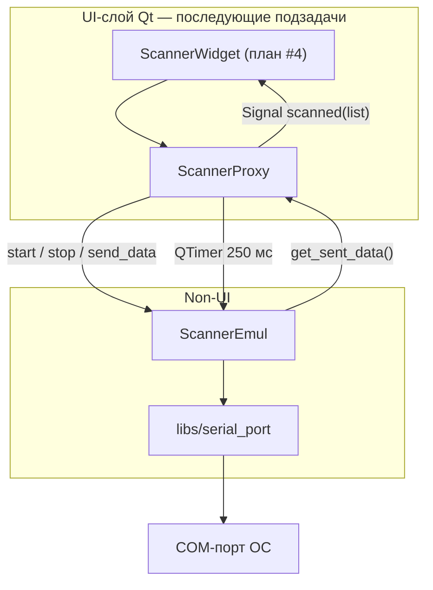
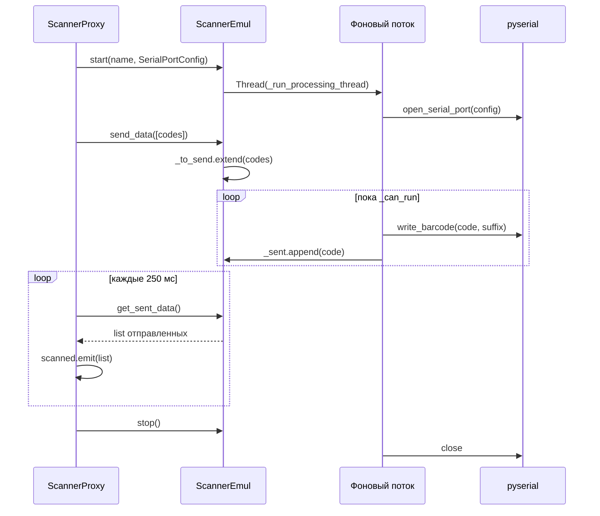

# Инфраструктура Serial и ядро эмулятора сканера

| Параметр | Значение |
|----------|----------|
| Точка входа приложения | `main.py` |
| План | эмулятор сканера ШК (Serial), подзадача **#1** |
| Зависимость | `pyserial==3.5` (`requirements.txt`) |

## Назначение

Подсистема эмулирует **ручной сканер штрихкодов**, выводящий коды в **COM-порт** (не TCP). Реализованы три слоя по образцу камеры и принтера:

| Слой | Модуль | Зависимости |
|------|--------|-------------|
| Библиотека COM | `libs/serial_port.py` | stdlib, **pyserial** |
| Ядро (non-UI) | `core/barcode_scanner/scanner_core.py` → `ScannerEmul` | threading, `libs/serial_port`, `libs/loggers` |
| Qt-мост | `core/barcode_scanner/scanner_proxy.py` → `ScannerProxy` | PySide6.QtCore |

В `scanner_core.py` и `libs/serial_port.py` **нет импортов PySide6** — COM и очередь обрабатываются вне UI-потока.

Логирование ядра: логгер `SCANNER_LOGGER` (`'SCN'`) в `libs/loggers.py`; имя попадает в кортеж `LOGGERS`, инициализируемый в `main.py` → `setup_logging()`.

## Архитектура

Паттерн совпадает с `CameraEmul` / `CameraProxy`: ядро кладёт успешно отправленные коды в `_sent`, прокси опрашивает `get_sent_data()` по таймеру и эмитит сигнал в UI-поток.

## `libs/serial_port.py`

Обёртка над **pyserial** без Qt.

### `SerialPortConfig`

Неизменяемый dataclass параметров порта:

| Поле | По умолчанию | Описание |
|------|--------------|----------|
| `port_name` | — | Имя порта ОС (`COM3`, `/dev/ttyUSB0`) |
| `baud_rate` | `9600` | Скорость |
| `bytesize` | `8` | 5–8 (маппинг в константы pyserial) |
| `parity` | `'N'` | `N`, `E`, `O`, `M`, `S` |
| `stopbits` | `1` | `1`, `1.5`, `2` |
| `suffix` | `"\r\n"` | Суффикс окончания «сканирования» |

### API

| Функция | Назначение |
|---------|------------|
| `list_available_ports() -> list[str]` | Список имён портов через `serial.tools.list_ports.comports()` |
| `open_serial_port(config) -> serial.Serial` | Открытие порта; `timeout=0.1`; при ошибке — `SerialPortError` |
| `write_barcode(port, code, suffix="\r\n")` | Запись `code + suffix` в UTF-8, `flush()` |

Исключение **`SerialPortError`** — некорректные параметры, порт занят/недоступен, порт закрыт, ошибка записи.

### Ограничение COM (Windows)

Приложение **не создаёт** виртуальный COM-порт: доступны только порты, которые видит ОС (физические адаптеры, драйверы вроде **com0com**). Перечисление — `list_available_ports()`; выбор порта — в combo виджета сканера. Пошаговая настройка виртуальной пары портов — в [com0com_setup.md](com0com_setup.md).

## `ScannerEmul` — `core/barcode_scanner/scanner_core.py`

Эмулятор: очередь кодов и запись в COM в **отдельном потоке**.

### Состояние

- `_to_send: deque[str]` — очередь на отправку (`send()`).
- `_sent: deque[str]` — успешно записанные в COM коды (снимается через `get_sent_data()`).
- `_serial: Serial | None` — открытый порт на время работы потока.
- `_can_run` — флаг цикла обработки.

### Жизненный цикл

1. **`start()`** — `_can_run = True`, запуск потока `ScannerEmul-{name}` → `_run_processing_thread`.
2. Поток: `open_serial_port` → цикл `while _can_run` (пустая очередь — `sleep(0.01)`) → `write_barcode` с `config.suffix` → лог `SENT`, append в `_sent`.
3. **`stop()`** — `_can_run = False`, `join()` потока; в `finally` потока — `_close_serial()`.
4. При ошибке открытия COM: лог ERROR, `_can_run = False`, поток завершается без записи.

### Публичный API

| Метод | Описание |
|-------|----------|
| `__init__(name, config: SerialPortConfig)` | Имя устройства и параметры COM |
| `start()` | Фоновый поток + open COM |
| `stop()` | Остановка и close COM |
| `send(messages: list[str])` | Добавить коды в `_to_send` |
| `get_sent_data() -> list[str]` | Вернуть и очистить `_sent` (FIFO через pop слева) |

Ошибки записи логируются на уровне ERROR; код не попадает в `_sent`.

## `ScannerProxy` — `core/barcode_scanner/scanner_proxy.py`

`QObject`-мост между UI и `ScannerEmul`.

| Элемент | Описание |
|---------|----------|
| `scanned = Signal(list)` | Список кодов, успешно отправленных в COM с прошлого опроса |
| `QTimer` | Интервал **250 мс** (как у `CameraProxy`) |
| `start(name, config)` | Создаёт `ScannerEmul`, `start()`, запускает таймер |
| `stop()` | `stop()` ядра, останов таймера, `_scanner = None` |
| `send_data(messages)` | Делегирует `ScannerEmul.send()` |

Таймер вызывает `_get_scanned_data()` → `get_sent_data()`; при непустом результате — `scanned.emit(sent_data)`.

## Сравнение с камерой

| Аспект | Камера | Сканер (подзадача #1) |
|--------|--------|------------------------|
| Транспорт | TCP-сокет (`libs/sockets`) | COM (`pyserial`) |
| Ядро | `core/scanning/camera_core.py` | `core/barcode_scanner/scanner_core.py` |
| Прокси | `camera_proxy.py`, 250 мс | `scanner_proxy.py`, 250 мс |
| Логгер | `CAMERA_LOGGER` (`CAM`) | `SCANNER_LOGGER` (`SCN`) |
| Суффикс протокола | Протокол камеры | `\r\n` по умолчанию в `SerialPortConfig` |

## Связанные таймеры линии

Интервал **250 мс** у `ScannerProxy` — опрос **исходящих** кодов ядра (аналог `camera_proxy.py`), а не per-code `spInterval` pipeline. Per-code задержки в очередях виджетов — через `CodeScheduler` и `model_processing` (см. [code_scheduler.md](code_scheduler.md)).

После интеграции виджета (подзадачи #4+) в таблицу «Другие таймеры» в `code_scheduler.md` добавляется строка для `scanner_proxy.py`.

## Дальнейшие подзадачи плана

Подзадача #1 **не** включает UI, JSON-конфиг и главное окно:

- **#2** — `ScannerParams`, `ScannerConfig`, секция `scanners` в `ConfigFile`
- **#3–#4** — форма и `ScannerWidget`
- **#5** — `MainLineField` (меню `acAddScanner`, save/load JSON, `closeEvent`, `_sync_scanner_name_generator`; см. [line_emulator.md](line_emulator.md))
- **#6** — `ScannerWidget` в combo transport/generator (реализовано; см. [line_emulator.md](line_emulator.md), [frontend/scanner-widget.md](frontend/scanner-widget.md))
- **#8** — unit-тесты (28 тестов) — см. [scanner_unit_tests.md](scanner_unit_tests.md)

## См. также

- [scanner_unit_tests.md](scanner_unit_tests.md) — unit-тесты serial lib, `ScannerEmul`, config, transport/generator wiring (подзадача #8)
- [line_emulator.md](line_emulator.md) — карта приложения эмулятора линии; раздел «Сборка exe» — `main.spec`, hiddenimports `pyserial` (#9)
- [com0com_setup.md](com0com_setup.md) — виртуальные COM-порты для отладки сканера (Windows)
- [code_scheduler.md](code_scheduler.md) — таймеры 10 мс / 250 мс в контексте линии
