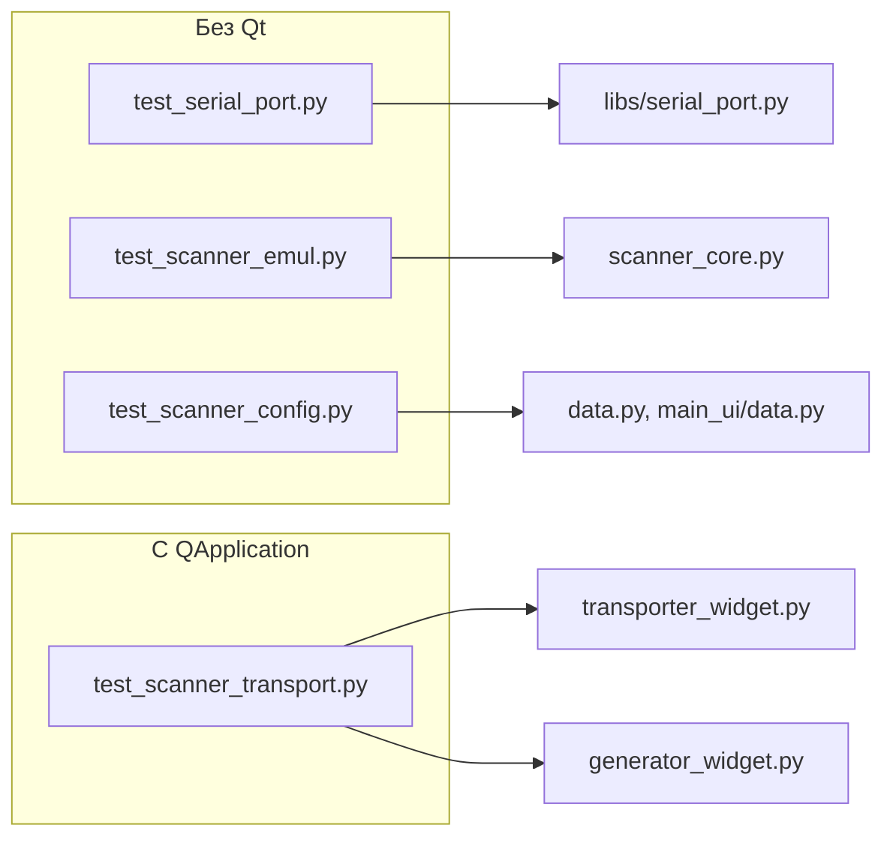

# Unit-тесты подсистемы сканера (Serial)

| Параметр | Значение |
|----------|----------|
| План | эмулятор сканера ШК (Serial), подзадача **#8** |
| Фреймворк | `unittest` (stdlib) |
| Всего тестов | **28** (4 модуля) |

## Назначение

Автоматические тесты покрывают non-UI слой COM (`libs/serial_port`), ядро `ScannerEmul`, модели конфигурации `ScannerConfig` / `ConfigFile.scanners` и wiring `ScannerWidget` в `TransporterWidget` и `GeneratorWidget` (подзадача **#6**).

**Принципы:**

- `serial.Serial` и функции `open_serial_port` / `write_barcode` **мокируются** — реальный COM-порт не требуется.
- Тесты `ScannerEmul` выполняются **без `QApplication`** (только threading + mock COM).
- Тесты transport/generator создают **один** `QApplication` на класс (`setUpClass`) и мокируют `list_available_ports` / `qta.icon` при создании `ScannerWidget`.



## Модули и покрытие

### `tests/test_libs/test_serial_port.py` (11 тестов)

Классы `TestListAvailablePorts`, `TestOpenSerialPort`, `TestWriteBarcode`.

| Область | Что проверяется |
|---------|-----------------|
| `list_available_ports` | Маппинг `comports()` → список имён; пустой список при отсутствии портов |
| `open_serial_port` | Передача kwargs в `serial.Serial` (дефолты 9600/8/N/1, timeout 0.1); кастомные bytesize/parity/stopbits → константы pyserial |
| Валидация | Некорректные `bytesize` / `parity` → `SerialPortError` до открытия |
| Ошибки ОС | `serial.SerialException` оборачивается в `SerialPortError` с именем порта |
| `write_barcode` | UTF-8 payload + suffix, `flush()`; кастомный suffix; закрытый порт; ошибка записи |

Патч: `@patch("libs.serial_port.serial.Serial")`, `@patch("libs.serial_port.list_ports.comports")`.

### `tests/test_core/test_scanner_emul.py` (6 тестов)

Класс `TestScannerEmul` — ядро без Qt.

| Тест | Сценарий |
|------|----------|
| `test_send_writes_codes_with_config_suffix` | Очередь `send()` → `write_barcode` с suffix из `SerialPortConfig` |
| `test_get_sent_data_drains_buffer` | `get_sent_data()` возвращает коды один раз, повторный вызов — пустой список |
| `test_pop_open_error_on_failed_open` | Ошибка `open_serial_port` → `pop_open_error()` один раз, затем `None` |
| `test_stop_closes_serial_port` | `stop()` вызывает `close()` на mock-порту |
| `test_clear_queues_empties_pending_and_sent` | `clear_queues()` сбрасывает pending/sent; после очистки уходит только новый код |
| `test_write_error_does_not_add_to_sent` | `SerialPortError` при записи — код не попадает в `_sent` |

Патч: `open_serial_port`, `write_barcode` в `core.barcode_scanner.scanner_core`. Синхронизация с фоновым потоком — хелпер `_wait_until()` (poll до 2 с). В `tearDown` — обязательный `stop()`.

### `tests/test_core/test_scanner_config.py` (7 тестов)

Классы `TestScannerParams`, `TestScannerConfig`, `TestConfigFileScanners`.

| Область | Что проверяется |
|---------|-----------------|
| `ScannerParams` | Дефолты совпадают с `SerialPortConfig` (9600, 8, N, 1, `\r\n`) |
| `ScannerConfig.to_serial_port_config()` | Маппинг `port_name` и вложенного `config` в `SerialPortConfig` |
| `ConfigFile` | `scanners=[]` по умолчанию; round-trip `model_dump_json` → `model_validate_json` |
| Обратная совместимость | Legacy JSON без ключа `scanners` загружается без ошибок |
| Смешанный конфиг | Секции `printers`, `cameras`, `scanners` сохраняются вместе |

### `tests/test_core/test_scanner_transport.py` (5 тестов)

Классы `TestTransporterScannerIntegration`, `TestGeneratorScannerIntegration`.

| Тест | Сценарий |
|------|----------|
| `test_scanner_in_from_and_to_combos` | Сканер в `cbxFrom` (источник) и `cbxTo` (приёмник); принтер только в `from` |
| `test_set_from_scanner_uses_model_out` | `TransporterWidget.model_in is scanner.model_out` |
| `test_set_to_scanner_uses_model_in` | `TransporterWidget.model_out is scanner.model_in` |
| `test_scanner_in_generator_to_combo` | Сканер в `GeneratorWidget.cbxTo`; принтер не в списке |
| `test_set_to_scanner_uses_model_in` | `GeneratorWidget.model_out is scanner.model_in` |

Вспомогательные фабрики: `_make_scanner()` (mock COM list + icon), `_make_printer()`.

### `tests/test_core/test_scanner_com_refresh.py` (3 теста)

Класс `TestScannerComRefresh` — кнопка `tbRefreshPorts` (план widget-delete-com-refresh, подзадача **#1**). Требует `QApplication`; мокирует `list_available_ports` и `qta.icon`.

| Тест | Сценарий |
|------|----------|
| `test_refresh_updates_combo_and_keeps_selection` | Клик refresh перечитывает порты и сохраняет текущий выбор, если порт ещё в списке |
| `test_refresh_without_selection_keeps_placeholder` | Без выбранного порта после refresh остаётся placeholder (индекс 0) |
| `test_refresh_disabled_while_running` | При `run(True)` `tbRefreshPorts` disabled вместе с `cbxComPort`; после `run(False)` снова enabled |

```powershell
.\venv\Scripts\python.exe -m unittest tests.test_core.test_scanner_com_refresh -v
```

## Запуск

Все тесты подзадачи #8 одной командой:

```powershell
.\venv\Scripts\python.exe -m unittest `
  tests.test_libs.test_serial_port `
  tests.test_core.test_scanner_emul `
  tests.test_core.test_scanner_config `
  tests.test_core.test_scanner_transport -v
```

По отдельности:

```powershell
.\venv\Scripts\python.exe -m unittest tests.test_libs.test_serial_port
.\venv\Scripts\python.exe -m unittest tests.test_core.test_scanner_emul
.\venv\Scripts\python.exe -m unittest tests.test_core.test_scanner_config
.\venv\Scripts\python.exe -m unittest tests.test_core.test_scanner_transport
```

Ожидаемый результат: `Ran 28 tests ... OK`.

## Что не входит в подзадачу #8

| Модуль | План | Примечание |
|--------|------|------------|
| `tests/test_core/test_bulk_control.py` | **#10** | Массовое управление виджетами (`MainLineField`) |
| `tests/test_core/test_scanner_com_refresh.py` | widget-delete-com-refresh **#1** | См. раздел выше — COM refresh UI |
| `tests/test_core/test_widget_delete.py` | widget-delete-com-refresh **#4** | Remove API, guards `_on_delete_clicked`, `clear_ui` → generators — [frontend/widget-delete.md](frontend/widget-delete.md) |
| UI `ScannerWidget` (DnD, Run, QMessageBox) | — | Отдельные интеграционные/ручные сценарии; COM — через [com0com_setup.md](com0com_setup.md) |
| `ScannerProxy` (QTimer 250 мс) | — | Покрывается косвенно через `ScannerEmul`; прямых unit-тестов прокси нет |

## См. также

- [scanner_serial.md](scanner_serial.md) — `libs/serial_port`, `ScannerEmul`, `ScannerProxy`
- [line_emulator.md](line_emulator.md) — `ConfigFile.scanners`, wiring Transport/Generator (#6)
- [com0com_setup.md](com0com_setup.md) — ручная отладка COM без физического адаптера
