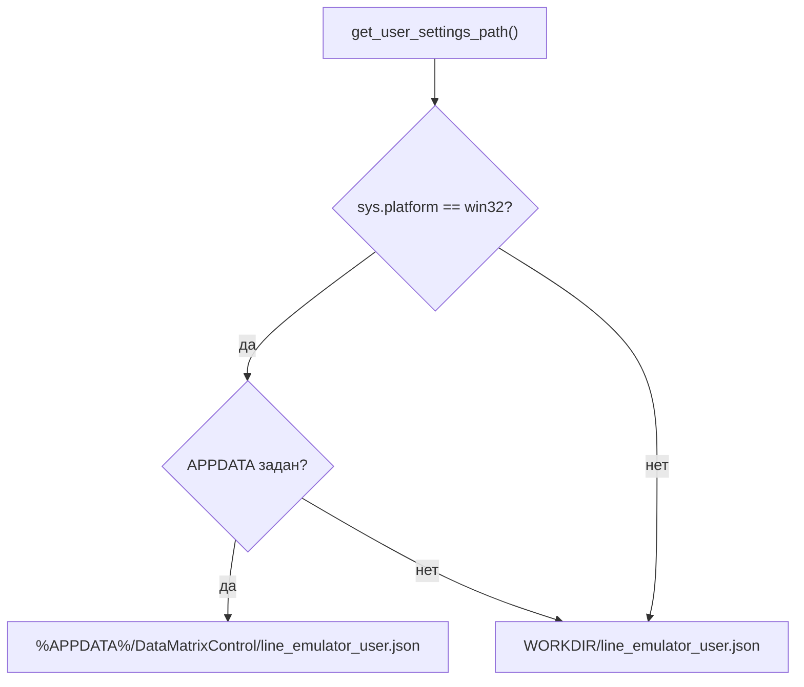

# Глобальные настройки пользователя (`core/main_ui/user_settings.py`)


| Параметр | Значение |

|----------|----------|

| Модуль | `core/main_ui/user_settings.py` |

| План | UI modernization Line Emulator, подзадача **#2** |

| Зависимости | Pydantic; **без Qt** (unit-тесты без GUI) |

| Интеграция в UI | `main.py` (startup), `MainLineField` (меню «Вид») — подзадача **#12** ✓ |


## Назначение


Хранение **глобальных** предпочтений Line Emulator, не привязанных к project JSON (`ConfigFile`). В первом релизе UI modernization — только выбор темы оформления (`theme_preference`).


| Хранилище | Содержимое | Когда сохраняется |

|-----------|------------|-------------------|

| Project JSON (`ConfigFile`) | устройства, layout, `dock_state`, порядок карточек | **File → Save** |

| User settings JSON | `theme_preference` | при смене «Вид → тема» (**#12** ✓); загрузка в `main.py` и `MainLineField.__init__` |


Разделение intentional: оператор может открыть разные project-файлы с одной и той же темой; layout проекта не смешивается с персональными настройками.


## Расположение файла


Имя файла: `line_emulator_user.json`.


| Платформа / условие | Путь |

|---------------------|------|

| Windows, задан `%APPDATA%` | `%APPDATA%/DataMatrixControl/line_emulator_user.json` |

| Иначе (non-Windows или `%APPDATA%` не задан) | `{client_info.WORKDIR}/line_emulator_user.json` |


`get_user_settings_path()` реализует эту логику. На Windows при отсутствии `%APPDATA%` используется fallback на `WORKDIR` (корень репозитория / каталог exe в frozen-сборке).





`save_user_settings` создаёт родительские каталоги (`mkdir(parents=True, exist_ok=True)`), если их ещё нет.


## Модель данных


### `ThemePreference`


```python

ThemePreference = Literal["system", "light", "dark"]

```


| Значение | Смысл |

|----------|--------|

| `"system"` | Следовать теме ОС (default) |

| `"light"` | Принудительно светлая тема |

| `"dark"` | Принудительно тёмная тема |


### `UserSettings`


Pydantic-модель (`strict=True`):


| Поле | Тип | По умолчанию |

|------|-----|--------------|

| `theme_preference` | `ThemePreference` | `"system"` |


## API


### `get_user_settings_path() -> Path`


Возвращает абсолютный путь к JSON-файлу настроек (см. таблицу путей выше).


### `load_user_settings(path: Path | None = None) -> UserSettings`


| Ситуация | Поведение |

|----------|-----------|

| Файл отсутствует | Новый `UserSettings()` с defaults |

| Файл существует | `UserSettings.model_validate_json(...)` |

| Невалидный JSON / schema | `pydantic.ValidationError` |

| Ошибка чтения | `OSError` |


Аргумент `path` — override для тестов (без записи в реальный `%APPDATA%` / `WORKDIR`).


### `save_user_settings(settings: UserSettings, path: Path | None = None) -> None`


Сериализует модель в JSON (`model_dump_json(indent=4)`, UTF-8). Создаёт каталоги при необходимости. Ошибки записи — `OSError`.


## Пример JSON


```json

{

    "theme_preference": "system"

}

```


Допустимые значения `theme_preference`: `"system"`, `"light"`, `"dark"`.


## Интеграция в UI (#12)

### Startup (`main.py`)

```python
user_settings = load_user_settings()
apply_theme(app, ThemeMode(user_settings.theme_preference))
```

Вызывается после `QApplication`, **до** `MainLineField()`. На Windows задаётся `QT_QPA_PLATFORM=windows:darkmode=0` (см. [qt_theme.md](qt_theme.md)).

### Меню «Вид» (`MainLineField`)

| Пункт UI | `QAction` | Значение JSON |
|----------|-----------|---------------|
| «Как в системе» | `acThemeSystem` | `"system"` |
| «Светлая» | `acThemeLight` | `"light"` |
| «Тёмная» | `acThemeDark` | `"dark"` |

При выборе: `_on_theme_preference_changed` → `save_user_settings(UserSettings(theme_preference=...))` → `apply_theme(app, mode)`. Checkable actions синхронизируются через `_sync_theme_menu_from_settings()` при старте окна.

Статическая разметка — [frontend/layout-shell.md](frontend/layout-shell.md); wiring vs layout JSON — [frontend/mainlinefield-layout.md](frontend/mainlinefield-layout.md).

## Связь с design system

`theme_preference` из user settings передаётся в `libs/qt_theme.py`:

- `ThemeMode` — enum с теми же строковыми значениями;
- `resolve_effective_mode(preference, app=...)` → `"light"` | `"dark"` (для `"system"` — `QStyleHints` или детекция ОС);
- `apply_theme(app, preference)` — Qt style + глобальный QSS.

Подробности tokens, QSS и тесты — [qt_theme.md](qt_theme.md), [frontend/theme-system.md](frontend/theme-system.md).


## Тестирование


Файл: `tests/test_core/test_user_settings.py` (**8** тестов, подзадача **#13** ✓). Благодаря отсутствию Qt-зависимости модуль тестируется с временным `path=` без `QApplication`.


| Класс / тест | Проверяет |

|--------------|-----------|

| `TestUserSettingsDefaults.test_load_returns_system_theme_when_file_missing` | Отсутствующий файл → `theme_preference="system"` |

| `test_user_settings_model_default` | Default модели `UserSettings()` |

| `TestUserSettingsThemeRoundtrip.test_roundtrip_system_light_dark` | Save/load для `system`, `light`, `dark` |

| `test_saved_json_contains_theme_preference` | Поле `theme_preference` в записанном JSON |

| `test_save_creates_parent_directories` | `mkdir(parents=True)` для вложенного пути |

| `test_invalid_theme_rejected_on_load` | Невалидное значение → `ValidationError` |

| `TestGetUserSettingsPath.test_windows_uses_appdata_subdirectory` | Windows + `%APPDATA%` → `DataMatrixControl/line_emulator_user.json` |

| `test_non_windows_uses_workdir` | Non-Windows → `{WORKDIR}/line_emulator_user.json` |


```powershell

.\venv\Scripts\python.exe -m unittest tests.test_core.test_user_settings -v

```


## Roadmap


| Подзадача | Что добавляет |

|-----------|---------------|

| **#12** | ✓ Загрузка при старте `main.py`, сохранение при смене «Вид → тема», `apply_theme` |

| **#13** | ✓ Unit-тесты `test_user_settings.py` (defaults, roundtrip, path resolution) |

| **#14** | Финальная актуализация cross-links в обзорной документации |


## Связанная документация


- [qt_theme.md](qt_theme.md) — `ThemeMode`, `apply_theme`, design tokens.

- [line_emulator.md](line_emulator.md) — обзор приложения, project JSON vs user settings.

