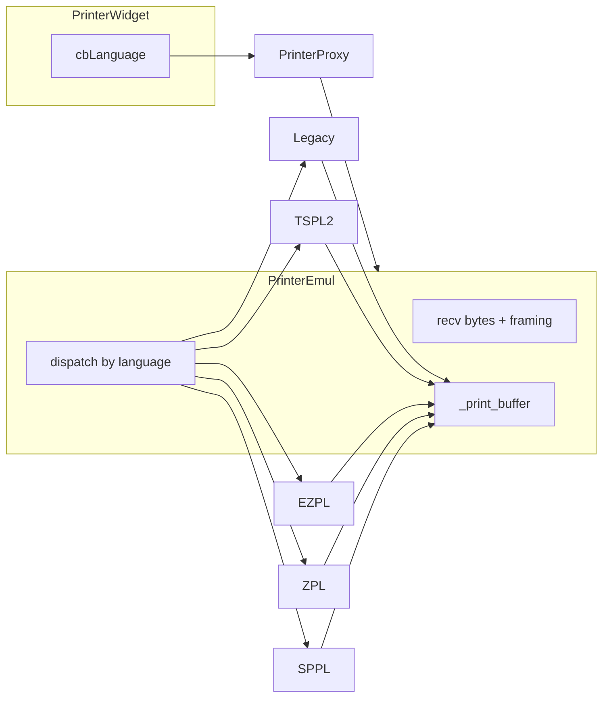

# Индекс модулей — Эмулятор производственной линии

| Параметр | Значение |
|----------|----------|
| Точка входа | [`main.py`](main.py) |
| Версия | [`client_info.VERSION`](client_info.py) |
| Главное окно | [`core/main_ui/line_emul.py`](core/main_ui/line_emul.py) → `MainLineField` |
| Конфиг JSON | [`core/main_ui/data.py`](core/main_ui/data.py) → `ConfigFile` |
| Документация приложения | [`docs/line_emulator/line_emulator.md`](docs/line_emulator/line_emulator.md) |

## Дерево `core/`

```text
core/
├── main_ui/
│   ├── line_emul.py      # холст, save/load JSON, add_printer(..., language=)
│   └── data.py           # ConfigFile (printers, cameras, scanners, …)
├── printing/             # TCP-эмулятор принтера — см. ниже
├── scanning/             # camera_widget, camera_core, …
├── barcode_scanner/      # scanner_widget, ScannerEmul (COM)
├── transporting/         # transporter_widget
└── generator/            # generator_widget
```

## `core/printing/` — эмулятор принтера

```text
core/printing/
├── data.py               # PrinterLanguage, PrinterConfig
├── printer_core.py       # PrinterEmul: TCP, dispatch, _print_buffer
├── printer_proxy.py      # Qt-мост, start(..., language=)
├── printer_widget.py     # UI виджета, cbLanguage, options()
├── framing.py            # бинарные кадры TSPL2 / EZPL / ZPL / SPPL
├── extract.py            # GS1/штрихкод из задания по языку
├── chw.py                # CHW (legacy)
└── dialects/
    ├── __init__.py       # re-export base types
    ├── base.py           # PrinterDialect, PrinterDeviceState
    ├── legacy.py         # Legacy + делегирование ~SP → sppl
    ├── tspl2.py
    ├── ezpl.py
    ├── zpl.py
    └── sppl.py           # SAVEMA SPPL
```



| Файл UI | Элемент | Назначение |
|---------|---------|------------|
| [`forms/ui/Printer.ui`](forms/ui/Printer.ui) | `cbLanguage` | Выбор языка эмуляции на холсте |
| [`forms/Printer.py`](forms/Printer.py) | — | Сгенерированный UIC |

### `PrinterConfig.language`

Модель: [`core/printing/data.py`](core/printing/data.py).

| JSON `language` | Пункт `cbLanguage` | Диалект |
|-----------------|-------------------|---------|
| `legacy` (default) | Legacy | `legacy.py` |
| `tspl2` | TSPL2 | `tspl2.py` |
| `ezpl` | EZPL | `ezpl.py` |
| `zpl` | ZPL | `zpl.py` |
| `sppl` | SAVEMA | `sppl.py` |

Поле опционально в старых конфигах: при отсутствии используется `legacy`.

Пример элемента `printers[]`:

```json
{
    "name": "PRN_9100",
    "port": 9100,
    "buffer": 1,
    "language": "ezpl"
}
```

Поведение виджета: [`core/printing/printer_widget.py`](core/printing/printer_widget.py) — маппинг индекса combo ↔ `PrinterLanguage` в `_LANGUAGE_BY_COMBO_INDEX`; при **Run** combo отключается вместе с именем и портом; при **Stop** настройки снова доступны.

### Связанная документация

| Документ | Содержание |
|----------|------------|
| [`docs/printing/README.md`](docs/printing/README.md) | Мануалы PDF, перечень эмулируемых команд |
| [`CHANGELOG.md`](CHANGELOG.md) | Секция [2026-09-16] Эмуляция языков принтера |
| [`docs/line_emulator/bulk-control.md`](docs/line_emulator/bulk-control.md) | Массовое управление виджетами |

## Прочие каталоги

| Путь | Назначение |
|------|------------|
| [`forms/`](forms/) | UIC главного окна и виджетов устройств |
| [`libs/`](libs/) | `model_processing`, `code_scheduler`, `sockets`, `serial_port`, … |
| [`tests/test_core/`](tests/test_core/) | Unit-тесты ядра и виджетов |
| [`build/spec/main.spec`](build/spec/main.spec) | PyInstaller для `dmcLineEmulator` |
